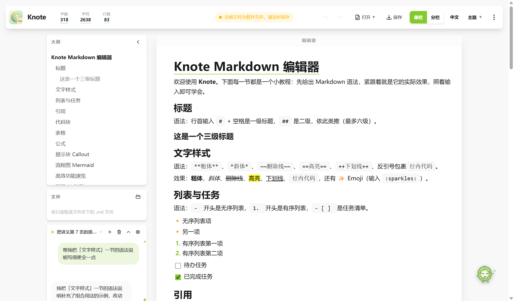
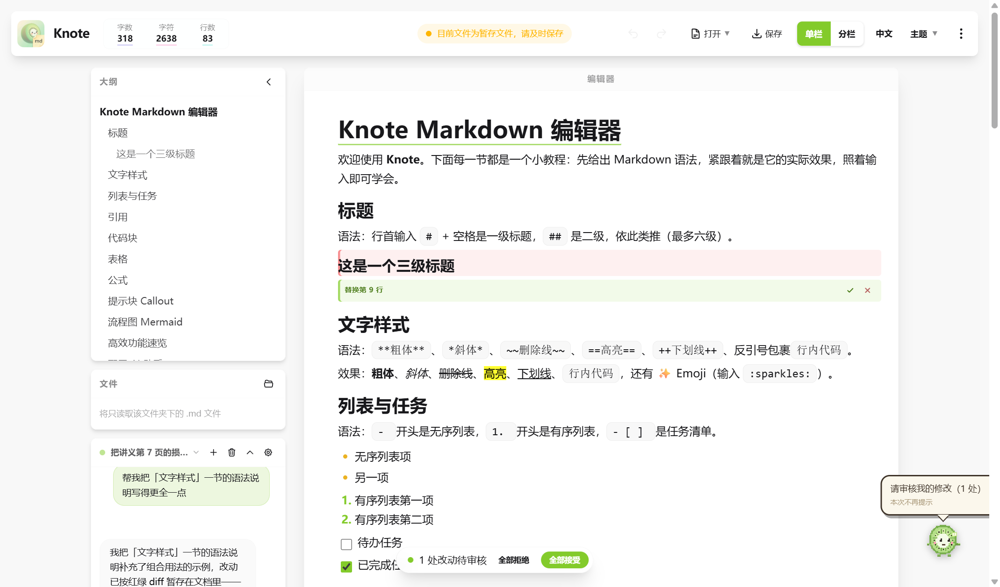
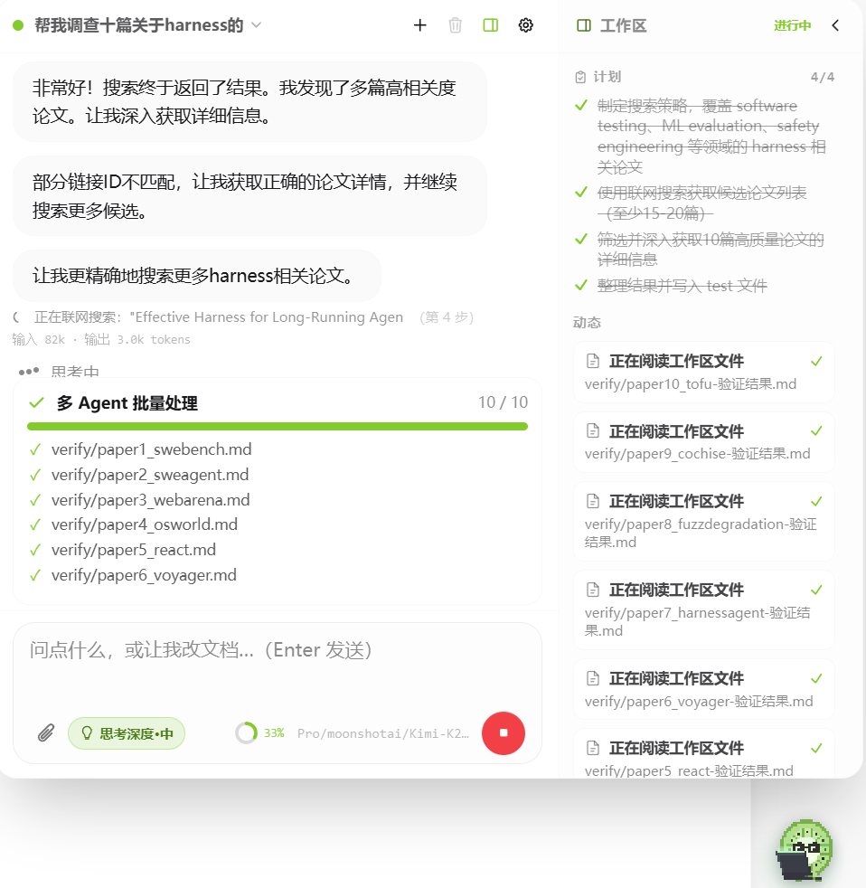

# Knote

**A modern, Feishu-style WYSIWYG Markdown editor with a built-in AI agent.**\
**类飞书体验的所见即所得 Markdown 编辑器，内置可审改的 AI 助手。**

Cross-platform · Local-first · Bring-your-own-AI-key\
跨平台 · 本地优先 · 自带 AI 密钥

[English](#english) · [中文](#%E4%B8%AD%E6%96%87)



---

## 中文

Knote 是一款本地优先的 Markdown 编辑器，拥有现代块编辑器（飞书 / Notion 风格）的顺滑体验，同时可配置辅助 Agent，他可以帮助你维护、修改、重构文档，你可以审改他的修改，不满意的内容可以拒绝修改。可作为网页应用（部分功能受限）、Windows 桌面应用（推荐）和 Android 应用（正在测试）运行。

**演示：拖入 PDF → 生成论文总结并自动配图**

<https://github.com/user-attachments/assets/f9992311-e33d-4753-a1ff-96be1ba3cadf>

### ✨ 基础功能

- **所见即所得的编辑体验** —— 输入 Markdown 语法即时转换，一键可切到源码/预览双栏模式。
- **丰富的 Markdown** —— 标题、列表、任务、表格、带语法高亮的代码块、KaTeX 公式、脚注、Emoji、高亮/下划线等。
- **Callout 提示块** —— `> [!tip]`、`> [!warning]` 等渲染为彩色卡片。
- **Mermaid 图表** —— 写 `mermaid` 代码块即可实时渲染流程图/时序图。
- **标签页与文件夹工作区** —— 像浏览器一样同时打开多个文档/文件夹，可拖拽排序，重启自动恢复。浏览文件夹树、新建/重命名/删除/移动文件与文件夹，并跨文件全文搜索。
- **查找替换**（`Ctrl+F` / `Ctrl+H`）、**快速打开**（`Ctrl+P`）、**标题折叠**、**版本历史**（一键回滚）、**图片查看器**（双击放大/拖拽）、**界面缩放**（`Ctrl+滚轮`）。
- **导出** PDF、Word（`.doc`）、HTML、Markdown。
- **中英双语界面**。

### 🤖 AI 助手

Knote 内置 AI 助手，直接驻守在编辑器中，目标是帮你把"写、改、审、理"文档这件事变得更顺手。他不会直接修改原文，而是先把改动暂存成 diff，用户逐块或一键接受后才会生效。



**能做什么：**

- **读写当前文档（带审核）**：读取带行号的全文后生成修改——替换、插入、续写长内容、图文一次成型；所有改动以红/绿 diff 暂存在文档里，逐块或一键接受/拒绝，绝不直接覆盖原文。
- **管理整个工作区**：打开文件夹后，列目录、读其他 Markdown、按内容**全库检索**、看文档**大纲**快速定位；**新建 / 精确编辑 / 重命名 / 移动 / 删除**（进回收站）文件；还能把同一任务**并发批处理**到多个文件。
- **读 PDF 与图片**：拖入附件，或直接读工作区里的 PDF / 图片。桌面版把整份 PDF 在本地**结构化**——正文转文字、图和表格连同图注提取成可引用的元素，随消息发给助手；需要时查看某图高清原图，并把图/表精确插进文档。网页版退化为按页读取文字和整页截图。
- **联网搜索与读网页**：桌面版用**你自己的网络**（搜索词不经任何第三方中转）搜索关键词、抓取网页正文——查资料、找文献、核对事实都不用跳出编辑器（网页版可配 Jina Key）。
- **规划与自我追踪**：面对多步任务，先列一份**计划清单**、边做边打勾，进度实时显示在右侧**工作区面板**（见下）。
- **实用工具**：知道当前的本地日期 / 时间（"三天后""本周"都能算），需要精确算数时用内置**沙箱计算器**（支持科学计数、常用函数）。
- **以 diff 形式审稿**：所有对当前文档的修改都以红/绿 diff 暂存，你逐块接受/拒绝或一键全接，避免误改原文；改动前会先看现有格式，公式、代码块、列表层级尽量沿用你的风格。

> 助手会用哪些工具，取决于你的模型是否支持"工具调用"以及当前是否打开了文件夹——点"检测"后会亮起对应能力徽章。所有联网/文件/图片来源的内容都被当作**不可信外部数据**，其中的指令不会被执行。

**工作区面板 —— 让 agent 的工作全程可见：**

助手工作时，聊天窗口右侧会展开一块**工作区面板**，把它正在做的事实时摊开给你看，不再是黑箱：

- **计划**：多步任务的每一步——未开始 ○ / 进行中 ◍ / 已完成 ✓，实时打勾，附完成进度。
- **动态**：它调用了哪些工具、搜索/抓取了哪些网址、读写了哪些文件，按栈自上而下逐条显示，成功 / 出错一目了然。
- **子任务**：用多智能体并发处理多个文件时，每个子任务的进度也在这里实时显示。

面板只展示**当前这一次任务**的进展，任务结束自动归位；不需要时可一键收起。




*示例截图，可能因版本更新稍有不同*

**参考场景：**

- **生成复习资料**：把 PDF 教材或课堂笔记拖拽给助手，让他生成复习资料、思维导图式提纲、Anki 卡片或 Markdown 表格，随后一边看资料一边用"问助手"追问概念。


*示例截图，可能因版本更新稍有不同*

- **边学边问**：阅读技术文档时遇到不懂的术语或公式，直接选中让助手解释、举例或补充推导过程，无需跳出编辑器去搜索。
- **论文/报告润色**：写好初稿后让助手检查逻辑断层、语法和排版，生成 diff 后逐条接受，保留自己想要的表达。
- **会议纪要整理**：把会议录音转录或手写速记丢给助手，让他提炼决议项、待办清单和责任人表格。
- **代码文档化**：选中代码块，让助手补充参数说明、示例用法，并自动生成对应 API 说明段落。
- **多文件知识库问答**：打开整个项目文件夹，让助手跨文件检索并总结某个模块的实现或历史变更。
- **写作陪跑**：卡壳时给出大纲建议、续写段落或反向提问，帮你把思路理顺。

**配置：**

点击右下角绿色圆球打开助手，进入设置：

1. 选择协议 —— 多数服务选 **OpenAI 兼容**，Claude 官方接口选 **Anthropic**。
2. 填写 **API 地址**、**API Key**、**模型名称**。
3. 点击**检测** —— Knote 会探测模型能力并亮起徽章（对话 / 工具 / 图片 / PDF）。

密钥仅存于浏览器本地存储；Knote 没有服务器，绝不上传。

> **PDF 版面分析（可选增强）**：桌面版设置里提供 PaddleOCR 环境的**一键安装**——没有安装过 Python 也没关系，Knote 会自动下载内置版 Python 并完成全部配置（全程国内镜像）。装好后，PDF 的图表提取与精确定位能力自动启用；不装也能正常使用文字读取和整页截图。

### 📖 三分钟上手

1. **写**：新建文档，直接输入 `# 标题`、`- 列表`、`**粗体**` 等语法，即时变成排版效果；`Ctrl+P` 快速打开文件，`Ctrl+F/H` 查找替换。
2. **配助手**：右下角绿色圆球 → ⚙ 设置 → 填 API 地址/Key/模型 → 点检测。
3. **喂材料**：把 PDF 或图片拖进聊天框（PDF 芯片显示"解析 x/N"，✓ 后发送），或选中文档里的一段文字点"问助手"。
4. **审改动**：助手的修改以红/绿 diff 出现在文档里——绿色块右上角 ✓ 接受、✕ 拒绝，或用底部胶囊条一键处理全部。
5. **存与导出**：`Ctrl+S` 保存；顶栏"导出"可出 PDF / Word / HTML / Markdown。

### 🛠 技术栈

Vue 3 · Vite · TipTap / ProseMirror · markdown-it · Tailwind CSS · daisyUI · KaTeX · Mermaid · highlight.js · Electron · Capacitor

### 🚀 快速开始

**下载 Windows 安装包后一键安装（推荐）：**

前往 [Releases](https://github.com/1661169091kiwi/Knote/releases/latest) 下载 `Knote Setup x.x.x.exe`，双击安装即可。

**下载 Android apk 安装包（测试中）：**

前往 [Releases](https://github.com/1661169091kiwi/Knote/releases/latest) 下载 `.apk`（如当前版本未提供，可按下方开发方式自行构建）。

**本地浏览器部署（开发者）：**

```bash
git clone https://github.com/1661169091kiwi/Knote.git
cd Knote
npm install
npm run dev        # 打开 http://localhost:5173

# 打包 Windows 安装包
npm run dist:win   # -> release/Knote Setup <版本>.exe

# 打包 Android APK（原生工程未纳入版本库，需先生成）
npx cap add android
npm run dist:apk   # -> android/app/build/outputs/apk/debug/
```

### 📄 许可证与致谢

基于 [MIT 许可证](LICENSE) 发布。构建于诸多优秀开源项目之上（Vue、TipTap/ProseMirror、markdown-it、KaTeX、Mermaid、highlight.js、Electron、Capacitor —— 均为宽松协议）。像素字体 **Press Start 2P** 以 SIL 开放字体许可（OFL）使用。

> "飞书"及其他产品名称为各自所有者的商标；Knote 为独立项目，与之无关联、亦未获其背书。

---

## English

Knote is a local-first Markdown editor that feels like a modern block editor (Feishu / Notion style) while keeping **plain Markdown as the single source of truth** — plus a configurable AI agent that helps maintain, edit and restructure your documents. Every change it proposes is staged as a red/green diff you review and can reject. Runs as a web app, a Windows desktop app (recommended), and an Android app (in testing).

### ✨ Features

- **True WYSIWYG editing** — type Markdown syntax and it converts live (TipTap / ProseMirror); a split source/preview mode is one click away.
- **Rich Markdown** — headings, lists, tasks, tables, code blocks with syntax highlighting, KaTeX math, footnotes, emoji, highlight/underline, and more.
- **Callout blocks** — `> [!tip]`, `> [!warning]`, etc. render as colored cards.
- **Mermaid diagrams** — write `mermaid` code blocks and see the diagram render live.
- **Built-in AI agent** — connect any OpenAI-compatible or Anthropic API (DeepSeek, SiliconFlow, OpenAI, Kimi, Claude…). It reads and edits the current document with every change staged as a red/green diff you accept per-block or all at once. Beyond that it **manages your whole folder workspace** (full-text search, document outline, create / precise-edit / rename / move / delete files, batch-process many at once), **searches the web and reads pages over your own network** (search terms never pass through a third party), reads workspace **PDFs & images**, keeps a **live plan** you can watch in the workspace panel, and ships utilities like a sandboxed calculator and current-date awareness. On desktop, whole PDFs are **structured locally** (text extracted, figures/tables cropped with captions) so the agent reads the full document and inserts exact figures. Your API key is stored **only in your browser** — Knote has no server.
- **Agent workspace panel** — while the agent works, a right-side panel shows its live **plan** (each step checked off), **activity** (which tools it called, which URLs it searched/fetched, which files it read/wrote), and **sub-agent** batch progress, so its reasoning and progress are never a black box.
- **Tabs & folder workspaces** — open multiple documents/folders like a browser; drag to reorder; the session restores on restart. Browse a folder tree, create/rename/delete/move files, and search full-text across the whole folder.
- **Find & replace** (`Ctrl+F` / `Ctrl+H`), **quick open** (`Ctrl+P`), **heading fold**, **version history** with one-click rollback, **image viewer**, and **UI zoom** (`Ctrl+Wheel`).
- **Export** to PDF, Word (`.doc`), HTML, and Markdown.
- **Bilingual UI** (中文 / English).

### 🚀 Getting started

**Windows (recommended):** grab `Knote Setup x.x.x.exe` from [Releases](https://github.com/1661169091kiwi/Knote/releases/latest).

**Develop / run from source:**

```bash
git clone https://github.com/1661169091kiwi/Knote.git
cd Knote
npm install
npm run dev        # web dev server at http://localhost:5173

npm run dist:win   # Windows installer -> release/

npx cap add android
npm run dist:apk   # Android debug APK
```

### 🤖 Configuring the AI agent

Click the green floating ball (bottom-right) to open the assistant, then open settings:

1. Choose the protocol — **OpenAI-compatible** for most providers, or **Anthropic** for Claude's native API.
2. Fill in **API URL**, **API Key**, and **model name**.
3. Click **Detect** — Knote probes the model and lights up capability badges (chat / tools / vision / PDF).

Keys live in your browser's local storage only. On desktop, the optional PaddleOCR layout-analysis environment installs with **one click** — Knote even downloads an embedded Python automatically if none is installed.

### 📄 License & attributions

Released under the [MIT License](LICENSE). Built on excellent open-source projects (Vue, TipTap/ProseMirror, markdown-it, KaTeX, Mermaid, highlight.js, Electron, Capacitor — all permissively licensed). The **Press Start 2P** pixel font is used under the SIL Open Font License.

> "Feishu" and other product names are trademarks of their respective owners; Knote is an independent project and is not affiliated with or endorsed by them.
