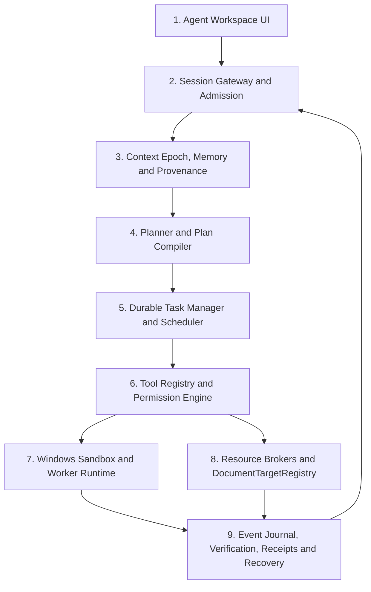

# Knote 通用 Agent 升级设计

> 文档状态：目标设计提案 + 当前磁盘 P0 实施事实<br>
> 编写日期：2026-08-11<br>
> 最近核对：2026-08-12<br>
> 适用平台：Knote Windows 桌面端优先，Web/Android 仅保留安全降级能力<br>
> 目标读者：产品、Agent Runtime、Electron、编辑器、Windows 安全、测试与发布负责人<br>
> 结论约束：本文描述的是目标方案，不代表当前 Knote 已具备通用 Agent 或操作系统沙箱能力。

## 0. 执行摘要

Knote 当前已经具备会话、工具循环、工作区读写、待审核文档差异、执行账本、部分持久事件、上下文压缩和最多 3 路并行运行等能力，但它仍是一个运行在 renderer 生命周期内、以 `agentStore.js` 为中心的文档助手。它尚不具备通用 Agent 所需的独立 durable runtime、可恢复后台任务、确定性的 Planner/Plan Compiler、统一 Tool Registry、任意标签页定向能力，以及 Windows AppContainer/Job Object 级别的真实执行隔离。

本设计采用四个阶段完成升级：

1. P0 先固定契约并收紧事实边界：三态验证、结构化 receipt、工具注册契约、不可变目标身份，不扩大宿主执行能力。
2. P1 将 Session Admission、Context Epoch、计划、任务、事件和恢复迁出 renderer，建立主进程托管的 durable Agent Runtime。
3. P2 引入 Windows AppContainer + Job Object + staging 的真实沙箱，完成任意 tab 定向、通用受控命令和真正流式下载，达到“可称为通用 Agent”的最低门槛。
4. P3 增加长期 memory、provenance、受控自治和完整任务中心，并在迁移稳定后退出 `agentStore.js` 单体运行路径。

必须坚持以下决策：

- 模型只能提出计划、工具调用和完成声明，不能授予权限、判定自身成功或选择绕过沙箱。
- 所有副作用先绑定不可变目标、计划版本、参数摘要和授权，再执行，再由程序做后置验证。
- verifier 使用 `PASS | FAIL | UNKNOWN`，解析失败、超时或提供方错误必须为 `UNKNOWN`；涉及修改或外部副作用时按 fail-closed 处理。
- 不把 Electron renderer 的 `sandbox: true` 称为 Agent OS 沙箱。
- 不照搬 OpenCode 的无沙箱宿主执行，也不把其进程内 BackgroundJob 描述成可跨重启恢复。
- 不再用固定 10 MiB/30 MiB 作为下载单文件上限；改为真实流式落盘、磁盘余量、任务聚合预算、背压、校验和可恢复续传。
- 整体视觉重做不属于本设计的自动实施范围，必须另行向用户展示方案并获得明确确认。

## 1. 目标与非目标

### 1.1 产品目标

升级后的 Knote Agent 应能在用户明确授权的工作区内完成长时、多步骤、可暂停和可恢复的知识工作，包括：

- 阅读、检索、比较和整理多个文档、网页、PDF、图片及工具输出。
- 生成明确计划，将计划编译为有依赖、有预算、有验证条件的任务图。
- 在用户切换标签页、关闭 Agent 面板或 renderer 重载后继续安全运行。
- 精确修改任意已注册文档 buffer，而不是要求用户先切换到目标 tab。
- 在真正的 Windows OS 沙箱中执行受控命令、检查或构建任务。
- 下载大文件并以流式、可续传、可校验方式交付到 staging，再安全发布到工作区。
- 对每个事实、修改和完成声明给出来源、工具结果、验证状态与可审计 receipt。
- 在严格审核、批次审核和受控自治三种模式间提供一致、可解释的权限语义。

### 1.2 工程目标

- 将运行状态从 Vue reactive store 中解耦，renderer 只作为客户端和状态投影。
- 以 durable admission + event journal + materialized projection 替代 localStorage/IndexedDB 多处状态拼接。
- 将 Planner、Plan Compiler、Task Manager、Tool Registry、Permission Engine、Verifier 明确分层并可独立测试。
- 所有执行路径具备明确的幂等性等级、崩溃恢复策略和 `UNKNOWN` 处理规则。
- Windows 安装包内的安全边界二进制、运行时和 manifest 可签名、可校验、可回滚。

### 1.3 成功标准

达到 P2 退出条件后，才允许在产品文案中称为“通用 Agent”：

- renderer 重载不丢失已 admission 的输入，不会重复执行已结算工具。
- 一个至少运行 30 分钟、包含网络读取、两个并行只读分支、一个沙箱命令和三个文档修改的任务可暂停、恢复并产生完整 receipt。
- 用户切换到其他工作区或 tab 时，任务仍只操作创建时绑定的目标；无法证明目标一致时保守冲突，不重定向到当前文档。
- 沙箱进程无法读取原工作区、用户 profile、API Key 或任意宿主路径，无法直接联网，Job 关闭后无后代进程残留。
- 1 GiB 测试下载不会把完整响应保存在 JS Buffer 中，取消和重启后可按协议恢复。
- 修改完成声明只有在确定性 postcondition 为 `PASS` 且所需语义验证不为 `UNKNOWN` 时才可展示为成功。

### 1.4 非目标

- P0-P3 不建设云端 Knote 控制平面、远程 worker 集群或跨设备任务接管。
- 不承诺应用完全退出、Windows 注销或机器关机期间继续计算；本设计不是 Windows Service。
- 不允许 Agent 操作工作区外任意文件、宿主凭据、注册表、系统设置、GUI 自动化或任意原始网络套接字。
- 不在 Web/Android 上模拟命令沙箱；相关工具必须不可见并返回平台不支持。
- 不以模型自评替代程序验证，不承诺语义 verifier 能证明程序正确性。
- 不在 P0 直接重写全部 UI，不在没有用户确认时实施整体视觉改版。
- 不直接复制 OpenCode 源码。若未来复用实现代码，必须单独完成许可证、NOTICE、版本固定和供应链审查。

## 2. 固定研究基线与证据边界

### 2.1 Knote 基线

| 项 | 固定值 | 使用方式 |
|---|---|---|
| 仓库 | Knote 仓库根目录 | 本文 Knote 事实来源 |
| 实现基线 | `36c0a5b6c6789127fdcb7d01cf4a254916b959ad` | 本轮升级开始前的提交 |
| 应用版本 | `1.1.35` | 来自 `package.json` |
| 文档状态 | 与本轮 Agent/Electron/Android 实现同批维护 | 发布状态以 Git 标签和 GitHub Release 为准 |
| 旧交接文档 | 仅用于历史约束 | 不作为当前 Git 状态证据 |

本文引用的 `agentEventStore.js`、`agentContextMemory.js`、`agentToolOutputStore.js`、`agent-command-runner.cjs` 等文件属于本轮实现；公开版本是否包含相应能力，以其提交和 Release 为准。

### 2.2 OpenCode 双基线

| 基线 | 固定版本 | 用途 |
|---|---|---|
| 指定技术报告 | OpenCode `opencode@1.18.9`，提交 `ff0382e97145cb6585b575dcc1269fa1512e853b`，2026-07-30 | 保留报告原始结论和永久链接语义 |
| 本地官方源码 | tag `v1.18.15`，提交 `d7b115f623760e68a4749d16508a9eca350f246f` | 核验后续已实现的 Session Admission、Context Epoch、Tool Registry 等事实 |

禁止把报告中的 `1.18.9` 路径和本地 `1.18.15` 行为混成同一个版本事实。本文若描述 OpenCode 当前本地源码，默认指 `v1.18.15`；若引用报告结论，会明确标记为“报告基线”。

### 2.3 安全事实

- OpenCode `SECURITY.md:17-19` 明确说明 Agent 没有 sandbox，权限系统是 UX 提示而非安全隔离；真正隔离应使用容器或 VM。
- Knote `electron/main.cjs:837-839` 的 `contextIsolation: true`、`nodeIntegration: false`、`sandbox: true` 保护的是 renderer 边界，不限制由主进程启动的 Agent 子进程。
- Knote 当前 `electron/agent-command-runner.cjs:225-299` 仍以当前用户权限调用宿主 `spawn`。`shell: false`、参数白名单和文件指纹是重要纵深防御，但不是 AppContainer、受限 token 或 Job Object。
- 当前 Agent 下载已由 `electron/main.cjs` 逐 chunk 写入 main-owned 私有隔离区，并由 `electron/agent-download-resume-store.cjs` 提供加密 checkpoint 与 Range/If-Range 跨重启续传；网页正文 broker 仍采用有界内存聚合，两者不能混称。

### 2.4 证据标记

本文采用三类陈述：

- **当前事实**：可从上述固定磁盘快照直接定位。
- **目标决策**：本设计要求未来实现的契约。
- **残余风险**：即使按设计实现仍需通过测试或安全评审确认的事项。

任何目标决策都不得在代码和验收完成前转写为产品现状。

## 3. 当前能力边界与差距

### 3.1 已有可复用基础

| 能力 | 当前事实与锚点 | 可保留部分 |
|---|---|---|
| 多会话与并行 | `agentStore.js:131-190` 维护会话、队列、runtime，`MAX_PARALLEL_AGENT_RUNS = 3` | 会话 UX、队列概念、每会话活动投影 |
| durable event 雏形 | `agentEventStore.js:64-159` 在 IndexedDB 记录排序事件并保护未终结 run | 事件命名经验、未结算检测用例 |
| 状态镜像 | `agentStateStore.js:48-85` 串行写入 chat state | 迁移源，不作为 V2 权威存储 |
| 恢复 | `agentRecovery.js` 和 `agentStore.js:950-1008` 检测中断并明确不自动重放未知工具 | “未知副作用不重放”原则 |
| 上下文压缩 | `agentContextMemory.js` 有覆盖边界、附件 barrier、模型/摘录 fallback | 原子 coverage boundary 与附件保护测试 |
| 大工具输出 | `agentToolOutputStore.js` 提供 hash、首尾预览、范围续读、配额和 tombstone | 有界 model projection 与 artifact 引用协议 |
| 执行账本 | `agentExecutionLedger.js` 将模型声明与程序后置验证分离 | mutation receipt、grounding coverage、完成声明门禁 |
| 文档 diff | `agentStore.js:746-770` 绑定 exact document buffer 并等待逐 hunk 审核 | 红绿 diff、逐 hunk 决策、owner receipt |
| 运行绑定 | `agentStore.js:7219-7269` 捕获 workspace、document、provider 和 owner | 不可变 run binding 思路 |
| 工作区边界 | `workspace-boundary.cjs`、`fs-mutation-coordinator.cjs`、App 中 conditional write | 路径授权、mutation 串行、stale/tombstone 规则 |
| 网络安全 | `public-url-policy.cjs` 与 `main.cjs:1810-2107` 有公开地址、重定向、降级和响应校验 | 可信网络 broker 基础 |
| 权限提示 | `agentStore.js:5715-6043` 将工具、目标和参数摘要绑定当前 run/call | grant digest 的迁移输入 |

#### 3.1.1 当前磁盘的来源续读契约（2026-08-12）

当前工作树已在 legacy renderer runtime 内实现一套 P0 来源契约，但它仍不是 P1 的 main-owned durable source service：

- `SourceReadResultV1` 同时返回 `continuation` 与 `grounding`。完整性分为 `requested_range_complete`、`source_complete`、`projection_complete` 三层；兼容字段 `complete` 只等于“请求范围完整且模型投影完整”，绝不代指整个来源完整。
- `next_cursor` 是版本化、HMAC-SHA256 签名的 opaque base64url，绑定 source kind、source identity hash、revision、读取选项以及 exact `workspace chat + session + surface + run` owner。篡改、跨 owner/选项复用返回 `CURSOR_INVALID`，来源 revision 变化返回 `CURSOR_STALE`。
- 文档和工作区文本按 32 KiB UTF-8 byte 页读取；附件初始投影为 24,000 bytes，续读为 32 KiB；PDF 文本层按请求页序列使用 48,000-byte 页。分页不拆 UTF-8 code point，超长物理行只有在全部 byte ranges 暴露后才进入可编辑 read coverage。
- `read_document`、`read_file`、`read_attachment`、`read_pdf_text`、`read_workspace_pdf`、`find_in_files` 已接入同一来源语义。workspace search cursor 绑定 query/regex 与文件 revision snapshot，可从 exact file/line/match offset 继续；正则超长行、读取失败文件和目录深度遗漏必须显式保持 `source_complete=false`。
- 大工具输出仍保存在 renderer IndexedDB artifact store。artifact 记录上游 `source_id`、三层 grounding 和 source continuation；`source_id` 绑定 kind、物理来源、revision 与请求范围/查询选项，不能用同一文件的另一范围冒充续读。读完整 artifact 只能把 `projection_complete` 提升为 true，不能把上游 partial source 提升为完整；只有同一 `source_id` 的来源续读可以解决 source 层遗漏。
- 文本/Office 附件在 attachment pool 中保留完整 parser output；模型只收到有界初始投影和续读 cursor。内嵌 data-URL 图片最多发送 8 张，结果明确列出 total/sent/omitted；无工具模型遇到 partial 或 parser-incomplete 附件会在 provider 请求前失败。
- 网页正文不再在 renderer 静默字符截断：Electron broker 的 3 MB response-body 边界若无法完整取得会明确失败。folder traversal 超过深度 12、无效 UTF-8 文本、PDF 空/失败文本层也不会伪装成完整来源。

以上事实仅证明当前磁盘上的 P0 renderer 实现；cursor signing key、附件 payload 和运行 owner 仍随 renderer run 生命周期结束，artifact 也尚未迁入 P1 main-owned durable store。

### 3.2 关键缺口

| 缺口 | 当前风险 | 目标状态 | 优先级 |
|---|---|---|---:|
| renderer 持有运行主循环 | 页面重载会 abort；不能真正后台运行 | renderer 仅订阅 runtime，任务由主进程托管服务执行 | P1 |
| `agentStore.js` 单体 | 状态、provider、工具、权限、计划、PDF、下载耦合，难以独立证明 | 九层模块 + 版本化契约 | P0-P3 |
| 无 Plan Compiler | 模型计划只是 UI checklist，不能形成可授权 DAG | 确定性编译目标、依赖、锁、预算、验证条件 | P1 |
| 固定全局并行数 3 | 无资源类别、provider 限流、目标锁或公平性 | 多资源 scheduler，按 provider/sandbox/network/target 分槽 | P1 |
| 恢复只报告中断 | 长任务不能从语义 checkpoint 继续 | durable task + lease + checkpoint + side-effect reconciliation | P1 |
| 活动文档依赖 | `DOCUMENT_CHANGED` 拒绝，`OPEN_IN_TAB` 要求用户切 tab | `DocumentTargetRegistry` 定向任意 buffer，revision CAS | P1-P2 |
| verifier fail-open | `agentStore.js:7102-7135` 解析或调用失败默认 passed | `PASS/FAIL/UNKNOWN`，副作用完成声明 fail-closed | P0 |
| 宿主命令执行 | Node 语法检查仍以用户权限 spawn，未来扩大工具将扩大攻击面 | AppContainer + restricted token + Job Object + staging | P2 |
| 下载预算尚未任务化 | 当前已移除产品固定 10/30 MiB 上限、实现流式文件与 Range/If-Range；但仍缺 task aggregate budget、volume reserve 与任务中心预算提升 | 动态聚合预算、磁盘余量门禁和 durable task budget | P2 |
| 权限仅进程内 | UI request 与执行存在生命周期和因果绑定不足 | durable grant，绑定 plan revision/call/args/target/epoch | P1 |
| memory 只是会话摘要 | 无 Context Epoch、长期 scope、来源、撤销 | immutable baseline + typed source + provenance memory | P1/P3 |
| artifact 位于 renderer IndexedDB | 大输出受 16 MiB 单 artifact 等前端存储约束 | runtime 管理磁盘 artifact，model projection 保持有界 | P1 |
| 无发布级安全证据 | 没有 native helper 签名、沙箱自测、SBOM 门禁 | 签名 manifest、clean VM、攻击矩阵、安装包验证 | P2 |

### 3.3 从 OpenCode 借鉴与明确不借鉴的内容

| 类别 | 采用方式 | 依据或限制 |
|---|---|---|
| Durable Admission / Promotion | 采用“先持久 admission，再 advisory wake，在安全 turn boundary promotion” | OpenCode `core/session/input.ts:41-80,245-287` |
| Context Epoch | 采用不可变 baseline、typed snapshot、变更消息和 compaction replacement | OpenCode `CONTEXT.md:26-40,90-135` 与 `core/session/context-epoch.ts` |
| Tool Registry | 采用统一 schema、可见性、权限过滤、输出 bounding 和执行 wrapper | OpenCode `opencode/src/tool/registry.ts` |
| 权限规则 | 采用默认 ask、last matching rule、once/task grant、事件化 request/reply | OpenCode `opencode/src/permission/index.ts`，但增加 durable 因果绑定 |
| Durable typed events | 采用 aggregate sequence、versioned type、原子 projector | OpenCode `core/event.ts` 和 `event-v2-bridge.ts` |
| Tool semantic progress | 只在语义变化或有界节奏 checkpoint，不持久每个 stdout chunk | OpenCode `schema/session-event.ts:327-340` |
| 大输出投影 | 完整输出进 artifact，模型只看到有界预览和引用 | OpenCode `CONTEXT.md:189-199`，结合 Knote 已有范围续读 |
| BackgroundJob | 只借鉴 API 形状，不采用其 durability 语义 | OpenCode `core/background-job.ts:113-118` 明确是 process-local |
| 宿主 shell | 不采用 | OpenCode 无 OS sandbox；Knote 通用命令必须在 P2 沙箱内 |
| 未结算副作用自动重放 | 不采用 | OpenCode `file-mutation.ts:207` 也将该问题保留为 TODO |

借鉴是架构层面的独立实现。任何代码级复用必须另开依赖与许可证 ADR。

## 4. 安全模型与不可破坏不变量

### 4.1 信任区

| 区域 | 信任级别 | 可持有内容 | 禁止内容 |
|---|---|---|---|
| Electron main / Agent Control Plane | 高可信 | SQLite、workspace grants、API Key broker、permission engine、publish coordinator | 执行模型生成代码、解析不可信 shell 字符串 |
| Agent Runtime utility process | 受信任但可崩溃 | Planner、Task Manager、Tool Registry、经 main broker 的 provider adapter、状态投影 | 原始 API Key、任意宿主文件句柄或不受控子进程 |
| Renderer | 不可信展示客户端 | UI projection、用户交互、编辑器 buffer 事务入口 | 权威授权、任务所有权、宿主 spawn、长期 secret |
| Sandbox worker | 默认恶意 | staging 输入副本、最小 argv、临时 output | 原工作区、用户 profile、API Key、原始网络、宿主 IPC |
| 外部内容与模型输出 | 不可信数据 | 经 schema 校验后的文本、工具意图 | 权限 token、可执行控制字段、成功状态 |

这里的 renderer“非权威”是指它不能授予 OS 权限或确认宿主副作用；编辑器仍是未保存 buffer 内容的事实来源。若 renderer 自身被攻陷，活动 buffer 的内容可信度也会受影响，因此 main 必须独立验证磁盘发布和沙箱证据，但本文不声称能在同一桌面进程组内抵御完整 renderer compromise。

### 4.2 核心不变量

1. **Durable before visible**：输入、批准、计划版本、工具开始和工具结算必须先持久化，再对模型或 UI 生效。
2. **No ambient target**：工具不得以“当前文档”“当前 tab”作为最终目标；必须解析为不可变 `targetId + baseRevision`。
3. **No model-owned authority**：模型不能写入 `approved`、`verified`、`sandboxed`、`published` 等程序权威字段。
4. **Causal permission**：每个 grant 绑定 session、task、plan revision、call、tool version、canonical args digest、target capability、时效和使用次数。
5. **Fail closed**：目标、权限、沙箱、签名、postcondition 或 verifier 状态无法确定时，不执行或不声明成功。
6. **Staging first**：不可信 worker 只能写 staging；发布到真实工作区由 trusted mutation coordinator 执行。
7. **One writer per target**：同一 document buffer、路径或目录 mutation key 同时最多一个 publisher。
8. **Unknown is terminal for replay**：无法判断副作用是否发生时标记 `UNKNOWN`，禁止自动重放；先 reconciliation。
9. **Bound model projection, explicit source/artifact completeness**：模型可见输出必须有界；完整输出存在时必须有 hash 和可续读引用。requested range、上游 source 与 artifact projection 必须分别结算，任一层遗漏都不能伪装成全文。
10. **No silent sandbox fallback**：AppContainer helper、签名或 policy 不可用时返回 `SANDBOX_UNAVAILABLE`，绝不回退到宿主 `spawn`。
11. **No secret inheritance**：worker 不继承完整环境变量、凭据文件、剪贴板或用户 profile。
12. **No tree kill utilities**：进程树终止通过 Job Object `KILL_ON_JOB_CLOSE`，不调用 `taskkill`、WMI 或循环清理。
13. **Receipts are append-only evidence**：更正通过新 receipt 链接旧 receipt，不原地改写历史结论。
14. **Platform truthfulness**：Web/Android 不展示不可执行工具，不以浏览器 sandbox 冒充 Windows 命令沙箱。

## 5. 九层目标架构



### 5.1 分层职责

| 层 | 责任 | 主要输入 | 权威输出 | 建议模块边界 |
|---:|---|---|---|---|
| 1 | 对话、任务中心、计划、权限、diff、证据和状态展示 | runtime projection、用户交互 | command intent，不含 authority | `src/agent-ui/*`、`src/lib/agentClient.js` |
| 2 | Session API、durable admission、promotion、renderer reconnect | prompt、attachment refs、control request | admitted input、ordered message | `electron/agent-runtime/session-gateway.cjs`、`session-input-store.cjs` |
| 3 | immutable baseline、typed context source、短期压缩、长期 memory、provenance retrieval | session、workspace、policy、source revisions | context epoch、evidence bundle | `electron/agent-runtime/context/*`、`memory/*` |
| 4 | 将用户目标转成 declarative plan，再确定性编译为 task DAG | admitted prompt、context、tool catalog | frozen plan revision、compiled tasks | `planner.cjs`、`plan-compiler.cjs` |
| 5 | durable state machine、依赖、预算、优先级、lease、pause/resume/cancel | compiled task DAG | runnable task、checkpoint、terminal state | `task-manager.cjs`、`scheduler.cjs` |
| 6 | 工具定义、schema、可见性、risk、permission、idempotency、output policy | proposed call、task context | authorized invocation 或拒绝 | `tool-registry.cjs`、`permission-engine.cjs` |
| 7 | 执行不可信代码，限制 process/filesystem/network/resource | signed invocation manifest、staging | sandbox result + OS evidence | `native/knote-sandbox-broker/*`、`electron/sandbox/*` |
| 8 | 文档 buffer、文件发布、网络、下载、artifact、PDF 等可信资源访问 | capability-bound request | resource receipt、mutation candidate | `document-target-registry.cjs`、`brokers/*`、`artifact-store.cjs` |
| 9 | versioned event journal、projector、三态 verification、receipt、reconciliation | 全部状态转换与结果 | durable projections、audit、recovery action | `event-journal.cjs`、`verifier.cjs`、`receipt-store.cjs` |

### 5.2 进程拓扑

```text
Knote.exe / Electron main（可信控制面）
  |-- BrowserWindow renderer（可重启 UI 客户端）
  |-- Agent Runtime utility process（可信、无用户代码、持有任务循环）
  |-- KnoteSandboxBroker.exe（已签名 native broker）
        |-- AppContainer worker + bundled Node runtime（不可信执行面）
  |-- PDF sidecar（保持现有专用边界，不能自动获得 Agent 通用权限）
```

Agent Runtime 可以在 BrowserWindow 被销毁、隐藏或重载后继续，只要 Electron 应用仍在运行。用户选择“完全退出”时，Runtime 停止 admission，checkpoint 可停止任务，关闭 sandbox Job，持久化状态后退出；下次启动执行 reconciliation，而不是假装进程从未中断。

### 5.3 主时序

1. UI 调用 `sessions.admit`，提供 client-generated `inputId`；Control Plane 在事务中记录 `input.admitted`。
2. Scheduler 收到 advisory wake；若 Context Epoch 初始 source 不可用，输入保持 admitted，不能 promotion。
3. 安全 turn boundary 将 eligible input promotion，并原子追加 model-visible message。
4. Planner 生成 `PlanV1`；Plan Compiler 校验 target、tool intent、依赖、预算、risk 和 verification contract，产生冻结 revision。
5. Permission Engine 根据审核模式和 risk 生成 grant 或 `WAITING_APPROVAL`。
6. Task Manager 取得 lease，Tool Registry 对每个 call 做 schema、语义、capability 和 args digest 校验。
7. 文件/文档/网络 broker 在可信层执行；命令由 Sandbox Broker 在 staging 内执行。
8. 程序 postcondition 先得出 `PASS/FAIL/UNKNOWN`，可选语义 verifier 后运行；Task Manager 决定继续、修复、等待或终止。
9. terminal receipt 持久化后，UI 才显示“完成”；断线 UI 可按 aggregate sequence 续订。

## 6. Durable 数据模型与事件契约

### 6.1 存储选择

V2 权威存储使用 Electron main 托管的 SQLite WAL 数据库：

```text
<userData>/agent-runtime/v2/runtime.db
<userData>/agent-runtime/v2/artifacts/
<userData>/agent-runtime/v2/staging/<taskId>/
<userData>/agent-runtime/v2/receipts/
```

实现优先使用当前 Electron 所带 Node runtime 可用的 `node:sqlite`，启动时做版本和事务能力自检。若目标 Electron 构建不提供所需 API，应在 P1 ADR 中固定一个受维护的 SQLite binding；不得静默回退到 renderer IndexedDB。数据库启用 foreign key、WAL、busy timeout、周期性 passive checkpoint，并在启动时执行 `quick_check`；损坏时只读隔离原文件并进入恢复 UI，不能创建空库后假装历史不存在。

### 6.2 核心表

| 表 | 关键字段 | 关键约束 |
|---|---|---|
| `agent_session` | `id, workspace_id, state, model_ref, policy_mode, created_at, updated_at` | workspace identity 不可为空；删除使用 tombstone |
| `session_input` | `id, session_id, admitted_seq, promoted_seq, delivery, payload_hash, payload_json` | `(session_id, admitted_seq)` unique；同 id 不同 hash 冲突 |
| `session_message` | `id, session_id, seq, role, content_ref, provider_meta_ref` | `(session_id, seq)` unique；promotion 与 message 原子提交 |
| `context_epoch` | `id, session_id, baseline, snapshot_json, baseline_seq, created_at` | 每 session 仅一个 active epoch；baseline immutable |
| `plan` | `id, session_id, revision, status, objective, digest, planner_meta` | `(id, revision)` unique；approved revision 不原地修改 |
| `plan_node` | `id, plan_id, revision, dependencies, target_refs, risk, verification_json` | DAG 必须无环；依赖只能指同 revision |
| `agent_task` | `id, plan_node_id, state, priority, lease_owner, lease_until, checkpoint_ref, version` | optimistic `version`；terminal 不可逆 |
| `tool_call` | `id, task_id, tool_id, tool_version, args_hash, target_hash, idempotency_key, state` | `idempotency_key` unique；一个 terminal settlement |
| `permission_grant` | `id, task_id, plan_revision, call_id, scope_json, args_hash, expires_at, remaining_uses, decision` | 使用时原子递减；deny 也 durable |
| `document_target` | `id, workspace_id, document_id, buffer_id, revision, generation, locator_json, state` | target id 不因 active tab 改变 |
| `artifact` | `id, owner_id, path, sha256, bytes, media_type, state, retention_json` | complete 前不可进入 model provenance |
| `memory_item` | `id, scope, kind, text, confidence, source_set_hash, state, expires_at` | 可 tombstone；禁止 secret kind |
| `provenance_node/edge` | source/claim/tool/mutation 节点及关系 | immutable content hash；更正追加新边 |
| `event_journal` | `id, aggregate_id, seq, type, version, at, data_json, prev_hash, hash` | `(aggregate_id, seq)` unique，严格递增 |
| `receipt` | `id, task_id, schema_version, status, body_json, body_hash, previous_receipt_id` | append-only；terminal task 至少一个 receipt |

### 6.3 事件原子性

每个 durable event 与对应 projection 在同一个 SQLite `BEGIN IMMEDIATE` 事务中提交：

```text
read aggregate sequence
validate expected sequence / task version
insert event_journal(seq + 1)
apply local projector
update aggregate sequence
commit
publish live wake
```

live token delta、stdout chunk 和进度动画不逐条持久化。以下边界必须 durable：

- `input.admitted`, `input.promoted`, `input.cancelled`
- `context.epoch_started`, `context.updated`, `context.compacted`
- `plan.proposed`, `plan.compiled`, `plan.approved`, `plan.superseded`
- `task.ready`, `task.started`, `task.checkpointed`, `task.waiting`, `task.terminal`
- `permission.requested`, `permission.decided`, `permission.consumed`
- `tool.called`, `tool.progress`（语义 checkpoint）, `tool.settled`, `tool.verified`
- `target.registered`, `target.revised`, `target.closed`, `mutation.published`
- `artifact.completed`, `receipt.committed`

事件 schema 以 `type + version` 注册。未知必需版本使相关 aggregate 进入只读 `MIGRATION_REQUIRED`，不能跳过事件继续运行。

### 6.4 状态机

#### 输入

```text
ADMITTED -> PROMOTED -> CONSUMED
    |          |
    +-> CANCELLED
    +-> BLOCKED_CONTEXT / BLOCKED_ATTACHMENT（修复后仍从 ADMITTED 重试）
```

#### 任务

```text
CREATED -> READY -> RUNNING -> VERIFYING -> SUCCEEDED
   |         |         |           |       -> PARTIAL
   |         |         |           |       -> FAILED
   |         |         |           +------> UNKNOWN
   |         |         +-> CHECKPOINTED -> READY
   |         |         +-> WAITING_USER -> READY
   |         |         +-> PAUSING -> PAUSED -> READY
   |         +-> CANCELLED
   +-> BLOCKED / CANCELLED
```

允许的 terminal state 为 `SUCCEEDED | PARTIAL | FAILED | CANCELLED | UNKNOWN`。`UNKNOWN` 不等于失败：它表示副作用结果无法证明，必须由 reconciliation 或用户检查产生新的 linked receipt。

#### 工具调用

```text
PROPOSED -> AUTHORIZED -> RECORDED -> RUNNING -> SETTLED -> VERIFIED
              |             |           |           |          |
              +-> DENIED    +-> ABORTED +-> UNKNOWN +-> FAIL   +-> PASS
```

`tool.called` 必须在副作用前 durable。若在 `RECORDED/RUNNING` 后崩溃，恢复器按工具的 `recoveryClass` 处理，不能统一重放。

## 7. Planner、Plan Compiler 与 Task Manager

### 7.1 Planner 输出

Planner 只生成声明式意图，不直接生成授权或 OS 启动参数：

```ts
interface PlanV1 {
  schemaVersion: 1
  planId: string
  revision: number
  objective: string
  assumptions: Array<{ id: string; text: string; needsUser: boolean }>
  nodes: Array<{
    nodeId: string
    title: string
    objective: string
    dependencies: string[]
    toolIntents: string[]
    targetRefs: string[]
    expectedEffects: string[]
    verification: Array<{ kind: string; predicate: string }>
    estimated: { tokens?: number; durationMs?: number; diskBytes?: number; networkBytes?: number }
  }>
}
```

Planner 必须：

- 将信息不足、目标歧义或不可逆选择标为 assumption，而不是猜测。
- 对简单任务允许生成一个隐式单节点 plan，但仍经过 compiler。
- 计划并行只用于无目标冲突的独立节点；同一文档或目录 mutation 必须显式串行。
- 不得将“询问用户”与其他副作用放在同一可并行批次。
- 不得把模型建议的 `verified: true`、`approved: true` 或任意 capability token 带入输出。

### 7.2 两段式 Plan Compiler

Plan Compiler 是确定性程序，分两段工作：

1. **Plan compile**：解析 target refs，检查 DAG、工具可见性、平台、风险、预算、锁、预期产物和验证器，产生 `CompiledPlan` 与 digest。
2. **Call compile**：每次模型提出具体 tool call 时，检查它是否属于 active plan node，规范化参数，重新解析 target revision，生成 `argsHash`、`idempotencyKey`、permission request 和 invocation manifest。

任何以下变化都创建新 plan revision，并使旧 revision 尚未消费的 grant 失效：

- tool、目标集合、目标 revision 策略或执行顺序变化。
- 下载 origin、命令 executable/argv、写入范围或 destructive flag 变化。
- 预算增加，或审核模式从严格变宽松。
- Context Epoch 发生与安全策略或工作区身份相关的不兼容 replacement。

只改变说明文字且 compiled digest 不变时，不要求重新授权。

### 7.3 Task Manager

Task Manager 负责：

- 按依赖将 plan node 转为 durable task。
- 维护 lease、heartbeat、attempt、checkpoint、budget consumption 和 terminal receipt。
- 接收 `pause/resume/cancel/steer`，所有控制命令带 expected task version。
- 只在 safe boundary 接纳 steer；运行中的 native process 不因新 prompt 改变已授权 argv。
- 对独立 subtask 建立 child task/session，限制深度和总预算；默认最大深度 1。
- 将前台交互任务设为高优先级，但用 aging 防止后台任务永久饥饿。

### 7.4 Scheduler 资源模型

移除单一 `MAX_PARALLEL_AGENT_RUNS`，改为多维 semaphore：

| 资源 | 默认策略 | 冲突键 |
|---|---|---|
| Provider turn | 每 provider 默认 3，可按 429/retry-after 动态下降 | `providerId + accountRef` |
| Sandbox worker | `min(4, max(1, floor(logicalCPU/2)))`，设置页可降低 | `sandboxProfile` |
| 网络读取 | 全局 6、每 origin 2 | normalized origin |
| 大下载 | 全局 2、每 volume 1 个 publish | volume + destination |
| 文档 mutation | 每 target 1 | `documentTargetId` |
| 文件 mutation | 每 canonical path 1，目录 rename/delete 取得 subtree lock | workspace + canonical path |
| PDF sidecar | 沿用其健康和并发边界 | sidecar instance |

所有默认值是可配置资源策略，不是安全边界。预算至少包括 tokens、provider cost、wall time、network bytes、staging disk bytes、tool calls 和 retry 次数；超过预算进入 `WAITING_USER`，不能由模型自行提高。

## 8. 后台任务、checkpoint 与恢复

### 8.1 生命周期语义

- 关闭 Agent 面板、切换 tab、切换会话或 renderer reload 不取消任务。
- 关闭 BrowserWindow 但应用保留在托盘时任务可继续，UI 重新连接后按 durable seq 补事件。
- 用户选择完全退出时停止新任务，最多等待一个有界 grace period 进入 semantic checkpoint，然后关闭 Job Object；不调用外部进程清理工具。
- 进程崩溃、断电或系统更新后，启动恢复器先取得 singleton runtime lock，再扫描非 terminal task。
- 同一 session 的显式 resume 加入已有 drain；多个 wake 合并，不能启动两个 owner。

### 8.2 Semantic checkpoint

checkpoint 保存“可重新推导下一步的语义状态”，而不是 JS continuation：

```ts
interface TaskCheckpointV1 {
  taskId: string
  taskVersion: number
  planId: string
  planRevision: number
  activeNodeId: string
  contextEpochId: string
  completedCallIds: string[]
  unresolvedCallIds: string[]
  artifactRefs: string[]
  targetRevisions: Record<string, string>
  budgetConsumed: Record<string, number>
  nextAction: "provider_turn" | "tool_reconcile" | "verify" | "await_user" | "publish"
  checkpointHash: string
}
```

创建 checkpoint 的时机：

- input promotion 和 plan revision commit 后。
- 每个有副作用工具结算后。
- staging 产物完整 hash 后、publish 前后。
- 用户批准、拒绝、暂停或 steer 被接纳后。
- provider turn 完整终止后，不持久化半个未验证 tool-call JSON。

### 8.3 崩溃后的分类恢复

| 工具/阶段 | 自动动作 | 原因 |
|---|---|---|
| 纯读取，未结算 | 可用同 target revision 重试；revision 变化则重新规划 | 无外部副作用 |
| provider 请求，未产生 durable assistant/tool call | 可按 provider attempt policy 重试 | 不能重复已 durable 的完整输出 |
| sandbox 命令，Job 已消失且无 terminal result | 标 `UNKNOWN`；检查 staging/output markers 后决定 retry 或请求用户 | 命令可能已产生 staging 副作用 |
| staging 内、具唯一 idempotency key 的 create | 若目标完整 hash 匹配则补记 success，否则清理隔离 staging 后重试 | 不触及真实工作区 |
| workspace publish 事务前 | 重新检查 base revision，可安全继续 | 尚未写真实目标 |
| workspace publish 期间 | 读取 mutation journal、文件 identity 和 hash；无法证明则 `UNKNOWN` | 禁止盲目重复写 |
| 下载有稳定 ETag/Last-Modified 和合法 partial | `Range + If-Range` 续传 | 服务端身份可验证 |
| 无 validator 的 partial download | 删除或保留隔离副本并从 0 重启，不能 append | 防止拼接不同内容 |
| 外部非幂等 API/未来发送操作 | 一律 `UNKNOWN`，不得自动重发 | at-most-once 无法由本地单方面证明 |

### 8.4 控制语义

- `pause`：停止 admission 新 tool call；等待当前原子区完成后 checkpoint。沙箱长命令在工具定义允许时可 suspend，否则有界 cancel 并按结果分类。
- `cancel`：撤销未消费 grant，abort provider/network，关闭相关 Job；已发布 mutation 不自动反向修改，而是提供显式 rollback candidate。
- `steer`：durable admission，下一 safe boundary promotion；不会改变已授权调用。
- `retry`：创建新 attempt 和 linked receipt；不是重置旧 event。

## 9. DocumentTargetRegistry

### 9.1 目标

`DocumentTargetRegistry` 消除 `DOCUMENT_CHANGED` 和 `OPEN_IN_TAB` 所暴露的“必须依赖活动文档”限制，使 Agent 可以定向任务创建时的任意注册 tab/buffer，同时保持编辑器 undo、autosave、历史和冲突保护。

### 9.2 身份模型

```ts
interface DocumentTargetV1 {
  targetId: string
  workspaceId: string
  documentId: string       // 物理/逻辑文档稳定身份
  bufferId: string         // 本次编辑 buffer 身份
  tabId: string
  bufferRef?: string       // tab-buffer-store durable ref
  canonicalPath?: string
  revision: string         // 内容 hash + monotonic edit revision
  generation: number       // close/reopen 或 identity replacement 递增
  editable: boolean
  state: "ACTIVE" | "BACKGROUND" | "COLD" | "CLOSED" | "CONFLICTED"
}
```

`targetId` 是 opaque ID。路径、文件名或当前 tab 都不能单独作为 target capability。Registry 由可信控制面维护，renderer 只能提交带 nonce 和 expected generation 的注册/更新消息。

### 9.3 Target capability

```ts
interface TargetCapabilityV1 {
  capabilityId: string
  targetId: string
  taskId: string
  planRevision: number
  allowedActions: Array<"read" | "stage_edit" | "publish" | "scroll">
  baseRevision: string
  generation: number
  expiresAt: number
  nonce: string
  mac: string
}
```

capability 由 main 进程 secret 做 MAC，仅通过内部 IPC 传句柄/ID，不发给模型。任何 revision、generation、task、plan 或 action 不匹配都必须拒绝。

### 9.4 任意 tab 修改协议

1. Registry 解析 `targetId` 并取得 snapshot/revision。
2. Agent 读取明确范围，grounding receipt 记录 target/revision/range。
3. 修改工具生成基于 base revision 的 patch/hunk，不直接写 editor。
4. 严格或批次审核模式将 hunk 绑定 target；UI 可在不切换 tab 的任务中心审核，也可导航到目标。
5. 接受时取得 target mutation lock 并执行 revision CAS 或条件提交：
   - active buffer：通过 RichEditor transaction 应用，进入 undo history。
   - background warm buffer：更新 tab state 和 durable `bufferRef`，递增 revision，安排该 buffer 的 save queue。
   - cold buffer：从 `tab-buffer-store` 读取、CAS 更新、写回；不安装到 active editor。
   - closed file：只有在无未保存 buffer、canonical file identity 与 base hash 匹配时才由 main mutation coordinator 执行 conditional commit；在 native broker 落地前不得称为跨进程原子 CAS。
6. 回读 target/buffer，hash 一致才记 `mutation.published` 和 `PASS`。

用户切换活动 tab 不影响以上流程。若 target 已关闭、外部修改、buffer generation 改变或 base revision 过期，返回 `TARGET_CONFLICT`，不得自动改写当前 tab，也不得要求用户切换后盲目复用旧行号。

### 9.5 与现有系统迁移

- P0 用 adapter 将当前 `agentDocumentKey()` 注册为一个 target，行为仍限 active tab。
- P1 注册所有 warm/cold tab，读取与 diff owner 改用 targetId。
- P2 `edit_file` 遇到 open tab 时通过 Registry 路由至该 buffer，删除 `OPEN_IN_TAB` 用户切换要求。
- 旧 pending hunk 在 migration 时保留原 `hunksBaseDocumentId`；能唯一映射则导入，不能映射则保留只读并要求重新生成，不猜测目标。

### 9.6 当前磁盘 conditional commit 边界

当前 Electron/Node 路径会先准备 immutable before/proposed snapshots 与同目录 temp，随后在最终 rename 前重新打开 live target，精确比较 expected content 及 `dev/ino/size/mtime/ctime` identity；不匹配返回明确 `STALE_DOCUMENT`，允许 proposed snapshot 留作恢复证据，但 live target 零写。renderer canonical key lock 与 main mutation coordinator 能消除 Knote 自身 open/edit/save/delete 的交错。

这仍不是跨进程绝对原子 CAS。纯 Node API 无法把最后一次 check 与随后 rename 绑定成一个不可分割的 OS 操作，外部进程仍可在 check -> rename 的极短窗口替换目标；Windows rename-over-existing fallback 也只能在移动旧文件前再次缩窄窗口。conditional trash 虽然也会在 main mutation lane 内复检 expected stat/content，但 check -> `shell.trashItem` 同样不是跨进程原子操作。文档、测试报告和 UI 不得把这些路径表述为“绝对原子写/删”或“已消除所有外部竞态”。

后续 native publish broker 的验收下限：

1. broker 以不允许其他 writer/delete sharing 的方式打开并持有目标 handle，校验 volume/file ID、link count、reparse state 和 expected digest。
2. condition check、目标身份保持和 replace/rename/delete 必须由同一 native request/handle 生命周期完成；检测 sharing violation 或 identity 漂移时返回 `STALE`/`UNKNOWN`，绝不降级到 Node rename 或 `shell.trashItem`。
3. temp 必须与目标同 volume，完成 flush 后再 publish；失败时 live target 保持原字节，staging/recovery artifact 可审计。
4. 验收测试必须包含独立外部进程在 check/publish/delete 边界高频 replace、rename、delete、hardlink/reparse 注入，以及 Windows rename-over-existing 和回收站路径；只有 native stress/VM 证据通过后才能称跨进程原子 conditional replace/delete。

## 10. Tool Registry、权限与三种审核模式

### 10.1 工具定义

```ts
interface ToolDefinitionV1<I, O> {
  id: string
  version: string
  description: string
  inputSchema: JsonSchema
  outputSchema: JsonSchema
  platforms: Array<"windows" | "web" | "android">
  effect: "read" | "stage_write" | "publish" | "delete" | "process" | "network" | "credential" | "external"
  risk: "low" | "medium" | "high" | "forbidden"
  targetResolver: string
  concurrencyKey: string
  idempotency: "pure" | "keyed" | "reconcilable" | "non_idempotent"
  recoveryClass: string
  sandboxProfile?: string
  outputPolicy: { modelBytes: number; modelLines: number; artifact: boolean }
  postcondition: string
}
```

Registry 负责：

- 合并 built-in 工具和未来扩展工具，但 extension 默认不可见。
- 按平台、模型能力、审核模式、workspace grant 和 agent role 过滤工具。
- 在统一边界做 schema decode、语义 preflight、输出 bounding、artifact capture 和 receipt normalization。
- tool version、schema digest、implementation digest 进入 plan 和 receipt；运行中更新 registry 不改变已编译 task。
- plugin/自定义工具只有在来源固定、hash 固定、权限声明完整且通过供应链策略后才可注册；P0-P2 默认关闭第三方执行工具。

### 10.2 Permission grant

```ts
interface PermissionGrantV1 {
  grantId: string
  decision: "allow" | "deny"
  sessionId: string
  taskId: string
  planId: string
  planRevision: number
  callId?: string
  toolId: string
  toolVersion: string
  argsSha256: string
  targetCapabilityIds: string[]
  resourceBudget: Record<string, number>
  scope: "once" | "plan_node" | "task"
  issuedAt: number
  expiresAt: number
  remainingUses: number
  issuedBy: "user" | "policy"
  policyMode: ReviewMode
}
```

参数 canonicalization 使用版本化 JSON canonical form；URL 包含 normalized origin/path/query，命令包含 executable hash、argv array、cwd target、sandbox profile，下载包含最终 origin、目标和动态预算。执行前必须重新计算 digest 并原子消费 grant，避免 TOCTOU。

不提供跨任务“永远允许”。用户偏好可以形成 policy rule，但每次仍生成任务级 grant 并记录 policy 依据。deny 同样 durable；同一 plan revision 不得通过改变无关参数反复询问被拒目标。

### 10.3 三种审核模式

| 模式 | 中文名称 | 适用场景 | 写入语义 | 始终需单独批准 |
|---|---|---|---|---|
| `strict_review` | 严格审核 | 默认迁移模式、敏感资料、首次使用 | 每个文档 hunk 审核；每个直接文件 mutation/命令/下载显示精确摘要 | 删除、命令、跨 origin、凭据、工作区外候选、外部副作用 |
| `checkpoint_review` | 批次审核 | 长任务、多个文件 | 读取自动；所有写入先进入 staging；用户批准冻结 plan digest，发布前再审核按 target 分组的最终 diff | plan/target/origin/argv 变化、删除、凭据、不可逆外部副作用 |
| `guarded_autonomy` | 受控自治 | P3 后、用户对单次任务显式开启 | 在已批准 plan、预算、target 和 P2 真沙箱内，低/中风险 staging 与非破坏性 publish 可自动进行；receipt 和 rollback 必须可见 | destructive、凭据、工作区外、原始外部发布、预算提升、沙箱降级 |

策略：

- P0/P1 默认且只完整支持 `strict_review`。
- P2 可将 `checkpoint_review` 标记为稳定；批次批准只覆盖 digest 不变的计划。
- `guarded_autonomy` 在 P2 安全验收、签名和 crash recovery 全部通过前不可见；每个任务单独开启，到期自动回到默认模式。
- “全自动且无提示”不是一种模式。高风险和 forbidden 操作不因模式降低门槛。

#### 10.3.1 当前磁盘 P0 过渡实现

当前工作树在既有 renderer Agent 上保留五个可读 runtime 状态，以兼容历史 receipt；UI 实际生成 `manual`、`review_tab_manual`、`allow_all_tab_manual`、`allow_all_all_auto` 四个状态。界面以“人工 / 审查 / 全部通过”主档位呈现，只有选中的“全部通过”行显示“编辑文档时人工审核”开关。它们不等同于上述目标态 `strict_review | checkpoint_review | guarded_autonomy`，也不代表 durable Permission Engine 或 P2 OS 沙箱已经完成。

- 状态只存在于进程内，owner 为 exact `workspace chatKey + sessionId + surfaceKey`；不会写入 session/config。切换 workspace、session 或 tab/surface 不继承，应用重启和 session 删除后失效。
- `review` 要求无历史、无工具的独立 reviewer 明确 PASS；`allow_all` 必须经共享 `appDialogQueue` 二次确认，并以 exact owner 的进程内 grant 直接授权当前 session/surface 内的 Agent 操作。该 grant 不跨 workspace、session、surface 或应用重启传播。
- `allow_all_tab_manual` 仅让已打开 Markdown 文档的可见 hunk 保持人工审核；`allow_all_all_auto` 在 owner 释放且 exact document CAS 成立时自动应用。切换该开关不会撤销同一 owner 的非文档操作 grant。
- 分类表只决定 `review` 是否具备证据式自动审核资格：`delete_file`、`run_command`、`run_code` 为 `alwaysConfirm`；staged document hunks、`create_file`、已绑定且已读取的 open-buffer `edit_file` 为 `reviewableNonDestructive`；move/rename/batch/create-folder、未打开 buffer 的 edit 和未知工具为 `unsupported`。`allow_all` 的权限来自显式 grant，不因这些分类回退人工。
- `review` 使用独立 provider 请求：无对话历史、无工具、`temperature=0`、有界脱敏输入，只接受 exact schema 的 `PASS | FAIL | UNKNOWN`。拒绝、截断、provider 错误、非法 JSON、重复/转义重复 key、schema 不符或 PASS checks 不完整一律为 `UNKNOWN`，不能自动放行。
- `review` 的自动 PASS 绑定 exact runtime mode revision 和确定性证据；`allow_all` 的 direct authorization 绑定独立 grant revision、call id 及 `[tool,input]` 指纹。进入 renderer mutation lane 后重新验证对应 authority；等待期间 authority 或调用变化时先退出 mutation lane，再显示正常人工 permission card，不在 lane 内等待用户，也不消费陈旧授权。
- 文档 hunk 只有在 exact owner run 已从 active map 释放后才审核；document binding lease 保留到审核结束。自动接受再次比较 `documentId + generation + revision + content fingerprint + expected markdown`，并经 `applyBoundDocument` CAS 写回。用户在 reviewer 等待期间编辑正文时 CAS 必须失败，hunk 留待人工。
- `allow_all` 不绕过 schema、workspace preflight、read coverage、exact target、无覆盖创建、隔离、回读验证、文件 identity/stat/content 重验或 document CAS。删除不再二次确认，但仍执行上述重验；命令和代码只有在平台真实提供受控后端时才可见。技术校验失败直接返回工具失败，不以“证据不足”为由改弹人工 permission card。
- `review.mode_changed`、`review.decision`、`review.completed` 事件及 assistant receipt 仅保存模式、分类、结果、reason code、指纹和紧凑确定性证据，不保存 reviewer prompt、文档摘录、secret 字段或 chain-of-thought。

### 10.4 风险矩阵

| 操作 | risk | strict | checkpoint | autonomy |
|---|---:|---|---|---|
| 已授权 target 范围读取 | low | 自动 | 自动 | 自动 |
| 公网 GET/HEAD，无凭据 | low/medium | 首 origin 按 policy | plan origin 集合批准 | 预算内自动，重定向重新评估 |
| 文档 staging diff | low | hunk 审核 | 最终批次审核 | plan 范围内自动 |
| 创建新文件到 staging | low | 执行摘要 | plan + 最终 diff | 预算内自动 |
| 覆写工作区文件 | medium | 精确 diff | 最终 diff | 仅 CAS + rollback 可用时自动 |
| 删除/移动目录 | high | 每次批准 | 每次批准 | 每次批准 |
| sandbox command | medium/high | executable + argv + target 批准 | plan digest 批准，变化重批 | 仅 catalog、预算和 profile 内自动 |
| 下载不可信数据 | medium | URL + target 批准 | plan origin/target 批准 | policy 内自动，危险类型仍拒绝 |
| 使用 secret 或 authenticated request | high | 每次、字段脱敏 | 每次 | 每次 |
| 工作区外写、GUI 自动化、系统设置 | forbidden | 拒绝 | 拒绝 | 拒绝 |

## 11. Windows 真沙箱设计

### 11.1 威胁模型

假设以下内容恶意：模型生成的脚本、工作区源码、依赖安装脚本、下载文件、工具 stdout/stderr、路径和软链接/重解析点。目标是即使代码执行，也只能影响该 task staging 和被显式 broker 的最小资源。

不把以下措施单独视为真沙箱：argv 白名单、`shell: false`、renderer sandbox、环境变量过滤、工作目录检查、用户确认对话框、普通子进程或 Job Object 单独使用。

### 11.2 组件

建议新增 Rust native helper `native/knote-sandbox-broker/`，使用固定 Rust toolchain 和 `windows` crate 构建 `KnoteSandboxBroker.exe`。选择 native helper 是因为 AppContainer profile、restricted token、ACL、`STARTUPINFOEX`、Job Object 和 inherited handle 控制不能可靠地只靠 Electron JS 完成。

打包内容：

```text
resources/agent-runtime/KnoteSandboxBroker.exe
resources/agent-runtime/runtime/node.exe
resources/agent-runtime/runtime/<必要 Node 文件>
resources/agent-runtime/runtime-manifest.json
```

禁止从宿主 `PATH` 解析 Node。manifest 固定相对路径、SHA-256、大小、版本、签名 publisher 和允许的 executable catalog。

### 11.3 启动流程

1. main 校验 broker、runtime 和 manifest 的 Authenticode/签名链与 SHA-256；失败即 `SANDBOX_INTEGRITY_FAILED`。
2. 为 task 创建随机 AppContainer profile/SID，或从受控 profile pool 分配并清空专用目录。
3. 创建 `<userData>/agent-runtime/v2/staging/<taskId>`，ACL 只授予当前用户控制面和该 AppContainer SID 所需读写权限。
4. 将显式输入复制/物化到 staging；原工作区不挂载、不授 ACL，输入 manifest 记录 source revision 与 hash。
5. 创建 restricted primary token，移除不必要 privileges；使用 `PROC_THREAD_ATTRIBUTE_SECURITY_CAPABILITIES` 绑定 AppContainer。
6. 创建 suspended worker，显式 handle allowlist，只继承一个受 ACL 保护的 IPC handle；不继承 console、stdin、环境 secret 或任意 workspace handle。
7. 在 resume 前将进程加入 Job Object，并设置 `KILL_ON_JOB_CLOSE`、active process、per-process/job memory、CPU rate/time 和 UI 限制。
8. worker 只接收 length-prefixed、versioned invocation manifest；argv 是数组，`shell=false`，cwd 必须在 staging canonical root 内。
9. 完成后 broker 返回 exit、resource usage、stdout/stderr artifact refs、output manifest、AppContainer SID 和 Job policy digest。
10. trusted verifier 检查 staging output；只有 publish coordinator 可以将候选改动 CAS 到真实 workspace。

任务完成并超过可诊断 retention 后，main 删除对应 AppContainer profile 和 staging ACL；启动恢复器清理超过租约且不再关联非 terminal task 的孤儿 profile。profile 删除失败只产生受限重试和本地诊断，不使用进程枚举或外部清理工具。

### 11.4 文件系统与 IPC

- worker 不获得 workspace root、`USERPROFILE`、`APPDATA`、SSH、Git credentials、浏览器数据、剪贴板或 API Key。
- 对 staging 内所有输入和输出执行 canonical path、reparse point、hardlink count、file identity 和 parent identity 检查。
- 禁止 worker 创建指向 staging 外的 reparse point；publish 前重新从 trusted side 枚举并拒绝 reparse/hardlink 异常。
- IPC 使用继承的匿名 pipe 或 task-specific named pipe。若使用 named pipe，DACL 仅允许控制面 SID 和该 AppContainer SID，且协议限制 frame 大小、字段数量和总输出速率。
- stdout/stderr 流向 artifact store，内存只保留小窗口；达到输出预算时先停止读取请求/终止任务并标明 `OUTPUT_LIMIT`，不能截断后仍判命令成功。

### 11.5 网络与 secret

- AppContainer 不授予 `internetClient`、`privateNetworkClientServer` 或 loopback exemption，原始 socket 默认失败。
- 所有网络访问走 trusted Web/Download Broker，按 URL、method、header、body、redirect 和 byte budget 授权。
- provider API Key 只存在于 main 进程的 trusted provider broker/client，不进入 Runtime utility process 或 worker。
- 将来若工具需要 authenticated API，使用一次性 broker capability；日志和 receipt 只记录 secret reference 与脱敏 header digest。

### 11.6 Job Object 与终止

至少设置：

- `JOB_OBJECT_LIMIT_KILL_ON_JOB_CLOSE`
- `JOB_OBJECT_LIMIT_ACTIVE_PROCESS`
- `JOB_OBJECT_LIMIT_PROCESS_MEMORY` / `JOB_OBJECT_LIMIT_JOB_MEMORY`
- CPU hard cap 或 job user-time limit
- unhandled exception / breakaway 策略，禁止 silent breakaway

取消、超时和应用退出通过关闭 Job handle 终止整棵进程树。不得调用 `taskkill`、WMI 进程枚举或循环 kill。若 Job assignment 失败，进程仍 suspended 时立即终止并返回失败，不允许继续执行。

### 11.7 Node/V8 兼容性

不要盲目启用会破坏 V8 JIT 的 Arbitrary Code Guard，也不要在未验证前启用会破坏 Node 的 Win32k/child-process mitigation。每项 mitigation 必须在支持矩阵中单独验证；无法启用的措施记录为 residual risk，但 AppContainer、restricted token、Job、staging 和无网络五项是不可降级基线。

### 11.8 通用命令能力

P2 将当前只允许 `node --check` 的 `run_command` 迁移为结构化 `run_process`：

- executable 必须来自签名 catalog，或由用户显式注册后固定 canonical path + publisher + hash；不接受模型提供任意绝对路径。
- 首批 catalog 只包含 bundled Node 及经验证的 npm CLI 入口；Git/其他 toolchain 逐项加 profile，不一次开放整个系统 PATH。
- package scripts 必须在 staging workspace 运行；安装依赖默认断网，若需要网络由 package broker 单独设计，不给 npm 原始联网能力。
- 不支持单字符串 shell pipeline。需要 shell 语义时由 Plan Compiler 展开为多个 argv invocation 和显式依赖。
- 每个 command receipt 记录 executable/runtime hash、argv digest、cwd target、AppContainer SID、Job limits、exit、duration、peak memory 和 output refs。

### 11.9 Fail-closed 与平台降级

- broker 缺失、签名不符、AppContainer API 失败、Job assignment 失败、staging ACL 无法证明时，命令工具不可见或返回 `SANDBOX_UNAVAILABLE`。
- 不允许退回当前 `startRestrictedCommand()` 宿主路径。
- Web/Android 的工具 catalog 不包含 process 工具；历史 receipt 仍可只读查看。

## 12. 流式下载与 Artifact 系统

### 12.1 当前磁盘实现状态（2026-08-12）

当前工作树已经完成普通 Agent 下载的流式隔离、严格 HTTP Range/If-Range 和跨 main 重启恢复，但这仍是 legacy renderer Agent 调用的 main broker，不等同于 P1/P2 durable Task Manager：

- `download_file` 的 `max_bytes` 为调用者可选的精确上限，不再有产品默认 10 MiB 或 30 MiB hard cap；省略不代表无限 authority，磁盘错误和资源整数边界仍 fail closed。
- body 不再 `Buffer.concat`；每个网络 chunk 经危险 magic 前缀检查后直接写入 `<userData>/agent-download-quarantine/v2/<resumeId>.part`。
- `resumeId` 由 main 以 32 random bytes 生成并采用 filename-safe base64url；renderer/model 不能选择或枚举。目标冲突只在当前 sender 已获同 workspace 授权时返回该 opaque ID。
- v2 metadata、destination reservation 和完整 URL/query 使用 Electron `safeStorage` 加密。safeStorage 不可用时允许本次流式完成，但不写明文 metadata，任一中断删除 partial，因而不能跨重启续传。
- metadata 使用 generation 双槽原子替换；每次先 `part.sync()`、复核 `dev/ino/size/nlink=1`，再推进 encrypted committed offset。crypto hash state 不持久化，恢复时从 byte 0 流式重建 SHA-256 和 8192-byte sniff。
- v1 目录只继续清理旧的 48-hex `.part`，不会把 v1 当作可恢复 metadata。
- 当前仍缺 task aggregate network/disk budget、volume free-space reserve、用户预算提升和 main-owned Agent task journal；这些仍属于 P1/P2 后续交付。

### 12.2 新下载协议

```ts
interface AgentDownloadRequestV2 {
  id: string
  url: string
  workspaceGrantId: string
  relativePath: string
  maxBytes: number | null
  resumeId?: string
}
```

当前 IPC 使用上面的过渡请求；每次 fresh/resume/cross-origin URL 都重新经过精确权限审核。未来迁入 Task Manager 时再以 `taskId + budgetRef + redirectGrantRef` 包装此 broker contract，不能让 renderer 提供 authority 字段。无 `Content-Length` 可以流式下载；当前逐 chunk 执行可选 `maxBytes`，volume reserve policy 尚未落地。

### 12.3 真正流式落盘

1. 在 0700 v2 quarantine 创建 0600、`wx+`、非 symlink、`nlink=1` 的 `<resumeId>.part`，不直接创建最终工作区文件。
2. `net.request` response 每个 chunk 直接写入 file handle，同时更新 incremental SHA-256、bytes 和首部 magic window。
3. file write Promise 未完成时暂停 response，完成后 resume，形成真实 backpressure；内存不得随文件大小增长。
4. 每 8 MiB 或 2 秒（先到者）先同步 part、检查 identity/size/link count 和当前 host，再原子提交 encrypted metadata；异常 catch 再做一次同序 checkpoint。metadata 永不序列化 `crypto.Hash`。
5. 恢复时验证新 workspace grant 对应相同 lexical/canonical/dev/ino boundary、parent identity 与 canonical destination key；part 长于 committed 只通过已验证 handle 截断，短于 committed 或 identity 改变立即拒绝并清理。
6. 完成后重新检查长度、SHA-256、MIME/magic、目标 identity，再沿用既有同目录 publication staging、SHA-256 回读、MOTW、hard-link no-replace 与最终 `nlink=1` 链。
7. `publishVerifiedDownload()` 的 publication uncertain/recovery-required 语义保持不变；不能确认 link 后状态时绝不自动 unlink 用户可见目标。

所有 download hop 发送 `Accept-Encoding: identity` 与 `Cache-Control: no-cache`，使 Range、长度和落盘 hash 针对同一字节表示。若 fresh 200 仍返回非 identity `Content-Encoding`，本次可以按实际交付字节完成，但 validator 不进入 resumable metadata，失败即删除；非 identity 206 一律 `DOWNLOAD_RANGE_MISMATCH`。

### 12.4 动态预算与磁盘余量

无固定单文件上限不等于无限制：

- 每个 task 有用户可见的 aggregate network/disk budget，默认由 Plan Compiler 根据已知长度和任务类型估算。
- 每个 volume 保留 `max(2 GiB, volume capacity 的 10%)`，可在设置中提高但不可被模型降低。
- 未知长度下载每个 checkpoint 重新检查 free space；触达 reserve 时暂停并进入 `WAITING_USER`，不把磁盘写满。
- artifact retention 另有全局配额和 LRU/tombstone，删除只影响可重建 artifact，不能删除唯一 receipt 或用户文件。
- 任务预算提升会创建新的 permission decision；不能由 HTTP `Content-Length` 自动扩大。

### 12.5 续传

- 只有 strong ETag，或没有 strong ETag 但存在合法 IMF-fixdate Last-Modified，才能 checkpoint 为 `PAUSED_RETRYABLE`。weak ETag 单独存在不允许 append。
- 有效 partial 发送 `Range: bytes=<committed>-` 与相同 validator 的 `If-Range`。fresh 请求收到 unsolicited 206/Content-Range 仍拒绝。
- 合法 206 必须严格匹配 `bytes start-end/total`，其中 `start===committed`、`end>=start`、`total>end`；响应 validator 必须一致，Content-Length 若存在必须等于 span，实际 body bytes 也必须覆盖 span，累计与 total 均不得超过 `maxBytes`。
- `end < total-1` 时同步 checkpoint 并发起下一 Range；绝不把一个中间 206 提前 publish。
- resume 收到 200 表示 If-Range/range 不适用：在读取 body 前通过已验证 handle truncate 到 0，重置 hash/sniff/validator metadata，再按 fresh 200 处理，不能 append。
- 416 仅接受 `bytes */total`，并要求 `committed===knownTotal===total`、validator 仍一致、part identity/nlink/size 与全量重建 hash/sniff 均通过；其他 416 全部 `DOWNLOAD_RANGE_MISMATCH`。
- malformed Content-Range、multipart/byteranges、非 identity 206、412、validator/total/start/length 不一致均不 append、不 publish，并删除该 resume。
- 5xx、连接 reset、timeout 和 incomplete body 仅在 encrypted persistence、稳定 validator 与 part identity 都成立时同步为 `DOWNLOAD_PAUSED`；URL/SSRF/DNS post-check、HTTPS downgrade、危险 extension/MIME/magic、maxBytes、metadata/identity 损坏一律删除。
- same-origin redirect 只携带同一记录的 validator 继续 Range。cross-origin 在新 origin 的 body/Range 前写 `AWAITING_REDIRECT_APPROVAL` 并返回本地 permission URL；批准后保留 resume ID 但先从 0 重启，不能因 ETag 文本相同跨 origin 拼接。
- renderer crash、main-frame navigation 和 app quit 是 main 生成的 trusted `pause`；renderer 只能通过 Cancel endpoint 请求 `discard`，不能伪装 crash disposition。
- `status/list-available/discard` IPC 只返回 `resume_id/state/bytes/total/origin/path/expiry`，验证 sender、schema、owner 和 workspace grant；metadata path、完整 signed URL/query 不进入失败 receipt、activity、trace 或日志。

### 12.6 内容安全

- 保留当前 URL public-address、DNS recheck、危险扩展/MIME/magic 和不覆盖目标策略。
- 明确承认 Chromium net + proxy DNS 无法完全 pin 预解析地址；高风险环境残余风险需由 enterprise proxy/VM 缓解。
- 下载成功只表示字节完整，不表示文件可信、可执行或事实正确；receipt 分开记录 `transportVerified` 与 `contentTrusted=false`。
- `.exe/.dll/.msi/.ps1/.bat/.cmd/.lnk` 等危险类型默认拒绝。未来安装依赖必须走独立供应链工具，不复用普通 download。

### 12.7 Artifact

- 完整 tool output 和大文件存 main-owned artifact store，模型仅获得有界首尾 preview、总 bytes/lines、hash、artifactId 和续读 cursor。
- 模型必须读取所需范围后，grounding coverage 才可从 partial 变 complete；持久化完整 artifact 本身不代表模型看过中间内容。
- artifact 必须保留上游 `source_id`、source continuation 和三层 grounding。artifact 全量续读只解决 projection；若 `source_complete=false/null`，必须继续读取同一 `source_id` 的原来源或明确保持未知。
- artifact path 不直接暴露为任意宿主绝对路径；读取通过 opaque ID 和 owner capability。
- P1 导入现有 IndexedDB artifact 的 metadata；无法读取或 hash 不匹配的条目标 `STALE`，不伪造完整性。

当前磁盘过渡实现仍是 renderer IndexedDB（DB schema v2），已具备上述 `source_id` 与三层解决规则；“main-owned artifact store”仍是 P1 交付项，不能据此声称已经完成。

## 13. Context Epoch、长期 Memory 与 Provenance

### 13.1 Context Source

每个 source 使用稳定 namespaced key、版本化 codec、infallible loader result 和纯 renderer：

```ts
interface ContextSourceV1<T> {
  key: string
  codecVersion: number
  load(): { state: "available"; value: T } | { state: "unavailable" }
  baseline(value: T): string
  update(previous: T, current: T): string
  removed?(previous: T): string
}
```

首批 source：

- `knote/runtime/date-locale`
- `knote/workspace/identity`
- `knote/workspace/instructions`
- `knote/document/targets`
- `knote/tools/catalog`
- `knote/policy/review-mode`
- `knote/model/capabilities`
- `knote/user/agent-preferences`
- `knote/task/budget`

source key 重复、codec 无法 decode 或 baseline 空值是硬错误。临时 unavailable 与 source 被删除不同：普通 reconcile 保留最近 admitted snapshot；初始 epoch 缺关键 source 时阻止首次 promotion。

### 13.2 Epoch 规则

- 一个 epoch 以完全、不可变、durable 的 baseline text 和 typed snapshot 开始。
- 只在 safe provider-turn boundary 采样 source；source 改变不会异步唤醒 idle session。
- 变化组合成一个 durable mid-conversation system message，并与 snapshot advance 原子提交。
- compaction 完成、session 移动 workspace、source codec 不兼容或安全策略需要 replacement 时开始新 epoch。
- model/provider 切换默认不结束 epoch；provider-native continuation metadata 只在精确兼容时投影。
- baseline text 按原样复用以保护 provider cache，不在每 turn 拼接“最新 system prompt”。

### 13.3 短期压缩

保留当前 `throughMessageId`/附件 barrier 思路，升级为：

- compaction 输入包括消息、工具 receipt 摘要、provenance refs 和上一 summary。
- commit 同时写 `summaryText, throughSeq, sourceSetHash, modelRef, createdAt, omittedAttachmentRefs`。
- provider 输出拒绝、截断、解析异常或 source coverage 不完整时，不推进 throughSeq。
- extractive fallback 只有在不丢失必需 evidence refs 且字符预算可容纳时使用；否则保持原历史并请求新 session/更大上下文。
- completed compaction 在下一 turn 创建新 Context Epoch；旧 update message 保留 audit，但不进入 active projected history。

### 13.4 长期 Memory

Memory 与对话 summary 分离，按 scope 管理：

| scope | 示例 | 默认写入规则 |
|---|---|---|
| user | 语言、格式偏好 | 用户明确设置或确认建议后写入 |
| workspace | 构建命令、目录约定、术语 | 来源为 workspace 文件或用户确认，带 revision/provenance |
| document | 文档目标、风格、未决项 | 绑定 documentId，不随同名文件串用 |
| session | 当前任务决策 | 自动，但随 session retention |

Memory kind 至少包括 `preference | constraint | decision | fact | procedure | episodic`。每项记录 source set、confidence、validFrom、expiresAt、supersedes 和 tombstone。

禁止自动保存：API Key、token、密码、完整私密附件、未经确认的人身敏感信息、模型推测。秘密检测命中时拒绝写 memory 并只记录脱敏诊断。

P3 首先实现 deterministic/FTS retrieval；embedding 是可选后续能力，不是正确性依赖。检索结果必须连同来源和有效 scope 注入，不能把低置信 memory 写成 system fact。

### 13.5 Provenance

Provenance graph 节点包括：

- `UserInput`：message/input id、hash、时间。
- `FileSnapshot`：target/path identity、revision、SHA-256、line/page range。
- `WebSnapshot`：final URL、fetchedAt、body hash、content type、redirect chain。
- `PdfElement/ImageRegion`：attachment hash、page、bbox/element id。
- `ToolResult`：call id、tool version、artifact refs、coverage。
- `Mutation`：base revision、patch hash、result revision。
- `Claim`：最终回复中的可验证陈述或完成声明。

边类型包括 `derived_from, read_from, produced_by, verifies, supersedes, contradicts, published_to`。最终回复中的完成 claim 必须至少链接相应 verified mutation/tool receipt；事实性总结按可用 UI 展示来源集合。无来源时明确标为推断，不得显示“已核验”。

## 14. 三态验证与 Receipt

### 14.1 验证层次

1. **协议验证**：provider 响应完整、tool-call batch schema 合法、terminal reason 已知。
2. **工具 postcondition**：文件回读、revision CAS、hash、exit code、下载长度/摘要等确定性条件。
3. **计划完成验证**：每个 node 的 required effects 和 evidence 是否存在。
4. **语义 verifier**：独立模型检查需求覆盖、明显幻觉和输出质量，只提供不完全语义证据。
5. **完成声明门禁**：程序根据前四层和 claim 类型决定可展示状态。

### 14.2 三态规则

```ts
type VerificationState = "PASS" | "FAIL" | "UNKNOWN"
```

| 情况 | 状态 | 行为 |
|---|---|---|
| 明确满足 deterministic predicate | PASS | 可进入下一层 |
| predicate 明确不满足 | FAIL | 有界修复或失败 |
| verifier JSON 缺失/非法 | UNKNOWN | 不默认通过 |
| verifier provider 超时/拒绝/错误 | UNKNOWN | 不默认通过 |
| postcondition 所需 target/artifact 不可读取 | UNKNOWN | 禁止成功声明，进入 reconciliation |
| 任务不需要语义 verifier 且 deterministic evidence 完整 | semantic 可标 `NOT_REQUIRED`，overall 由程序判定 | 不强制浪费模型调用 |

涉及 mutation、command、download 或 external effect 的完成声明：overall 必须为 `PASS`。`UNKNOWN` 时用户可见文案应是“执行结果未能核验”，而不是“已完成”。纯建议性对话可以交付，但需标示未核验来源，不得包含虚假副作用声明。

语义 verifier 最多重试 2 次；同一错误不无限循环。模型 verifier 无权覆盖 deterministic `FAIL/UNKNOWN`。

### 14.3 Receipt schema

```ts
interface RunReceiptV1 {
  schemaVersion: 1
  receiptId: string
  previousReceiptId?: string
  sessionId: string
  inputId: string
  plan: { id: string; revision: number; digest: string }
  taskId: string
  status: "SUCCEEDED" | "PARTIAL" | "FAILED" | "CANCELLED" | "UNKNOWN"
  contextEpochId: string
  policyMode: "strict_review" | "checkpoint_review" | "guarded_autonomy"
  startedAt: number
  endedAt: number
  targets: Array<{ targetId: string; baseRevision: string; finalRevision?: string }>
  sandbox?: {
    brokerVersion: string
    brokerSha256: string
    runtimeSha256: string
    appContainerSidHash: string
    jobPolicyDigest: string
    network: "none" | "brokered"
  }
  calls: Array<{
    callId: string
    toolId: string
    toolVersion: string
    argsSha256: string
    grantIds: string[]
    idempotencyKey: string
    resultCode: string
    artifacts: string[]
    mutation?: { targetId: string; before: string; after?: string; patchSha256?: string }
    verification: { deterministic: VerificationState; semantic?: VerificationState; reasons: string[] }
  }>
  claims: Array<{ claimId: string; textHash: string; provenanceNodeIds: string[]; verification: VerificationState }>
  overallVerification: { state: VerificationState; reasons: string[] }
  budgets: { granted: Record<string, number>; consumed: Record<string, number> }
  eventRange: { aggregateId: string; firstSeq: number; lastSeq: number }
  bodySha256: string
}
```

`bodySha256` 用排除 `bodySha256` 字段本身后的 canonical body 计算，event journal 通过 `prev_hash` 构成本地 tamper-evident 链。它不是远程公证或不可否认签名；UI 应称“本机执行凭证”，不能称法律意义数字签名。

### 14.4 更正与 rollback

- 接受/拒绝 pending hunk 后，创建 linked receipt 更新，不修改旧 receipt。
- rollback 是新 task，使用原 mutation 的 before revision/snapshot 生成反向 patch并再次 CAS/审核。
- 原目标已变化时 rollback 返回 conflict，不覆盖用户后续编辑。
- `UNKNOWN` 经人工检查可产生 `reconciled` receipt，记录检查方法和证据。

## 15. UI 信息架构

### 15.1 原则

- 继续使用 Knote 已有 Soft Futuristic Minimalism、白色主导和克制浅绿/淡黄语言。
- 状态不能只靠颜色；使用文本、图标和 `aria-live`。
- 任务运行与当前会话/tab 解耦，用户始终能找到后台任务和待处理权限。
- 默认展示目标、当前步骤、风险和结果；原始 event、hash、sandbox 细节放入可展开“执行凭证”。
- **任何整体布局、视觉语言、导航模型或 Agent 全屏工作区的重做，都必须先向用户展示设计并获得明确确认后方可实施。** P0-P3 默认只做现有设计系统内的增量 UI。

### 15.2 信息结构

```text
Agent 面板
  会话切换
  审核模式（任务级）
  对话时间线
  Composer / attachment / target chips
  当前任务摘要

任务中心（现有 workspace panel 增量扩展）
  运行中 / 等待我 / 已暂停 / 最近完成
  Plan DAG / checklist
  子任务与依赖
  资源预算
  工具活动
  Pause / Resume / Cancel

审核中心
  Plan approval
  Permission cards
  按 target 分组的 diff
  destructive / command / redirect confirmation

证据抽屉
  Receipt summary
  Sources / provenance
  Verification PASS/FAIL/UNKNOWN
  Sandbox and artifact details
  Export diagnostics
```

### 15.3 关键交互

- Composer 上方显示明确 target chips；用户可以移除或锁定，不能默默跟随 active tab。
- 发送后先显示 `已接收`，只有 promotion 后显示 `运行中`，避免 UI 把 admission 当执行完成。
- 后台任务 badge 显示运行/等待数量；切换工作区不隐藏原任务，任务卡显示其 workspace。
- plan 修改后显示 revision 和“授权已失效”原因。
- permission card 展示程序生成的 tool、目标、影响、预算、argv/origin、授权范围和过期时间；模型说明与程序摘要视觉分离。
- `UNKNOWN` 使用“结果待核验”而非红色普通失败；提供“检查目标”“查看 partial”“重新规划”，不提供无条件重试。
- diff 审核可从任务中心处理 background/cold tab，接受后可选择导航到文档，但导航不是执行前提。
- mobile/Web 只展示对话、计划、receipt 和可支持的文档审核；process 控件隐藏并解释桌面端限制。

### 15.4 可访问性与响应式

- 所有状态和操作可键盘完成，focus 在弹出 permission 时进入卡片，关闭后回到触发点。
- task timeline 使用语义列表，实时 token delta 不进入 `aria-live`；只播报状态边界。
- 200% 缩放、窄窗口和 320 CSS px 宽度不丢失 Pause/Cancel/Review。
- `prefers-reduced-motion` 下关闭任务流动动画。
- receipt hash、URL、path 可换行且可选择，不造成全局横向滚动。

## 16. P0-P3 实施路线图

时间仅用于相对规模评估，不构成发布日期承诺。每一阶段都必须在独立 feature flag 下完成并通过退出门禁后再默认开启。

### 16.1 P0：契约与 fail-closed 基础

目标：不扩大工具权限，先使当前系统的成功语义、目标和工具边界可迁移。

交付：

- 定义 `VerificationState`、`RunReceiptV1`、`ToolDefinitionV1`、`PlanV1`、`DocumentTargetV1` schema 和 contract tests。
- 将 `parseVerdict/runVerifier` 改为三态；异常为 `UNKNOWN`，deterministic gate 优先。
- 抽出只读 Tool Registry adapter，现有工具通过 adapter 注册，行为保持严格审核。
- 建立 `DocumentTargetRegistry` active-target adapter；pending hunk 和 ledger 使用 targetId/revision。
- 给 permission summary 增加 toolVersion、argsHash、plan revision placeholder 和 expiry。
- 为现有 run 生成兼容 receipt projection；不删除旧 `message.receipt`。
- 加入 `agentRuntimeV2`、`agentTargetRegistryV2` feature flag，默认关闭。
- 写 ADR：SQLite binding、native broker 技术栈、签名策略、旧会话迁移。

退出条件：

- verifier malformed/timeout/refusal 测试全部得到 `UNKNOWN` 且不能产生成功声明。
- 所有 mutation receipt 指向 targetId + before/after revision。
- 现有严格审核 UX 与测试无回归。
- Tool Registry 未引入任何新的宿主 executable。

回滚：关闭 P0 flags 后走现有路径；schema/additive receipt 不破坏旧消息。三态 fail-closed 是安全修复，不因回滚恢复 fail-open。

### 16.2 P1：Durable Runtime、后台任务和任意目标

目标：运行主循环不再属于 renderer 生命周期，并建立 Admission、Context Epoch、Task Manager 和 SQLite 权威存储。

交付：

- main-owned SQLite event journal、projector、session input admission/promotion。
- Agent Runtime utility process 与 versioned IPC；renderer `agentClient` 只订阅 projection。
- Planner + Plan Compiler V1、Task Manager、resource scheduler、lease/checkpoint/recovery。
- Context Source Registry、immutable baseline、mid-conversation update、compaction epoch replacement。
- main-owned artifact store，导入当前 metadata，保留有界 model projection。
- 注册 warm/cold tab 的 DocumentTargetRegistry；支持后台 buffer read/stage/review/publish。
- `strict_review` 完整迁移；任务中心显示后台、等待和恢复状态。
- 完全退出握手增加 runtime drain，不改变“应用退出后不继续计算”的产品事实。

退出条件：

- renderer 强制 reload 50 次不重复 promotion/tool settlement，任务可恢复 UI。
- 关闭窗口到托盘后任务继续，完全退出后任务进入可解释 checkpoint/unknown 并可重启恢复。
- 同一 inputId 重发幂等；相同 ID 不同 payload 明确冲突。
- 任务 A 在用户切到 workspace B 后仍只使用 A 的 target capabilities。
- event replay 从空 projection 得到与在线 projection 相同状态。

回滚：`agentRuntimeV2=false` 返回 legacy UI/runtime；V2 新会话保留只读并可导出，不反向写成可能丢证据的旧格式。旧存储在至少两个稳定版本内不删除。

### 16.3 P2：Windows 沙箱、通用工具和流式资源

目标：达到可安全扩大执行能力和称为“通用 Agent”的最低门槛。

交付：

- 已签名 `KnoteSandboxBroker.exe`、bundled Node runtime、AppContainer/restricted token/Job/staging。
- `run_process` executable catalog，首批 Node/npm 结构化任务；宿主 `run_command` fallback 永久禁用。
- sandbox input/output manifest、resource receipt、Job cancellation 和攻击自测。
- trusted 流式 Web/Download Broker，移除 10/30 MiB schema/常量，支持背压、动态预算、续传和 staging publish。
- `edit_file` 通过 DocumentTargetRegistry 修改任意已打开 tab，不再返回要求切 tab 的 `OPEN_IN_TAB`。
- `checkpoint_review` 稳定，plan digest + final diff 双门禁。
- Windows 10/11 clean VM、标准用户、代理、断网和磁盘故障矩阵。

退出条件：

- 所有 sandbox escape adversarial tests 保守失败；worker 不能读取 canary secret 或直接联网。
- helper/runtime 签名、hash、Job assignment 任一失败都无宿主执行 fallback。
- 1 GiB 下载峰值内存不随文件线性增长，取消/断线/续传/hash 测试通过。
- 同一任务跨 active tab/workspace 切换无错投 mutation。
- 安装包内所有 native 安全边界文件签名/manifest 验证通过。

回滚：关闭 `agentSandboxWindows` 和 `agentDownloadV2` 后隐藏通用 process/大下载工具，而不是回到宿主执行；文档读写 Agent 仍可在 P1 strict 模式工作。

### 16.4 P3：长期 Memory、Provenance 与受控自治

目标：提高长时工作质量、可解释性和低干预体验，同时保持权限上限。

交付：

- user/workspace/document/session memory store、确认/编辑/遗忘 UI、FTS retrieval。
- claim-level provenance graph、source drawer、receipt export 和 reconciliation UI。
- `guarded_autonomy` 任务级 opt-in、预算提升门禁、自动 rollback candidate。
- 多 subtask DAG、预算/公平性调优、provider 限流反馈。
- legacy `agentStore.js` 分片退出：provider、tools、runtime、persistence 删除或转 adapter。
- 在用户另行确认后，才可实施整体 Agent Workspace 视觉方案；未确认则继续增量 UI。

退出条件：

- secret 不进入 memory/provenance 明文，memory 可逐项删除并从 retrieval 消失。
- 每个完成 claim 可追溯至 source/tool/mutation；缺证据显示推断或未知。
- autonomy 不能扩大批准的 plan/target/origin/argv/budget；变更必停在 approval。
- legacy/V2 双路径退出计划完成，生产默认只有一个 authority writer。

回滚：关闭 memory retrieval/autonomy 不删除数据；任务回到 `checkpoint_review`，receipt 仍可读。legacy runtime 删除须晚于两个稳定版本和迁移成功率门禁。

## 17. 迁移、Feature Flag 与退出策略

### 17.1 持久数据迁移

现有 localStorage/IndexedDB 是真实用户数据，因此需要明确兼容迁移：

1. P1 首次启用时读取 legacy config、sessions、messages、queue、event、summary 和 artifact metadata，生成 migration manifest 与 source hash。
2. 在一个 SQLite 事务中导入；每个 legacy session 保存 `legacySourceKey`，重复运行幂等。
3. 无法映射的附件、artifact、pending hunk 标为 `UNAVAILABLE/STALE/NEEDS_REVIEW`，不丢弃也不伪造 coverage。
4. 对导入结果做计数、ID、消息顺序、summary boundary 和 hash 校验，成功后写 migration marker。
5. legacy stores 保留只读至少两个稳定版本；不做长期双写，避免两个 authority 分叉。
6. 用户可导出迁移报告；只有后续明确的数据清理版本才可删除旧 store。

### 17.2 Flags

| Flag | 默认阶段 | 关闭语义 |
|---|---|---|
| `agentTargetRegistryV2` | P0 off，P1 on | 只允许 active target adapter |
| `agentRuntimeV2` | P1 off，稳定后 on | legacy runtime，V2 数据只读 |
| `agentContextEpochV2` | 随 Runtime V2 | 禁止启动 V2 session，不临时拼 live system prompt |
| `agentSandboxWindows` | P2 off，安全门禁后 on | process 工具不可见，无 host fallback |
| `agentDownloadV2` | P2 off | legacy 小下载可暂留 strict 模式；删除 legacy 后则工具不可见 |
| `agentCheckpointReview` | P2 off | 回到 strict review |
| `agentLongTermMemory` | P3 off | 不检索/不新写，已有 memory 可管理 |
| `agentGuardedAutonomy` | P3 off | 所有任务回到 checkpoint/strict，不继续沿用旧 grant |

安全 kill switch 必须由本地配置和启动参数可用，但不能跳过数据库 migration 或签名验证。远程 kill switch 不在本项目范围。

### 17.3 单写者退出策略

- P0：legacy authority，V2 仅 schema/adapter。
- P1 canary：每个 session 明确选择 legacy 或 V2，绝不同时执行；V2 importer只读 legacy。
- P2：新 session 默认 V2，legacy session 可只读继续或手动迁移。
- P3：统计本地迁移报告和测试覆盖后移除 legacy execution；保留 legacy reader/exporter一个清理周期。

任何阶段若 V2 数据库或 runtime 不健康，不允许同一 task 自动切到 legacy 并重放；应暂停并提示恢复/导出。

## 18. 验收与测试矩阵

### 18.1 执行约束

- 不调用 `taskkill`、WMI 进程树查询或循环清理。
- Electron、NSIS 和其他重型任务一次只运行一个，使用隔离 userData，等待应用自然退出。
- 每个大阶段完成后按仓库约定依次执行：`npm test` -> `npm run test:electron-ui` -> `npm run test:editor-native` -> `npm run dist:win`。
- sandbox 安全测试在隔离 Windows VM 运行，失败 VM 直接销毁，不在开发主机尝试危险 escape payload。

### 18.2 功能与计划

| ID | 场景 | 通过条件 | 层级 |
|---|---|---|---|
| F-01 | 简单问答隐式单节点 plan | 仍生成 plan/receipt，无多余审批 | unit/e2e |
| F-02 | 多步骤 DAG | 依赖完成前节点不可运行，无环校验 | unit |
| F-03 | 两个独立只读节点 | 可并行且结果按 node 归属 | integration |
| F-04 | 同 target 两个写节点 | compiler 或 target lock 强制串行 | adversarial |
| F-05 | plan 修改 tool/target | revision 递增，旧 grant 失效 | integration |
| F-06 | plan 只改说明 | compiled digest 不变，不重复审批 | unit |
| F-07 | assumption 需用户选择 | task 进入 WAITING_USER，无其他同批副作用 | e2e |
| F-08 | subtask 深度超限 | 明确拒绝，不递归创建 | unit |
| F-09 | provider 429 | provider slot 降低，按 Retry-After 有界重试 | integration |
| F-10 | token/disk/cost 预算耗尽 | 进入 WAITING_USER，模型不能提额 | integration |

### 18.3 Admission、事件与恢复

| ID | 场景 | 通过条件 | 层级 |
|---|---|---|---|
| D-01 | 同 inputId 同 payload 重发 | 返回同 admitted record，只 promotion 一次 | unit/integration |
| D-02 | 同 inputId 不同 payload | `PROMPT_CONFLICT`，两者都不执行 | adversarial |
| D-03 | admission 后进程崩溃 | 输入保持 pending，重启后可 promotion | crash |
| D-04 | promotion 事务中断 | message 与 promotedSeq 同时存在或同时不存在 | fault injection |
| D-05 | renderer reload | runtime 不停，按 seq 恢复 UI，无重复工具 | Electron e2e |
| D-06 | 窗口关闭到托盘 | 后台任务继续并可重连 | Electron e2e |
| D-07 | 完全退出 | 有界 checkpoint、Job 关闭、下次 reconciliation | Electron e2e |
| D-08 | tool.called 后崩溃 | 按 recoveryClass 处理，未知副作用不重放 | crash |
| D-09 | event projector 重建 | 从空 projection replay 与在线快照一致 | integration |
| D-10 | aggregate seq 缺口/重复 | fail closed，进入修复，不跳过 | adversarial |
| D-11 | SQLite busy/磁盘满 | admission 不显示成功，原数据可读 | fault injection |
| D-12 | DB quick_check 失败 | 隔离损坏库并显示恢复，不创建假空历史 | integration |
| D-13 | 两个 runtime owner | singleton/lease 只允许一个执行者 | adversarial |
| D-14 | live stream overflow/断线 | UI 刷新 projection 后按 durable seq 重订 | integration |

### 18.4 DocumentTargetRegistry 与 mutation

| ID | 场景 | 通过条件 | 层级 |
|---|---|---|---|
| T-01 | 任务运行时切 tab | 仍读取/修改原 target，不出现错投 | Electron e2e |
| T-02 | 修改 background warm tab | active tab 不变，目标 buffer/disk 正确更新 | Electron e2e |
| T-03 | 修改 cold tab | tab buffer CAS、恢复后内容一致 | integration/e2e |
| T-04 | target 关闭但 disk 未变 | conditional publish 成功，receipt 指向同 identity | integration |
| T-05 | target 关闭且 disk 外部变化 | `TARGET_CONFLICT`，不覆盖 | adversarial |
| T-06 | generation 过期 | capability 拒绝，不能映射新打开 tab | unit |
| T-07 | 同名不同目录 | documentId/targetId 不串用 | adversarial |
| T-08 | 同文件重复可编辑 buffer | Registry 遵守现有唯一 buffer 约束或明确冲突 | integration |
| T-09 | pending hunk 接受时用户已输入 | revision CAS 失败，保留可重新生成信息 | Electron e2e |
| T-10 | background hunk 接受/拒绝 | 更新原 session receipt，不污染 active session | e2e |
| T-11 | rollback 后目标已变化 | 显示 conflict，不覆盖后续用户编辑 | integration |
| T-12 | rename/delete 与 autosave race | mutation coordinator/tombstone 拒绝迟到写 | adversarial |
| T-13 | snapshot 准备期间外部修改 closed file | 最终 condition check 返回 STALE，live target 零写 | pure Node fault injection |
| T-14 | 外部进程命中最终 check -> rename 窗口 | Node 路径明确记录残余风险；native broker 持有 exclusive handle 后 stress test 零误覆盖 | Win VM/native |

### 18.5 权限与审核模式

| ID | 场景 | 通过条件 | 层级 |
|---|---|---|---|
| A-01 | args 在批准后改变一个字符 | digest 不符，执行前拒绝 | adversarial |
| A-02 | target revision 改变 | capability/grant 失效 | adversarial |
| A-03 | once grant 重放 | remainingUses 原子为 0，第二次拒绝 | concurrency |
| A-04 | deny 后模型换 URL 但同目标绕过 | 同 plan denial policy 拒绝或重新明确展示风险 | adversarial |
| A-05 | permission request 时切 session | 决策只作用原 task/call | Electron e2e |
| A-06 | strict review | 每个 direct mutation 和 hunk 满足规定门禁 | e2e |
| A-07 | checkpoint review plan 变化 | 停止执行并要求新批准 | e2e |
| A-08 | autonomy 扩大预算 | 进入 WAITING_USER，不自动批准 | adversarial |
| A-09 | autonomy destructive 操作 | 始终单独批准 | e2e |
| A-10 | expired grant | fail closed，显示过期而非工具失败 | unit |
| A-11 | renderer 伪造 approved 字段 | main 忽略并拒绝，无 durable user decision | adversarial |
| A-12 | policy mode 切换 | 只影响下一 safe boundary，旧宽松 grant 被撤销 | integration |

### 18.6 Windows 沙箱安全

| ID | 攻击/故障 | 通过条件 | 环境 |
|---|---|---|---|
| S-01 | 读取原 workspace canary | access denied，staging 无 canary | Win VM |
| S-02 | 读取 `%USERPROFILE%`, SSH, browser data | access denied | Win VM |
| S-03 | 枚举继承环境中的 fake API key | key 不存在，日志不泄漏 | Win VM |
| S-04 | 直接 TCP/HTTP/loopback | 失败，无 loopback exemption | Win VM |
| S-05 | 创建 child/grandchild 后取消 | Job 关闭后全部退出 | Win VM |
| S-06 | breakaway flag/嵌套 launcher | 无法逃离 Job 或启动前拒绝 | Win VM |
| S-07 | staging reparse 指向外部 | 创建或 publish 被拒绝 | Win VM |
| S-08 | hardlink 指向外部/替换竞态 | identity/link count 校验拒绝 | Win VM/NTFS |
| S-09 | named pipe 猜测/跨 task 连接 | DACL/nonce 拒绝 | Win VM |
| S-10 | 超大 IPC frame/stdout flood | 有界内存，任务以明确 limit 结束 | Win VM |
| S-11 | memory/CPU/process bomb | Job limits 生效，Knote 控制面存活 | Win VM |
| S-12 | broker binary 被替换 | 启动前 hash/signature 失败，无 fallback | clean VM |
| S-13 | runtime node 被替换 | manifest 校验失败，无 host PATH fallback | clean VM |
| S-14 | Job assignment 失败注入 | suspended worker 不运行 | unit/native integration |
| S-15 | AppContainer profile/ACL 创建失败 | `SANDBOX_UNAVAILABLE` | native integration |
| S-16 | argv 注入、空参数、控制字符 | 作为数组保真或 schema 拒绝，无 shell 解析 | unit |
| S-17 | cwd `..`/absolute/reparse escape | canonical staging boundary 拒绝 | adversarial |
| S-18 | worker 尝试访问 main IPC | 只有受限 task channel 可见 | Win VM |
| S-19 | 取消与进程正常完成竞争 | exactly one terminal settlement，必要时 UNKNOWN | race test |
| S-20 | 应用退出时长命令 | Job 有界关闭，不使用 taskkill/WMI | Electron e2e |

### 18.7 下载、网络与 artifact

| ID | 场景 | 通过条件 | 层级 |
|---|---|---|---|
| N-01 | 1 GiB 固定内容下载 | hash/bytes 正确，峰值内存满足预算 | integration/perf |
| N-02 | chunked 无 Content-Length | 流式完成，逐 chunk 检查预算 | integration |
| N-03 | 慢磁盘 | response pause/resume，有真实 backpressure | integration |
| N-04 | 磁盘触达 reserve | 进入 WAITING_USER，partial 在 staging，不写最终文件 | fault injection |
| N-05 | 中断后 ETag 续传 | Range/If-Range 正确，最终 hash 一致 | integration |
| N-06 | ETag 改变 | 206 validator mismatch 删除；If-Range 200 在 body 前清零并 fresh | adversarial |
| N-07 | server 对 Range 返回 200 | 清空 partial 后重启 | integration |
| N-08 | Content-Range/416 | 错误值保守失败；仅 exact total+validator+本地全量复核的 416 可发布 | adversarial |
| N-09 | 跨 origin redirect | body 前新批准；拒绝时零目标字节 | e2e |
| N-10 | HTTPS 降级 HTTP | 永久拒绝 | unit/integration |
| N-11 | DNS rebind/proxy DNS | 可检测情况拒绝，receipt 记录 residual policy | integration |
| N-12 | 危险 extension/MIME/magic | staging 清理/隔离，不 publish | adversarial |
| N-13 | destination 已存在 | 不覆盖、不自动改名，返回 conflict | integration |
| N-14 | cancel 与最终 rename 竞争 | file identity reconciliation，单 terminal receipt | race test |
| N-15 | artifact 首尾 preview | 中间内容不算 model 已读，可用 cursor 全量覆盖 | unit |
| N-16 | artifact capture 失败 | 明确 lossy/UNKNOWN，不声称完整 grounding | fault injection |
| N-17 | UTF-8 cursor 落在 CJK/emoji 边界 | 无替换字符、无重叠或遗漏，逐页重建原 byte stream | unit |
| N-18 | cursor 篡改/跨 run/选项复用 | `CURSOR_INVALID`；revision 改变为 `CURSOR_STALE` | adversarial |
| N-19 | 超长单物理行 | 同一行按 byte 续读，完整暴露前禁止修改该行 | unit/Electron e2e |
| N-20 | 长文本附件初始投影 | 24,000-byte 投影携带 cursor，续读到末 byte 且 source identity 不变 | Electron e2e |
| N-21 | PDF source 与 artifact 双重分页 | 先完成 PDF source cursor，再独立完成 artifact projection，二者不能互相冒充 | unit/Electron e2e |
| N-22 | 搜索超时/cap/正则超长行 | 可恢复边界给 exact cursor；不可恢复遗漏明确 `source_complete=false` | adversarial |

### 18.8 Context、Memory 与 Provenance

| ID | 场景 | 通过条件 | 层级 |
|---|---|---|---|
| C-01 | 初始关键 source unavailable | 输入不 promotion，baseline 不残缺 | unit/integration |
| C-02 | 普通 source 临时 unavailable | 保留旧 effective snapshot，不发 removal | unit |
| C-03 | source 真删除 | 发一次 durable removal/update | unit |
| C-04 | 多 source 同 boundary 变化 | 稳定顺序合并一个 update message | unit |
| C-05 | duplicate source key | compose 失败 | unit |
| C-06 | compaction 完成 | 新 epoch baseline，旧 update 不进 active history | integration |
| C-07 | compaction 输出截断/拒绝 | 不推进 coverage boundary | adversarial |
| C-08 | 附件未被 summary 覆盖 | barrier 阻止丢弃 | unit |
| C-09 | model/provider 切换 | epoch 保留，不兼容 native metadata 不投影 | integration |
| C-10 | workspace move | 清 epoch，完整新 baseline 前不 promotion | integration |
| M-01 | 用户确认偏好 | 写 user memory，来源可见 | e2e |
| M-02 | 模型猜测偏好 | 不自动写 durable memory | adversarial |
| M-03 | secret/token 内容 | 检测并拒绝明文 memory | adversarial |
| M-04 | memory supersede/delete | retrieval 不返回旧项，audit 保留 tombstone | integration |
| M-05 | 同名文档 memory | 按 documentId 隔离 | adversarial |
| P-01 | 完成 claim 有 mutation | 可追溯 verified call/target/revision | unit |
| P-02 | claim 缺 source | 标推断/UNKNOWN，不显示已核验 | e2e |
| P-03 | web source redirect | provenance 保留 final URL、chain、hash、time | integration |

### 18.9 Verification

| ID | 场景 | 通过条件 | 层级 |
|---|---|---|---|
| V-01 | verifier 合法 PASS | 仅在 deterministic 也通过时 overall PASS | unit |
| V-02 | verifier 合法 FAIL | 有界修复，最终仍失败则不成功声明 | unit/integration |
| V-03 | 无 JSON/坏 JSON | UNKNOWN | unit |
| V-04 | verifier timeout/network error | UNKNOWN | integration |
| V-05 | verifier refusal/truncation | UNKNOWN | integration |
| V-06 | verifier 说 PASS 但回读 hash 失败 | overall FAIL/UNKNOWN，绝不被覆盖 | adversarial |
| V-07 | 模型说已下载但无 verified call | completion gate 阻断 | unit |
| V-08 | partial grounding | 必须续读同 artifact/source，否则阻断事实 claim | unit |
| V-09 | UNKNOWN 副作用重启 | 不自动重放，显示待核验 | crash/e2e |
| V-10 | verifier prompt injection in evidence | 数据被隔离引用，只输出 schema，异常 UNKNOWN | adversarial |

### 18.10 UI、性能与发布

| ID | 场景 | 通过条件 | 层级 |
|---|---|---|---|
| U-01 | 后台任务跨 workspace | 始终可在任务中心找到并显示 workspace | Electron e2e |
| U-02 | permission focus | 键盘可完成，焦点恢复正确 | accessibility |
| U-03 | 状态非颜色表达 | running/waiting/unknown/fail 均有文本/图标 | accessibility |
| U-04 | 320px/200% zoom | 关键控制可达，无全局横滚 | visual e2e |
| U-05 | reduced motion | 动画关闭，功能不变 | visual e2e |
| U-06 | renderer reconnect | 2 秒目标内恢复权威 projection | perf e2e |
| PF-01 | admission 本地提交 | 普通 SSD p95 <= 100 ms（目标值） | benchmark |
| PF-02 | 10 万 event projection | warm start p95 <= 2 s（目标值） | benchmark |
| PF-03 | sandbox cold launch | p95 <= 1.5 s（目标值，不牺牲安全） | Win benchmark |
| PF-04 | 1 GiB 下载 | main+runtime 增量 RSS <= 96 MiB（目标值） | Win benchmark |
| PF-05 | 50 active/queued tasks UI | 输入和滚动无明显阻塞，long task 虚拟化 | e2e/perf |
| R-01 | npm test | 全部通过；偶发配额用例隔离重跑并记录 | release gate |
| R-02 | Electron UI e2e | 全部通过，任务自然退出 | release gate |
| R-03 | editor native e2e | 全部通过 | release gate |
| R-04 | Windows dist | 生成 `release/Knote-Setup-<version>.exe` | release gate |
| R-05 | Authenticode | installer、Knote、broker 等要求项验证通过 | clean VM |
| R-06 | 安装/升级/卸载 | userData task/receipt 不被删除，helper 无残留进程 | clean VM |

性能数字是目标预算，不是当前测试证据。若硬件差异导致调整，必须在 release criteria 中记录测量环境和新的明确阈值。

## 19. Windows 构建、签名与发布门禁

### 19.1 构建产物

- `KnoteSandboxBroker.exe` 使用 locked toolchain、`Cargo.lock`、release profile、可复现构建参数。
- bundled Node 固定官方版本、来源 URL、上游签名/hash 和许可证；不能在用户机器首次运行时从网络临时下载。
- `runtime-manifest.json` 在 CI 生成，包含每个安全边界文件的 SHA-256、size、version、publisher 和用途；manifest 本身随 Knote 签名/资源完整性保护。
- 生成 SBOM，列出 Electron、Node runtime、Rust crates、native DLL 和 sidecar。

### 19.2 签名

- 使用 SHA-256 Authenticode 和可信 timestamp service 签名 `Knote.exe`、`KnoteSandboxBroker.exe`、installer；对不能重签的上游 Node 二进制验证其上游签名并由 Knote signed manifest 固定 hash。
- CI 用 `signtool verify /pa /all` 或等价 WinVerifyTrust 检查；应用运行时也对 broker/runtime 做 publisher + hash 双检。
- 证书 subject/issuer、timestamp、manifest hash 和 installer SHA-256 写入 release provenance。
- 开发构建可以使用明确的 dev certificate，但必须显示 `DEV SANDBOX BUILD`，不能与 production receipt 混淆。

### 19.3 发布门禁

1. 按顺序完成仓库四项验证。
2. 在全新 Windows 10/11 x64 VM 以标准用户安装、升级和卸载。
3. 运行完整 sandbox/security/download/crash 矩阵；不得在主开发机执行逃逸攻击集。
4. 验证无 `taskkill`/WMI 依赖，无 Job 后代残留，无 unsigned helper 被加载。
5. 验证旧 userData、legacy chat、pending review 和文档历史升级后可读。
6. 生成并校验 `release/Knote-Setup-<version>.exe`、hash、SBOM、signature report 和测试报告。
7. 只有 CI/tag release 全绿后才可宣称版本已发布；本地安装包不等于公开发布。

## 20. 风险登记与残余风险

| 风险 | 影响 | 缓解 | 触发退出/kill switch | 残余风险 |
|---|---|---|---|---|
| AppContainer 与 Node/toolchain 不兼容 | 命令不可用或行为差异 | bundled runtime、profile 测试、逐工具 catalog | 关闭 `agentSandboxWindows`，隐藏 process tool | 某些构建工具仍无法支持 |
| Native broker 漏洞 | 沙箱逃逸 | 小边界、Rust、代码审计、fuzz、签名、最小 IPC | 任一 escape 立即禁用 process 工具 | OS/API 0-day 无法完全消除 |
| workspace reparse/hardlink race | 越界或错写 | staging、handle identity、publish 前复检、mutation lock | 检测异常立即 `UNKNOWN`/隔离 staging | NTFS/过滤驱动复杂行为 |
| Node conditional commit 的最终 check -> rename race | 外部进程在最后窗口替换目标并被覆盖 | snapshots、temp fsync、content/stat 复检、Knote 内部 canonical lock | 检测 identity 漂移返回 STALE；高风险 publish 可关闭 | 纯 Node 无法提供跨进程绝对原子 CAS，需 native exclusive-handle broker |
| Job 终止与写入完成竞争 | 结果不确定 | terminal marker、handle/hash reconciliation | 不自动重试，标 UNKNOWN | 非幂等进程无法证明未执行 |
| SQLite 损坏/磁盘满 | 历史或任务不可用 | WAL、事务、quick_check、备份/导出、reserve | 进入只读恢复模式 | 硬件损坏仍可能丢最近未落盘数据 |
| renderer/main/runtime 协议漂移 | UI 错读状态 | version handshake、schema decode、兼容窗口 | 版本不匹配禁止控制，只读提示 | 升级中短暂停机 |
| 长期 memory 污染 | 错误长期影响 | 用户确认、scope、confidence、source、删除 UI | 关闭 retrieval | 已读错误仍可能影响当前 session |
| verifier 错判 | 错误完成或过度阻断 | deterministic 优先、三态、receipt、人工复核 | UNKNOWN fail-closed | 语义正确性不可形式化证明 |
| provenance 过度承诺 | 用户误以为来源证明结论 | claim/source 分离、显示推断、hash 只证明字节 | 禁止“已核验”badge | 来源本身可能错误 |
| 网络 SSRF/proxy DNS race | 内网访问 | URL policy、redirect、post-body re-resolve、无 worker 网络 | enterprise 可禁用 web/download | Electron proxy DNS 无法完全 pin |
| 大下载耗尽资源 | 卡顿/磁盘满 | 背压、聚合预算、volume reserve、并发槽 | pause + WAITING_USER | 恶意服务可长期慢速占槽 |
| 自治模式权限蔓延 | 未预期副作用 | task opt-in、digest、budget、high-risk always ask、expiry | 全局关闭 autonomy，撤销未消费 grants | 用户可能误读批准范围 |
| 第三方工具供应链 | 执行恶意代码 | P0-P2 默认关闭、固定 hash/签名/来源 | registry disable | 已批准依赖仍可能有漏洞 |
| Windows-only 能力差异 | 跨端体验不一致 | capability-driven UI、明确降级 | 隐藏工具 | 移动端不能接管执行 |
| migration 丢消息/目标 | 信任和数据损失 | 只读源、幂等 importer、manifest/hash、导出 | 自动回到只读 legacy | 无法恢复历史附件 payload |
| 安装签名证书故障 | 无法发布安全构建 | timestamp、证书轮换演练、publisher pin 更新 | 禁止 production 发布 | 证书吊销会影响旧包信誉 |

## 21. 需要单独确认的产品决策

以下事项不能由工程实现默认替用户决定：

1. **整体视觉改版**：是否将当前 Agent 浮窗/侧栏升级为全屏 Cowork 工作区。必须先提供 desktop/mobile 原型并获得用户明确确认；未确认时只做现有视觉系统内增量功能。
2. `checkpoint_review` 是否在 P2 稳定后替代 `strict_review` 成为新任务默认值。本文建议新用户仍默认 strict，待真实使用数据和安全反馈后再决定。
3. 长期 memory 是否默认关闭或首次使用时引导 opt-in。本文安全默认是关闭自动长期写入，用户确认的偏好除外。
4. production code-signing 证书、publisher pin 和 timestamp provider 的实际选择。

其余安全下限不是可选产品偏好：无真沙箱不开放通用命令、`UNKNOWN` 不成功、worker 无原始网络、destructive 始终批准。

## 22. 源码锚点附录

### 22.1 Knote 当前磁盘快照

| 主题 | 锚点 | 结论 |
|---|---|---|
| renderer sandbox | `electron/main.cjs:837-839` | renderer 隔离开启，不等于 Agent process sandbox |
| 当前命令 runner | `electron/agent-command-runner.cjs:8-15,90-104,225-299` | 仅 Node check/version，宿主 spawn，输出/超时有界 |
| 原生命令警告 | `electron/main.cjs:1134-1151` | 当前 UI 已明确提示不是 OS sandbox |
| 并行上限 | `src/lib/agentStore.js:139-148` | 全局固定最多 3 个 active run |
| 会话/runtime | `src/lib/agentStore.js:158-190` | state 仍属于 renderer reactive store |
| durable event 雏形 | `src/lib/agentEventStore.js:64-159,177-225` | IndexedDB event、prune、unfinished run 检测 |
| 恢复语义 | `src/lib/agentStore.js:950-977` | 中断工具标未知且不自动重放 |
| pending hunk | `src/lib/agentStore.js:746-770` | exact buffer + base document，接受前不生效 |
| immutable run binding | `src/lib/agentStore.js:7219-7269` | workspace/document/provider 在 run start 捕获 |
| active document 拒绝 | `src/lib/agentStore.js:6379-6387` | 活动文档变化返回 `DOCUMENT_CHANGED` |
| open tab 路由 | `src/lib/agentStore.js`、`src/App.vue` 的 workspace-path binding | 可编辑 open buffer 绑定 exact tab 并暂存 hunk；无法唯一绑定时保守拒绝 |
| target identity 基础 | `src/App.vue:3593-3646,5481-5503` | 已区分 physical snapshot 与 tab buffer identity |
| workspace binding | `src/App.vue:5738-5800` | folder operations 可绑定 run-start handle |
| open-tab guard | `src/App.vue:5890-5963` | 避免 disk write 与 buffer/autosave 冲突 |
| mutation lane | `src/lib/agentStore.js:6046-6114` | renderer mutation 串行，abort 与 receipt 竞态有处理 |
| execution ledger | `src/lib/agentExecutionLedger.js:145-156,290-400,495-576` | verified mutation、grounding、completion gate、receipt |
| verifier fail-open | `src/lib/agentStore.js:7102-7135` | malformed/error 默认 `passed: true`，必须替换 |
| context summary | `src/lib/agentContextMemory.js:60-230` | boundary、附件 barrier、模型/extractive commit |
| source continuation | `src/lib/agentSourceContinuation.js`、`src/lib/agentWorkspaceSearch.js` | 签名 cursor、UTF-8/page continuation、三层 grounding 与 workspace snapshot |
| source tool wiring | `src/lib/agentStore.js` 的 `read_document/read_file/read_attachment/read_pdf_text/find_in_files` | exact run owner、source revision、显式 partial/failure |
| artifact | `src/lib/agentToolOutputStore.js`、`src/lib/agentExecutionLedger.js` | renderer IndexedDB v2；16 MiB 单 artifact、hash/preview、`source_id` provenance，尚非 main-owned |
| 下载 | `electron/agent-download-resume-store.cjs`、`electron/main.cjs`、`electron/preload.cjs`、`src/lib/agentStore.js` | 当前磁盘已实现 safeStorage 加密 v2 checkpoint、严格 Range/If-Range 跨 main 续传、resume IPC、私有隔离回读/MOTW/原子无覆盖发布；task aggregate budget 与 volume reserve 仍未完成 |
| 网页读取 | `electron/main.cjs` 的 `knote:web-fetch`、`src/lib/agentStore.js` 的 `execWebFetch` | 3 MB broker body 边界；不完整 body 明确失败，完整正文可 artifact 化续读 |
| 安全网络策略 | `electron/main.cjs:1810-1822,2062-2107` | public URL、redirect、post-body recheck，并承认 DNS race |
| 测试/构建顺序 | `AGENTS.md`、`package.json:17-32` | 大改动四阶段验证 |

### 22.2 OpenCode `v1.18.15` 本地官方源码

| 主题 | 锚点 | 可借鉴结论 |
|---|---|---|
| 无沙箱声明 | `SECURITY.md:15-19` | permission 不是隔离，容器/VM 才是真边界 |
| Context 术语与关系 | `CONTEXT.md:7-58,90-135` | Context Epoch、safe boundary、admission/promotion、output projection |
| durable prompt admission | `packages/core/src/session/input.ts:41-80` | 先 event，再 projection，idempotent find |
| queue/steer promotion | `packages/core/src/session/input.ts:245-287` | steer cutoff 与 queue 单个 promotion |
| public admit-only | `packages/core/src/session.ts:360-385` | `resume:false` 只 admission，不 wake |
| Context Epoch | `packages/core/src/session/context-epoch.ts:40-77,122-173` | baseline/snapshot、atomic update、replacement |
| typed context source | `packages/core/src/system-context/index.ts:21-80,175-224,282-290` | stable key、unavailable、reconcile/replace |
| durable event transaction | `packages/core/src/event.ts:205-363` | aggregate seq、projector、event 同事务 |
| Tool Registry | `packages/opencode/src/tool/registry.ts:65-84,116-175,251-342` | registry service、plugin wrapper、visible tool materialization |
| Permission | `packages/opencode/src/permission/index.ts:28-37,67-167` | 默认 ask、last rule、once/always reply |
| BackgroundJob 限制 | `packages/core/src/background-job.ts:113-118` | 明确 process-local，不可冒充 restart durable |
| background task 实验性 | `packages/opencode/src/tool/task.ts:25-40,97-101` | background subagent 仍受实验 flag |
| semantic progress | `packages/schema/src/session-event.ts:327-340` | checkpoint semantic transition，不存每个 chunk |
| 未解决副作用恢复 | `packages/core/src/file-mutation.ts:198-207` | Tool.Called 到 settlement 的 crash/idempotency 仍是 TODO |
| V2 runner 限制 | `packages/core/src/session/runner/llm.ts:43-90` | durable continuation 和多项控制仍有明确未完成项 |

### 22.3 指定报告基线

- 文件：`OpenCode源码技术全景与架构解析.md`（研究资料，不随本仓库分发）
- 固定提交：`ff0382e97145cb6585b575dcc1269fa1512e853b`
- 核心包版本：`opencode@1.18.9`
- 本设计使用报告作为架构调研输入，但以版本固定的源码事实优先；报告中的工程推断不转写为 Knote 已实现能力。

## 23. Definition of Done

只有满足以下条件，通用 Agent 升级才可宣告完成：

- P0-P3 各自 exit criteria 和第 18 节对应矩阵全部通过，无未解释的安全 test skip。
- `agentStore.js` 不再持有生产 authority 的 provider/tool/task 主循环，renderer 可随时重建。
- 任意副作用都有 durable call、causal grant、postcondition、receipt 和明确 recoveryClass。
- Windows process 工具只通过已签名 AppContainer/Job/staging 路径运行，无宿主 fallback。
- 固定 10/30 MiB 下载限制和全量 `Buffer.concat` 下载路径已从 V2 删除，大文件通过真实流式测试。
- 任意 tab/buffer 定向通过 target identity 和 revision CAS，不依赖 active document。
- verifier malformed/provider failure 为 `UNKNOWN`，不能产生修改/下载/命令成功声明。
- 长期 memory 可查看、纠正、删除，不保存 secret；claim provenance 可追踪。
- installer、broker、runtime manifest、SBOM、签名和 clean VM 报告齐全。
- 完整视觉改版若实施，已有独立的用户明确确认记录；若未确认，现有视觉语言保持不变。

在 P2 之前，产品应继续使用“内置工作区 AI 助手”描述；达到 P2 并通过安全与发布门禁后，才可使用“通用 Agent”。
