# Knote 项目交接文档

> 生成时间：2026-08-03  
> 面向对象：接手 Knote 后续开发、测试、发布的下一位 Agent / 开发者  
> 本文是当前仓库状态、长期产品约束、近期故障上下文和验证证据的集中交接。它不替代 README，而是回答“现在代码处于什么状态、为什么这样设计、下一步怎样安全继续”。

## 0. 接手前必须先读

- 仓库：`C:\Users\16611\Desktop\Knote`
- 远端：`https://github.com/1661169091kiwi/Knote.git`
- 当前分支：`main`
- 当前基准提交：`f0097bf7eb42e48b20d2db04b36181367fd4a91c`（`v1.1.21`、`origin/main`）
- 当前源码版本：`1.1.30`
- 工作树包含大量尚未提交的有效改动。**严禁 reset、checkout、覆盖式回退或按记忆重写。**
- 当前 Windows 安装位置：`D:\Knote`
- 当前已安装程序仍为 `1.1.29.0`；核验时有 5 个 `D:\Knote\Knote.exe` 子进程在运行，为保护未保存内容，本轮没有自动覆盖安装。
- 当前新安装包：[Knote-Setup-1.1.30.exe](../release/Knote-Setup-1.1.30.exe)
- 安装包大小：108,017,543 字节
- 安装包 SHA-256：`6C8FFBD31B2252DE66233DEA19660FB4B214DDCF69EBEAC71629B74061BB7473`
- `release/`、`dist/`、`android/` 都被 `.gitignore` 忽略；看到本地产物不代表 GitHub 已发布。
- 当前改动尚未提交、打标签或推送 GitHub。下一位 Agent 必须先审阅 diff，再决定提交边界。

### 系统稳定性红线

本机曾因 Codex 桌面端在取消/清理 Shell 时泄漏大量 `taskkill.exe` 与 `conhost.exe`，继而引发 WMI Event ID 5858 风暴、DWM 句柄增长和整机假死。后续操作必须遵守：

1. 不从 Codex 调用 `taskkill`、WMI 进程树查询或循环式进程清理。
2. Electron 测试一次只运行一个，使用隔离的 D 盘临时目录，并让应用自己正常关闭。
3. 不因测试暂时无输出而强制取消；先等待自然结束。
4. 不并行启动 Electron、NSIS、Android Gradle 等重型任务。
5. Knote 安装器自身仍有一次有界的“检测并关闭 Knote”逻辑；这与 Codex 的泄漏故障不是同一条路径，但仍应持续审计，避免无界重试。

## 1. 产品定位与不可破坏的原则

Knote 是“本地优先的 Markdown 编辑工具 + 内置工作区 AI 助手”。

产品的核心不是把 Markdown 隐藏掉，而是让纯 Markdown 始终作为可迁移、可直接读写的事实来源，同时提供接近现代块编辑器的所见即所得体验。桌面端是主版本，Web 端复用渲染层，Android 端通过 Capacitor 包装 Web 构建。

不可破坏的产品原则：

- **文档优先**：任何异步切换、自动保存、Agent 修改、删除、重命名、更新安装都不能导致原文档丢失或 A 文档覆盖 B 文档。
- **永久历史**：历史版本写在安装目录之外，原位置升级不得删除；同名文档也不能串历史。
- **可审核 AI**：Agent 对文档的修改先形成红/绿 diff，用户审核后才生效；工具返回“成功”不等于任务完成，必须经过后置验证。
- **工作区优先**：Agent 会话绑定工作区根目录和会话，而不是永久绑定第一次打开的某一个文档。
- **本地优先与自带密钥**：API Key 保存在本地浏览器/Electron 用户数据中，Knote 本身没有中转服务器。
- **桌面操作原生可靠**：文件关联、打开参数、托盘退出、升级、自锁和退出前写盘都属于发布门禁，而不是“以后再修”的边缘功能。
- **风格一致**：UI 的目标是 Soft Futuristic Minimalism——白色主导，低饱和浅绿/淡黄/雾白动态柔光，克制、轻盈、慢速、无弹跳和夸张粒子。

## 2. 技术栈与平台

| 层 | 技术 / 入口 | 说明 |
|---|---|---|
| 渲染层 | Vue 3、Vite、Tailwind CSS、daisyUI | `src/main.js` 挂载，`src/App.vue` 是当前总控组件 |
| 富文本 | TipTap / ProseMirror、tiptap-markdown、Turndown | Markdown 与编辑器文档互转 |
| Markdown 渲染 | markdown-it、KaTeX、Mermaid、highlight.js | 公式、图表、代码、脚注、Callout 等 |
| 桌面壳 | Electron | `electron/main.cjs`、`electron/preload.cjs` |
| 安装器 | electron-builder + NSIS | `build/installer.nsh` |
| Web | Vite 静态站点 | GitHub Pages 使用 `--base=/Knote/` |
| Android | Capacitor 8 + Gradle | `capacitor.config.json`，`webDir=dist` |
| PDF | pdf.js + 可选本地 Python/PaddleOCR sidecar | 支持原生 PDF、按页图片、文本降级和精确图表提取 |
| 测试 | Node test runner + Playwright/Electron | 纯逻辑、对抗、真实鼠标级 UI 三层 |

`vite.config.js` 使用 `base: './'`，因为 Electron 从 `file://` 加载 `dist/index.html`。GitHub Pages 工作流会在构建时覆盖为 `/Knote/`，不要直接把 Vite 默认 base 改成 Pages 路径。

## 3. 代码结构

| 路径 | 当前职责 |
|---|---|
| `src/App.vue` | 应用总状态：标签页、文件树、工作区、编辑/预览/源码模式、保存、历史、长文档、冷标签、导出、教程、Agent 容器与退出落盘。文件很大，是当前主要复杂度来源。 |
| `src/components/RichEditor.vue` | TipTap 编辑器；剪贴板、链接、图片节点、图片对齐/缩放、编辑器事务和 Markdown 提交。 |
| `src/components/AgentPanel.vue` | Agent 聊天、设置、工具活动、快速问题导航、提问弹窗、待审核修改 UI。 |
| `src/components/OnboardingTour.vue` | 四页首次使用教程和语言切换。 |
| `src/lib/agentStore.js` | Agent 会话、配置、System Prompt、工具协议、执行循环、验证账本、PDF/图片引用、工作区绑定。 |
| `src/lib/clipboardMarkdown.js` | 双 MIME 剪贴板判定、换行规范化和 Markdown 优先规则。 |
| `src/lib/imageMarkdown.js` | 图片 Markdown/HTML 的对齐、宽度、标题和旧格式迁移。 |
| `src/lib/imagePathMapping.js` | 编辑器展示路径与磁盘 Markdown 路径之间的精确映射。 |
| `src/lib/desktopFs.js` | Electron 路径句柄、分块读取和桌面文件系统桥接。 |
| `src/lib/documentSaveQueue.js` | 按文档身份串行化保存；等待函数必须等到队列真正为空。 |
| `src/lib/largeSourceDraft.js` | 超长源码分页、页面草稿合并、偏移和光标映射。 |
| `src/lib/tabResidencyPolicy.js` | 热/冷标签页选择策略。 |
| `src/lib/documentMetrics.js` | 大文档统计、大纲和缺图检测的单次分块扫描。 |
| `electron/main.cjs` | 窗口、托盘、打开参数、IPC、文件系统权限、历史、PDF sidecar、退出握手和诊断。 |
| `electron/preload.cjs` | 向渲染进程暴露最小化安全 API。 |
| `electron/document-retention.cjs` | 不可变历史快照与原子替换。 |
| `electron/fs-mutation-coordinator.cjs` | 所有写入/删除/移动的主进程串行队列和旧路径 tombstone。 |
| `electron/workspace-boundary.cjs` | Electron 文件工具的工作区路径授权，防越界和链接逃逸。 |
| `electron/tab-buffer-store.cjs` | 冷标签页的签名、校验、磁盘缓冲。 |
| `electron/quit-cleanup.cjs` | 主进程退出控制、渲染器保存 ACK、受控 sidecar 回收。 |
| `electron/crash-diagnostics.cjs` | 本地、白名单、无敏感内容的崩溃诊断。 |
| `build/installer.nsh` | 安装位置、旧版检测、四选项升级、文件关联、卸载所有权判断。 |
| `scripts/` | 对抗测试、安装器门禁和 Electron UI 测试。 |
| `.github/workflows/release.yml` | 推送 `v*` 标签后构建 Windows + Android 并发布 Release。 |
| `.github/workflows/pages.yml` | main 分支推送后构建并部署 GitHub Pages。 |

## 4. 文档打开、编辑与保存链路

```mermaid
flowchart LR
    A["Windows 参数 / 文件选择 / 文件树"] --> B["desktopFs 或 File System Access"]
    B --> C["标签页身份 + 工作区身份"]
    C --> D["RichEditor / 大文档源码分页"]
    D --> E["documentSaveQueue 按身份串行"]
    E --> F["主进程 fs-mutation-coordinator"]
    F --> G["DocumentRetentionStore 先写不可变快照"]
    G --> H["临时文件 + fsync + 原子替换"]
    H --> I["原 Markdown 文件"]
```



关键不变量：

- 保存任务绑定“文件句柄/规范化绝对路径 + 当时的 Markdown + 修订号”，不能读取稍后已经切换到 B 的全局状态。
- 同一物理文件不能同时存在两个可编辑标签。
- 所有 Electron 写路径均进入同一变更协调器，包括普通写入、创建、图片写入、删除、重命名和回收站。
- 删除或重命名开始后，旧路径及其子路径被标记为 stale/tombstone；迟到的自动保存不能重新创建它。
- 重命名先迁移所有相关标签页和身份，再释放旧身份锁。
- 删除会取消自动保存/图片落盘，等待队列，写操作前历史；若用户在慢操作期间又编辑，则写 `after-delete-recovery` 永久恢复快照。
- 文件 A/B 的历史身份基于规范化完整身份的 SHA-256，而不是文件名，所以同名文件不会串版本。

## 5. 历史、用户数据与退出

Electron 的 `userData` 目录由 Electron 决定；E2E 可通过 `KNOTE_E2E_USER_DATA` 指向隔离目录。正式数据不在 `D:\Knote` 安装目录中。

实际子目录：

- 文档历史：`<userData>/document-history/v1/<SHA-256(identity)>/snapshots/`
- 冷标签缓冲：`<userData>/tab-buffers/v1/sessions/`
- 崩溃诊断：`<userData>/crash-diagnostics/`
- PDF 环境：`<userData>/pdf-env/`
- Agent 配置/会话和编辑器会话：Chromium localStorage / IndexedDB，随 Electron userData 保存。

历史快照文件是不可变 Markdown；`identity.json` 只是身份提示，`head.json` 是加速索引。即使索引损坏，也通过扫描不可变快照恢复。保存过程会保留 `before-save` 和新内容快照，再做原子替换。Windows 不支持覆盖 rename 时会使用可恢复的旧文件迁移路径。

退出链路：

1. 主进程 `before-quit` 进入唯一退出控制器。
2. 主进程向渲染器发送带 nonce/token 的 `knote:prepare-quit`。
3. 渲染器提交当前编辑块、图片预览和大文档页面草稿。
4. 排空自动保存、文档保存队列、冷标签写盘和会话持久化。
5. 渲染器 ACK；主进程才继续退出。
6. PDF sidecar 只按已登记子进程做有界、幂等清理。

## 6. 长文档与内存策略

当前版本已经不是“首次把整个文件同步塞过单个 IPC，再立刻构建 ProseMirror”的路径：

- 主进程对大于等于 384 KiB 的桌面文本只发送 stat 提示，不预读全文。
- `knote:fs-read-chunk` 单次最多 512 KiB。
- `readDesktopTextFile` 以 256 KiB 分块读取，使用流式 `TextDecoder`，每块主动让出事件循环；若读取期间 size/mtime 改变，只重试一次。
- 是否绕过 TipTap 不再只看字符数：`largeDocumentPolicy.js` 同时计算字符、行、标题、表格、fence 和 Mermaid 的结构复杂度。
- 1,000,000 字符以上直接快速返回分页判定，不再为了确认“大文件”先额外扫描全文。
- 用户给出的 `OpenCode源码技术全景与架构解析.md` 为 586,307 字节、350,823 字符、8,395 行，含 517 个标题、506 个表格行、338 个 fence（169 个代码块，其中 161 个 Mermaid）；新策略得分 2,488,423，`usePagedSource=true`。
- 页面块大小 200,000 字符；一次超大粘贴超过两倍页面大小时立即重新分页并保持全局光标。
- 撤销快照总预算 16 MiB；巨型文档不会无限保留整份内存副本。
- 后台大标签通过签名磁盘缓冲冷卸载，激活前先校验并 hydrate。
- 大纲、统计和缺图检测合并为一次分块扫描。

仍需诚实说明：激活的大文档最终仍会在渲染进程中组装为一个完整 JavaScript 字符串；当前不是 piece table / rope。后续若继续追求数百 MB 文件，需要把搜索、Agent 读取、保存和导出都改成区间/流式模型。

## 7. 本轮（1.1.29 → 1.1.30）完成的关键修复

### 7.1 Markdown 粘贴多余空行

- 双 MIME 粘贴只在 plain flavor 明确含 Markdown 语义时选择 Markdown 路径。
- CRLF 统一为 LF；两行连续 Markdown 在同一段落中使用硬换行，不生成空段落。
- `pre/code/link/table` 的 HTML 独有语义在 plain 文本没有对应 Markdown 语法时保留，避免把 HTML 代码块中的 `**literal code**` 误转成粗体。
- 用户给出的 RAL-Bench / MAGIC-Bench 原始样例已在真实 Electron 编辑器中验证。

### 7.2 Windows 更新后默认打开程序丢失或打开报错

- 使用稳定 ProgID：`Knote.Markdown`。
- 安装器只注册 OpenWith/Capabilities，不直接伪造 Windows 受保护的 UserChoice hash。
- 原位置升级期间，若用户选择 Knote，则 HKCU 镜像使 ProgID 全程可解析。
- 卸载只删除仍由该安装目录拥有的命令，保留另一个位置的 Knote。
- 修复旧版本留下的 `D:\Knote\Knote\Knote.exe` 嵌套命令：仅当它严格属于当前安装目录时迁移到 `D:\Knote\Knote.exe`，不会覆盖其他 Knote 副本。
- 本机安装前后的 Typora `.md` UserChoice 与 Hash 完全不变；四个 Knote 打开命令均已修正。

### 7.3 文件树右键与输入焦点

- 已打开/当前文档仍可在文件树呼出右键菜单。
- 文件树可操作行使用一致的手型光标。
- Agent 输入框获得焦点时，Ctrl+Z/Ctrl+Y 只作用于输入框，不再修改文档编辑器。

### 7.4 图片居中、靠右、缩放与写盘

- 对齐和宽度存入真实图片节点属性，并序列化成持久 HTML ``；不再依赖会泄漏到 Markdown 的可见 sentinel。
- 普通 Markdown 图片保持普通语法；只有需要宽度/对齐时才使用 HTML。
- 相对、绝对、嵌入图片的显示路径和磁盘路径严格互换。
- 拖动只更新预览，结束时把宽度和对齐合并为一个 ProseMirror 事务；一次拖动只产生一次不同写入。
- 切换、卸载、隐藏和退出前会强制提交图片预览。
- 居中/靠右和宽度经完整渲染器刷新后仍保留。
- 1.1.30 将工具栏百分比重新定义为“相对图片初始可见尺寸”，不再把它错误解释成编辑区宽度百分比。
- 新格式持久化 `scale + intrinsicWidth`，渲染为 `width:min(scale%, intrinsicWidth×scale)`：显式 100% 与初始尺寸一致，90% 恒为初始尺寸的 0.9。
- 旧文档的 `width:N%` 继续按原有容器百分比显示；“1:1”会清除新旧尺寸属性。
- 新格式与居中/靠右、相对/绝对/嵌入图片共同经过真实像素、写盘与刷新重载验证。

### 7.5 文件切换、删除、重命名与防覆写

- 新打开意图、文件树读取、历史恢复、会话恢复和主进程打开事件均使用 request/intent 序号，迟到响应不能覆盖后来选择。
- 主进程所有变更 IPC 共用串行协调器。
- 路径 tombstone 阻止删除/移动后的迟到写入。
- 工作区边界阻止 Agent/Electron IPC 读写外部路径、前缀兄弟目录、junction/symlink 逃逸。
- 文档历史通过完整身份隔离；并发 A/B 保存不会互相覆写。

### 7.6 退出、崩溃和 0x80000003

- 增加本地崩溃诊断账本，只记录白名单、有限、去敏字段，不记录 API Key、正文、命令行或完整堆栈。
- 统一 `before-quit`，避免 `window-all-closed` 再次进入退出流程。
- 退出前渲染器保存握手已经接线。
- 旧版 WER 曾提示 KERNELBASE / Nahimic / A-Volute 注入可能性，但当前版本重启后未稳定复现 `0x80000003`。没有足够证据时不要全局禁用 GPU。
- 本轮整机卡死已经确认主要来自 Codex Shell 清理泄漏，不应错误归因给 Knote。

### 7.7 结构型长文档漏判

- 旧阈值只按字符数判断，用户的 350k 字符架构文档没有命中 750k/1M，反而完整同步进入 TipTap。
- 该文档会初始化约 169 个代码块 NodeView、约 3,380 个隐藏语言按钮、169 个全局监听，并排队 161 个 Mermaid 渲染；卡顿主因不是 586 KB 读盘。
- 1.1.30 通过结构复杂度判定自动进入现有 200k 分页 Markdown 模式，默认不挂载 ProseMirror、完整源码框或完整预览。
- 若用户主动点击“载入富文本编辑器”，仍会承担完整 TipTap 成本；后续可继续做代码块语言菜单懒创建、共享 outside-click 监听和可视区 Mermaid。

## 8. Agent 架构与行为约束

Agent 会话按工作区 key 保存，运行开始时冻结：

- 工作区根；
- 会话 ID；
- 消息数组；
- 当前文档身份；
- 本轮 manifest/credential。

用户中途切换会话、文档或工作区时，旧运行只能回写原会话；依赖旧文档读结果的写操作必须停止。每次文件夹任务都应先读取文件树/manifest，避免用户已经有目标文档却新建重复文件。

主要 localStorage / IndexedDB：

- `knote-agent-config`：API 配置与模型能力。
- `knote-agent-chat*`：按工作区保存最近会话；最多保留有限会话和消息。
- `knote-agent-ws-open`：工作面板状态。
- `knote-pdf-cache-index` + IndexedDB `knote-pdf-cache`：PDF 结构化缓存。
- `knote-el-map`：PDF element ID 的跨重启映射。
- `knote-session`、`knote-recents`：应用标签/最近打开状态。

工具调用完成判断：

1. 工具必须是本轮实际提供的工具。
2. 参数必须可解析，失败不能当空对象。
3. 变更工具返回 ok 还不够，必须带可验证 post-condition receipt。
4. 多目标任务只完成部分时只能报告部分完成。
5. 无通过验证的改动时，内部错误应反馈给 Agent 重试；不要把“系统撤回完成声明”的内部措辞直接暴露给用户。
6. `ask_user` 用于需要用户选择时暂停当前运行，回答后在原会话继续。

## 9. PDF 与图片引用协议

能力降级顺序：

1. 模型原生支持 PDF：直接发送 PDF。
2. 不支持 PDF但支持图片：只渲染 Agent 指定的页。
3. 不支持图片：只解析指定页文本。
4. 需要插图时优先精确区域；没有精确需要才插整页。
5. 用户只要求第 3、7、8 页时，禁止扫描全文。

精确解析失败或 sidecar timeout 时自动退回模型可见的页面图片，而不是把内部 sidecar 错误直接抛给用户。相同 PDF、页码、坐标使用 canonical cache key；已完成和进行中的重复裁剪复用同一资源。

图片引用必须逐字使用工具返回值：

- 正确：``
- 错误：``
- 工具结果包含可直接复制的 `markdown_reference`。
- 写入前对所有 `att-*` / `el-*` 做原子存在性验证；无效引用会显示诊断而不是空白图。

## 10. UI 与历史产品上下文

已经形成的视觉规范：

- 白色占主导，浅绿、淡黄、雾白为低饱和动态柔光。
- 顶栏、Agent 工作区、聊天区、输入区共享一个整体背景，避免四块独立光效。
- 教程动画应慢速淡入、轻微上浮、0.96→1.0、模糊转清晰，明显缓入缓出，不弹跳。
- 首次教程四页：产品定位、Agent 配置、猕猴桃助手交互、欢迎页；允许跳过并从三点菜单重新打开。
- 助手使用后来专门绘制的猕猴桃图标，不使用早期复古应用图标。
- Agent 右侧问题快速导航：收起时固定最多 10 条、窄且居中聚拢；悬浮展开后按用户问题跳转，可滚动，滚动条只在实际滚动时显示。
- 左侧大纲、文件区和 Agent 区各自滚动；子区域到边界后把滚轮传给整个工作区，侧边空白 gutter 也视为侧栏滚动区。
- 顶层光效是慢速、不规则流动，不应使用高频 JS 布局测量。性能敏感动画优先 CSS transform/opacity。

历史上反复出现、回归时必须关注的功能：

- 链接尾部输入不继承链接格式；Ctrl+左键打开浏览器。
- 切换 A/B 文件不能把 A 写入 B。
- 某文档历史不能混入其他文档。
- 两个列表之间的虚拟空行可删除并合并，光标不瞬移到底部。
- 标签菜单不被顶栏遮挡，标签字母下行不截断。
- Agent 悬浮窗不可被顶栏压住，且有“召回助手”。
- 切换文档时滚动条不挤压布局。
- 图片居中/靠右、列表、粗体等 Markdown 往返不产生额外空行或可见控制标记。
- 英文模式不泄露“新对话”等中文。
- Agent 不能幻觉声称工具成功；PDF element ID 不可自行拼后缀或重复裁剪。

## 11. Windows 安装器

当前配置：

- `appId=com.kv.knote`
- `productName=Knote`
- x64、per-machine、NSIS、非 one-click。
- 安装目录不可在 electron-builder 默认页任意改，而由自定义页面决定。
- 默认优先寻找非系统固定磁盘，只有一个盘时才用系统盘。
- 用户选盘符根目录时自动规范成 `<盘>:\Knote`。
- 检测到已有 Knote 后四个选项：
  1. 原位置更新；
  2. 新位置安装并删除旧程序目录（明确提示旧目录个人文件风险）；
  3. 新位置安装并保留旧版本；
  4. 关闭。
- 选择 2/3 后才展示新目录页；原位置更新不要求重复选路径。
- 旧卸载器的注册信息只在 electron-builder 查询的短事务内隐藏，查询返回即恢复；提取失败也不能让旧版本失去卸载入口。
- per-machine 构建不声明可变 `$installMode`；自定义 NSIS 不得再次引用该变量。

本机实际验证：

- 安装器两次以管理员静默原位置安装，退出码均为 0。
- 当前 `D:\Knote\Knote.exe` 产品版本仍为 `1.1.29.0`。
- 1.1.30 的 `release\win-unpacked\Knote.exe` 产品版本为 `1.1.30.0`，但因 Knote 正在运行，本轮没有覆盖安装，也没有声称已安装。
- 1.1.30 安装包已构建并通过哈希核验；Authenticode 状态为 `NotSigned`，electron-builder 日志中的 signtool 资源处理不等于发行证书签名。
- 1.1.29 已安装 `resources/app.asar` 曾与对应 `win-unpacked` 完全一致；1.1.30 需在用户正常退出 Knote 后重新执行安装核验。
- HKCU、HKLM、HKCR 的 `Knote.Markdown` 以及 `Applications\Knote.exe` 均为：
  `"D:\Knote\Knote.exe" "%1"`
- 不存在 `D:\Knote\Knote\Knote.exe`。
- 当前系统 `.md` 的 UserChoice 是 Typora；安装前后 ProgId 和 Hash 完全不变。

尚未做的唯一关联动态门禁：当前机器没有把 `.md` 设为 Knote，因此无法实测“受保护的 Knote UserChoice 在重复安装中保持 byte-for-byte”。需要用户通过 Windows 设置手动选 Knote 后，在管理员终端运行：

```powershell
node scripts/installer-association.windows.integration.mjs release/Knote-Setup-1.1.30.exe --require-protected-user-choice
```

脚本会每 100ms 轮询两个类命令，并比较安装前后的 UserChoice ProgId/Hash；它不会写受保护注册表。

## 12. 本轮验证证据

| 层级 | 结果 | 覆盖 |
|---|---:|---|
| 纯 Node/对抗测试 | 175/175 | 历史、并发保存、Agent 协议、工作区边界、PDF、图片、粘贴、结构型长文档、冷标签、崩溃诊断、安装器、侧栏 |
| 1.1.30 图片定向 Electron | 1/1 | 初始 100%、90% 实际像素、单次写盘、居中/靠右、旧格式、刷新重载 |
| 1.1.30 结构型长文档 Electron | 1/1 | 350k 字符/8,000 行、分页、无 ProseMirror、输入、写盘、刷新重载 |
| 1.1.29 完整鼠标级 Electron UI | 21/21 | ask_user、删除确认、切换会话、Agent 工作区冻结、快速问题导航、输入隔离、文件树、A/B 异步竞争、历史恢复、8 MiB 文档；1.1.30 未重跑整套 |
| 安装器静态门禁 | 6/6 | 稳定 ProgID、OpenWith、升级连续性、旧卸载事务、所有权保护 |
| Vite 构建 | 通过 | 3130 modules |
| NSIS 构建 | 通过 | `Knote-Setup-1.1.30.exe`；108,017,543 字节 |
| 原位置安装 | 未执行 | Knote 正在运行；保护未保存工作，当前安装仍为 1.1.29 |

8 MiB Electron 实测记录：

- 打开中位数约 410.5 ms；
- 冷标签切换约 216.8 ms；
- 输入约 91.4 ms；
- 保存约 1098.8 ms；
- 重载再打开约 683.8 ms；
- 最大长任务约 186 ms；
- 未构建 ProseMirror（计数 0）。

350k 结构型文档 Electron 实测记录：

- 打开约 111.3 ms；
- 输入约 43.6 ms；
- 保存约 1961.4 ms；
- 重载再打开约 367.8 ms；
- 2 个分页，ProseMirror/完整源码框/完整预览均为 0。

1.1.30 的完整纯测试已自然运行并结束，包含 `electron/quit-cleanup.test.cjs`；没有中途取消 Shell 或调用 taskkill/WMI。后续仍必须一次一个测试并观察进程自然回收。

构建仍有非阻塞警告：

- daisyUI 生成 CSS 中的 `@property` 被优化器提示未知。
- `agentStore.js` 同时静态和动态导入，动态导入不能真正拆包。
- 主 chunk 和 Mermaid/PDF 相关 chunk 偏大。

## 13. 当前未提交工作树

已修改：

- `build/installer.nsh`
- `electron/main.cjs`
- `electron/preload.cjs`
- `package.json`
- `package-lock.json`
- `scripts/electron-ui.e2e.test.mjs`
- `scripts/image-alignment.adversarial.test.mjs`
- `scripts/pdf-delivery.adversarial.test.mjs`
- `scripts/sidebar-scroll.adversarial.test.mjs`
- `src/App.vue`
- `src/components/AgentPanel.vue`
- `src/components/RichEditor.vue`
- `src/lib/agentStore.js`
- `src/lib/desktopFs.js`
- `src/lib/documentSaveQueue.js`
- `src/lib/fileReader.js`
- `src/lib/imageMarkdown.js`

新增但未跟踪：

- `electron/crash-diagnostics.cjs` 及测试
- `electron/fs-mutation-coordinator.cjs` 及测试
- `electron/main-lifecycle.test.cjs`
- `electron/quit-cleanup.cjs` 及测试
- `electron/tab-buffer-store.cjs` 及测试
- `electron/workspace-boundary.cjs` 及测试
- `scripts/agent-workspace.adversarial.test.mjs`
- `scripts/desktop-fs-stream.adversarial.test.mjs`
- `scripts/document-metrics.adversarial.test.mjs`
- `scripts/image-path-mapping.adversarial.test.mjs`
- `scripts/installer-association.adversarial.test.mjs`
- `scripts/installer-association.windows.integration.mjs`
- `scripts/large-source-draft.adversarial.test.mjs`
- `scripts/markdown-paste.adversarial.test.mjs`
- `scripts/rich-editor-native.e2e.test.mjs`
- `scripts/tab-buffer-integration.adversarial.test.mjs`
- `src/lib/clipboardMarkdown.js`
- `src/lib/documentMetrics.js`
- `src/lib/imagePathMapping.js`
- `src/lib/largeSourceDraft.js`
- `src/lib/tabResidencyPolicy.js`
- 本交接文档

不要把这些 untracked 文件当成垃圾删除；它们是本轮核心实现和测试。

## 14. Web、Android、CI 与发布状态

- Web：本地 `npm run build` 已随 1.1.30 成功，`dist/` 是最新本地构建；尚未推 main，因此 GitHub Pages 尚未部署本轮改动。
- Android：共享 Vue 代码会随下一次 Capacitor sync 进入 Android，但本轮没有执行 `npm run dist:apk`，也没有生成 1.1.30 APK。
- CI：推送 `v*` tag 会并行启动 Windows 和 Android Release job；Windows 会先运行真实 Electron 鼠标测试，Android 使用 Node 22 + Java 21。
- 本地 Windows 1.1.30 安装包已构建但未覆盖正在运行的 1.1.29，也尚未上传 GitHub Release。
- 不要直接在当前巨大脏工作树上打 tag。先审阅、分组提交、推送，再让 tag CI 作为独立复现。

常用命令：

```powershell
npm install
npm run dev
npm run build
npm run test:editor-native
npm run test:electron-ui
npm run dist:win
npm run cap:sync
npm run dist:apk
```

注意：当前 `npm test` 会包含 `electron/quit-cleanup.test.cjs`。1.1.30 本轮完整纯测试已自然结束；仍不得中途取消 Shell、调用 `taskkill` 或用 WMI 轮询进程树。

## 15. 已知边界与下一阶段优先级

### P0：提交与可复现发布

1. 审阅当前全部 diff，确认没有夹带临时调试代码。
2. 将大型改动按“数据安全 / 编辑器 / Agent / 安装器 / 测试”拆分提交。
3. 用户手动把 `.md` 默认程序设为 Knote 后，完成 protected UserChoice 动态门禁。
4. 在干净 checkout 中运行安全测试、构建 Windows。
5. 同步/构建 Android，检查共享功能在移动端的降级。
6. 推送 main，随后打 `v1.1.30` 标签，让 CI 生成官方 Release。
7. 比较 CI 安装包与本机测试包；发布说明列出数据安全、长文档和关联修复。

### P1：降低架构复杂度

- 拆分 `App.vue`：文档会话、文件树、历史、长文档、导出、Agent 容器各自 composable/store。
- 拆分 `agentStore.js`：provider 协议、工具注册、执行账本、PDF、会话持久化。
- 真正拆分 Mermaid、PDF、Word 导出等重依赖，消除当前 Vite 大 chunk。
- 为保存身份、工作区身份和 Agent 运行身份建立显式 TypeScript 类型或 schema。
- 将迁移逻辑版本化，避免 localStorage/IndexedDB 结构靠隐式兼容。

### P1：长期数据安全

- 对活动、后台和冷标签分别增加慢删除/慢重命名的鼠标级 E2E。
- 对断电/磁盘满/权限变化做故障注入。
- 提供用户可见的历史目录导出、校验和恢复入口。
- 对 userData 做版本迁移清单，安装器只碰程序目录。
- 为 GitHub/Gitee 仓库同步设计冲突界面，不能用“最后写入覆盖”。

### P2：无自建服务器的在线文档方向

可采用“用户自己的 GitHub/Gitee 仓库作为远端”：

1. 本地 Markdown 仍是事实源。
2. 用户提供细粒度 token 或 OAuth Device Flow。
3. 保存生成本地 commit；同步时 fetch/rebase/merge。
4. 同一文档冲突显示三方 diff，由用户选择。
5. 附件进入 `assets/`，大文件需考虑 Git LFS 或大小上限。
6. 私有 token 进入系统凭据库，不放进文档、日志或普通 localStorage。
7. 离线编辑正常，恢复联网后同步。

这能在不搭建业务服务器的情况下实现多设备同步，但不能自动解决实时多人协作。实时协作需要 CRDT/OT 和一个可交换更新的信道；可研究 WebRTC 点对点或托管数据库，但复杂度和可靠性与“Git 仓库同步”完全不同。

## 16. 下一位 Agent 的建议开工顺序

1. 阅读本文、`README.md`、`package.json`。
2. 执行 `git status --short`、`git diff --stat`、逐文件 diff；不要 reset。
3. 确认源码/安装包版本为 1.1.30、哈希与本文一致；不要把仍在运行的已安装 1.1.29 误报成已升级。
4. 先跑纯 Node 测试；明确排除真实子进程终止测试。
5. 运行 `git diff --check` 和 `node --check electron/main.cjs electron/preload.cjs`。
6. 只运行一个 Electron 原生测试，等它自然退出后再运行下一个。
7. 若继续改保存/切换逻辑，必须复测 A/B 文档竞争、历史隔离和冷标签。
8. 若改 RichEditor，必须复测用户精确粘贴样例和图片刷新持久化。
9. 若改安装器，必须先过 6 个静态门禁，再做原位置安装；不得直接写 UserChoice。
10. 完成 protected UserChoice 动态门禁、Android 构建和干净 CI 后再发布。
11. 每个“已完成”声明必须附测试结果、安装结果或可重现证据；工具调用成功本身不是完成。

## 17. 最后一句

当前 1.1.30 源码和安装包已把这轮最危险的几条链路——文档串写、历史隔离、结构型长文档、图片真实缩放与持久化、粘贴空行、退出落盘和旧文件关联路径——收进了可验证的实现与测试中；但本机正在运行的安装仍是 1.1.29。接手时最重要的不是继续堆功能，而是先保护用户现场，再把这批巨大但有效的未提交改动安全地审阅、提交、在干净环境复现并发布。

