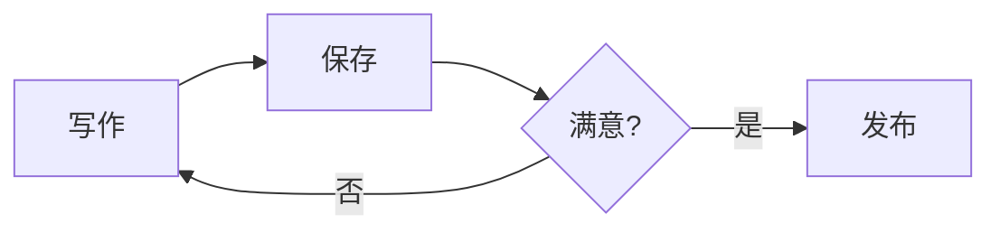
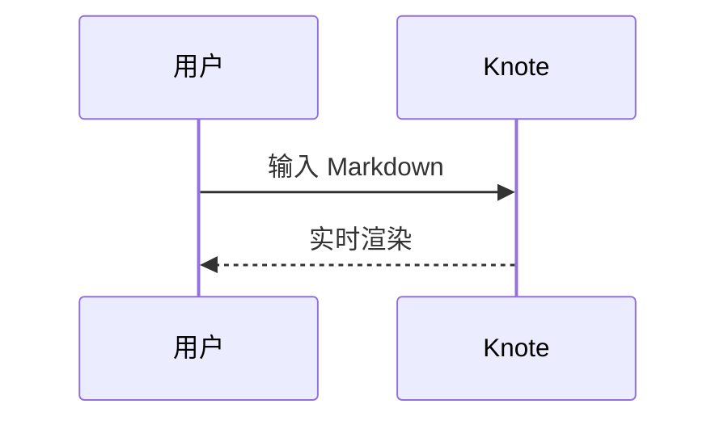
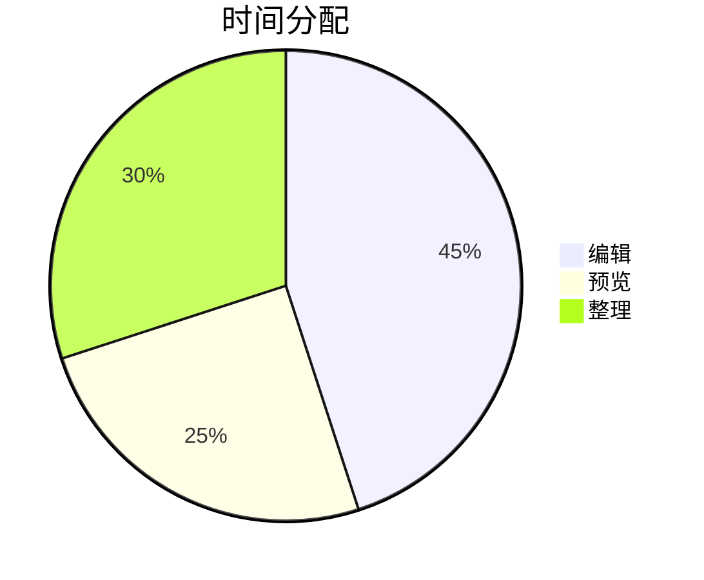
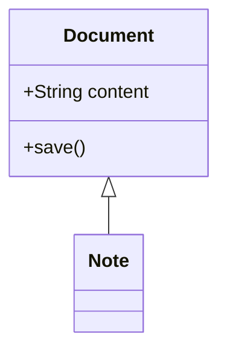
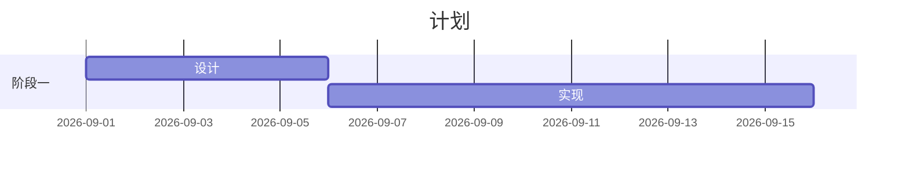
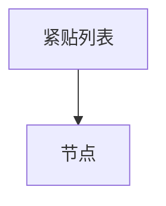

# 一级标题：综合压力测试

本篇文档用于压测 Knote 的 Markdown 往返保真度。目标：任何一次编辑之后，未被改动的部分应当逐字节保持原样。

## 二级标题：目录

- 文本样式与颜色
- 列表与紧邻边界
- 表格与对齐
- 图片与嵌入
- 引用与 Callout
- 代码与图
- 数学与脚注
- HTML 与边角情况

### 三级标题

#### 四级标题

##### 五级标题

###### 六级标题

####### 七个井号不是标题（应为正文）

# 带尾随井号的标题 #

## 带尾随井号的标题 ##

### 行内格式标题：**粗体**、*斜体*、`代码` 与 [链接](https://example.com)

#### 中文标题紧贴符号：**加粗**、*斜体*、《书名号》、（全角括号）

Setext 一级标题
===============

Setext 二级标题
---------------

## 文本样式

普通段落文本，包含 **粗体**、*斜体*、***粗斜体***、~~删除线~~、==高亮==、++下划线++ 与 `行内代码`。

嵌套格式：**粗体里包 *斜体* 和 `代码` 以及 ==高亮==**，另有 *斜体里包 **粗体***。

中文紧贴：**加粗**、*斜体*、==高亮==、++下划线++、~~删除~~，以及英文混排 sample text here。

带颜色文字：<span style="color:#e11d48;">这是红色文字</span>，以及 <span style="color:#2563eb;">蓝色文字</span> 和 <span style="color:#16a34a;">绿色文字</span>。

带底色文字：<span style="background-color:#fef08a;">黄色底纹</span>、<span style="background-color:#bfdbfe;">蓝色底纹</span>。

同时带颜色与底色：<span style="color:#7c2d12;background-color:#fed7aa;">深色文字配浅底</span>。

颜色嵌套在粗体里：**加粗的 <span style="color:#e11d48;">红色</span> 文字**。

颜色里嵌套粗体：<span style="color:#2563eb;">蓝色里的 **粗体** 与 *斜体*</span>。

颜色里包链接：<span style="color:#16a34a;">[绿色链接](https://example.com/green)</span>。

颜色里包行内代码：<span style="color:#e11d48;">`const x = 1`</span>。

## 转义与实体

转义字符：\*星号\*、\_下划线\_、\#井号、\[方括号\]、\\反斜杠、\`反引号\`、\~波浪\~。

实体引用：&amp; &lt; &gt; &quot; &apos; &nbsp; &copy; &reg; &trade; &mdash; &hellip; &#65; &#x42;。

比较符号：A > B、10 < 5、a >= b、x <= y、p != q、n && m。

看起来像标签但不是：a < b 与 c > d，以及 <不是一个标签>。

## 换行与空行

这一行以两个空格结束，后面是硬换行  
这是硬换行之后的第二行。

这一行以反斜杠结束，后面是硬换行\
这是反斜杠换行之后的第二行。

这是同一段落里的普通换行
紧贴着下一行文字。

段落末尾有两个空格，紧接着一个空行。  

下一个段落。

行尾有四个空格。    

只有一个空格的行（下一行）：

 

上面有一个只有空格的行。

连续两个空行之后：


这一行前面有两个空行。

连续三个空行之后：


这一行前面有三个空行。

## 分隔线

三个减号：

---

三个星号：

***

三个下划线：

___

带空格的减号：

- - -

长减号：

-----

紧贴段落的分隔线（上一段落行与其之间无空行）：
***

紧贴段落的分隔线（无空行隔离，下行直接接列表）：
---
- 分隔线后面紧贴的列表项一
- 分隔线后面紧贴的列表项二

---
表格紧贴分隔线（无空行）：
| 列一 | 列二 |
| --- | --- |
| 值一 | 值二 |

---
图片紧贴分隔线（无空行）：


## 无序列表

- 第一项
- 第二项
- 第三项

* 星号标记项一
* 星号标记项二

+ 加号标记项一
+ 加号标记项二

- 项里有**粗体**、*斜体*、`代码`、==高亮==、++下划线++
- 项里有 [链接](https://example.com/list) 和 
- 项里有 <span style="color:#e11d48;">红色文字</span> 与 <span style="background-color:#fef08a;">底色</span>

### 嵌套无序列表

- 第一层 A
  - 第二层 A1
  - 第二层 A2
    - 第三层 A2a
      - 第四层 A2a1
- 第一层 B
  - 第二层 B1

### 两空格与四空格缩进的嵌套

- 两空格父项
  - 两空格子项
    - 四空格孙项

- 四空格父项
    - 四空格子项
        - 八空格孙项

## 有序列表

1. 第一
2. 第二
3. 第三

1. 从一重新开始
1. 自动递增
1. 继续自动递增

5. 从五开始
6. 六
7. 七

### 有序列表嵌套

1. 第一层一
   1. 第二层一
   2. 第二层二
      1. 第三层一
2. 第一层二

### 有序列表其他定界符（括号形式）

1) 括号形式一
2) 括号形式二
3) 括号形式三

### 深层混合嵌套

1. 有序第一层
   - 无序第二层
     - 无序第三层
       1. 有序第四层
          - 无序第五层
            - 无序第六层
2. 有序第一层之二

## 任务列表

- [ ] 未完成任务
- [x] 已完成任务
- [ ] 带 **粗体** 的未完成任务
- [x] 带 ==高亮== 的已完成任务

### 任务列表嵌套

- [ ] 父任务
  - [ ] 子任务一
  - [x] 子任务二
    - [ ] 孙任务
- [x] 父任务二
  - [ ] 子任务三

### 任务列表与其他块混合

- [ ] 任务里有 `代码`
- [x] 任务里有 [链接](https://example.com/task)
- [ ] 任务里有 
- [x] 任务里有 <span style="color:#2563eb;">蓝色</span>

## 列表紧邻边界（无空行隔离）

段落紧贴列表（段落后一行直接是列表项）：
- 紧贴段落的项一
- 紧贴段落的项二

列表紧贴段落（列表最后一项后一行直接是段落）：
- 项一
- 项二
这段文字紧贴在列表之后，与列表之间没有空行。

列表紧贴无序列表（两种标记之间无空行）：
- 减号项
* 星号项紧贴减号列表
+ 加号项紧贴星号列表

列表紧贴有序列表（无序后无空行接有序）：
- 无序项
1. 有序项紧贴无序列表
2. 有序第二项

有序紧贴无序：
1. 有序项
- 无序项紧贴有序列表
- 无序第二项

列表紧贴表格（列表后无空行直接表格）：
- 列表项一
- 列表项二
| 表头一 | 表头二 |
| --- | --- |
| 单元一 | 单元二 |

表格紧贴列表（表格后无空行直接列表）：
| 表头一 | 表头二 |
| --- | --- |
| 单元一 | 单元二 |
- 紧贴表格的列表项一
- 紧贴表格的列表项二

列表紧贴图片（列表后无空行直接图片行）：
- 列表项一
- 列表项二


图片紧贴列表（图片后无空行直接列表）：

- 紧贴图片的列表项一
- 紧贴图片的列表项二

列表紧贴代码块：
- 列表项一
- 列表项二
```js
// 紧贴列表的代码块
const afterList = true
```

代码块紧贴列表：
```js
const beforeList = true
```
- 紧贴代码块的列表项一
- 紧贴代码块的列表项二

列表紧贴引用：
- 列表项一
- 列表项二
> 紧贴列表的引用行。

引用紧贴列表：
> 紧贴列表的引用行。
- 紧贴引用的列表项一
- 紧贴引用的列表项二

标题紧贴列表（标题后无空行直接列表）：
### 紧贴列表的标题
- 紧贴标题的列表项一
- 紧贴标题的列表项二

列表紧贴标题（列表后无空行直接标题）：
- 列表项一
- 列表项二
### 紧贴列表的标题

任务列表紧贴表格：
- [ ] 任务一
- [x] 任务二
| 表头一 | 表头二 |
| --- | --- |
| 等一 | 等二 |

表格紧贴任务列表：
| 表头一 | 表头二 |
| --- | --- |
| 等一 | 等二 |
- [ ] 紧贴表格的任务一
- [x] 紧贴表格的任务二

任务列表紧贴图片：
- [ ] 任务一
- [x] 任务二


图片紧贴任务列表：

- [ ] 紧贴图片的任务一
- [x] 紧贴图片的任务二

## 列表项内部的块

- 列表项第一段。

  列表项内部的第二个段落（前面有空行）。

- 列表项里有代码块：

  ```py
  def inside_list():
      return "代码块在列表项里"
  ```

- 列表项里有引用：

  > 引用在列表项里，带 **粗体**。

- 列表项里有表格：

  | 内表头 | 内表头二 |
  | --- | --- |
  | 内单元 | 内单元二 |

- 列表项里有图片：

  

- 列表项里有嵌套列表：

  - 内层一
  - 内层二

- 列表项里既有段落又有代码又有引用，无空行分隔：
  紧跟段落的代码块：
  ```sh
  echo "紧跟模式"
  ```
  紧跟代码的引用：
  > 紧跟引用

## 紧凑列表与松散列表

紧凑列表（项之间无空行）：
- 紧凑一
- 紧凑二
- 紧凑三

松散列表（项之间有空行）：

- 松散一

- 松散二

- 松散三

松散列表且每项多段：

- 第一项第一段

  第一项第二段

- 第二项第一段

  第二项第二段

## 列表内联边界（项内同一行紧跟块级元素）

- 项内同一行的图片：
- 项内同一行的代码：`inline only`
- 项内同一行的链接：[链接](https://example.com/inline)
- 项内同一行的颜色：<span style="color:#e11d48;">红色</span>

- 项后紧跟表格（项与表格之间无空行）：
| 表头 | 表头二 |
| --- | --- |
| 单元 | 单元二 |

## 表格

### 基础表格

| 列一 | 列二 | 列三 |
| --- | --- | --- |
| 单元一 | 单元二 | 单元三 |
| 单元四 | 单元五 | 单元六 |

### 对齐表格

| 左对齐 | 居中 | 右对齐 | 无对齐 |
| :--- | :----: | ----: | --- |
| 左 | 中 | 右 | 无 |
| left | center | right | none |
| 很长的左对齐内容 | 很长的居中内容 | 很长的右对齐内容 | 很长的无对齐内容 |

### 各种短横线数量的对齐

| 对齐一 | 对齐二 | 对齐三 |
| :- | :-: | -: |
| 单个短横 | 单个短横 | 单个短横 |

| 对齐一 | 对齐二 | 对齐三 |
| :-------- | :-------: | --------: |
| 多个短横 | 多个短横 | 多个短横 |

### 无前导管道的表格

列一 | 列二 | 列三
--- | --- | ---
单元一 | 单元二 | 单元三
单元四 | 单元五 | 单元六

列一 | 列二
:--- | ---:
左 | 右

### 参差不齐的表格（行列数不一致）

| 表头一 | 表头二 | 表头三 |
| --- | --- | --- |
| 只有一个单元 |
| 两个单元 | 第二个 |
| 四个单元 | 第二个 | 第三个 | 第四个多余的 |

| 表头一 | 表头二 |
| --- | --- |
| 单元 | 单元 |
| 单元 | 单元 |

### 空单元格与空表格

| 空一 | 空二 | 空三 |
| --- | --- | --- |
|  |  |  |
| 有内容 |  |  |

| 全是空的 |  |
| --- | --- |
|  |  |

### 单元格内联格式

| 类型 | 示例 |
| --- | --- |
| 粗体 | **粗体内容** |
| 斜体 | *斜体内容* |
| 粗斜体 | ***粗斜体内容*** |
| 代码 | `code_span()` |
| 删除线 | ~~删除内容~~ |
| 高亮 | ==高亮内容== |
| 下划线 | ++下划线内容++ |
| 链接 | [链接文字](https://example.com/table) |
| 颜色 | <span style="color:#e11d48;">红色单元</span> |
| 底色 | <span style="background-color:#fef08a;">黄底单元</span> |
| 组合 | **粗体里的 `代码`** |
| 组合二 | `代码里的 **星号**` 不应加粗 |
| 组合三 | ==高亮里的 [链接](https://example.com/a) 与 **粗体**== |

### 单元格内特殊字符

| 描述 | 内容 |
| --- | --- |
| 竖线转义 | a \| b |
| 多个竖线转义 | x \| y \| z |
| 反斜杠 | a \\ b |
| 星号 | a \* b |
| 小于大于 | A > B 与 C < D |
| 实体 | &amp; &lt; &gt; |
| 百分号 | 100% |
| 冒号 | key: value |
| 反引号 | a \` b |

### 单元格内换行与硬换行

| 描述 | 内容 |
| --- | --- |
| 硬换行 | 第一行<br>第二行 |
| HTML 换行 | 第一行<br/>第二行 |

### 单元格内图片

| 图片 | 说明 | 尺寸 |
| --- | --- | --- |
|  | 普通相对图片 | 原始 |
|  | 带标题 | 原始 |
|  | HTML 图片 | 40% |
| ![[pixel.png]] | Wikilink 嵌入 | 原始 |

### 单元格内代码与列表文本

| 名称 | 说明 |
| --- | --- |
| 反引号命令 | `npm run build` |
| 多个反引号 | `` `嵌套反引号` `` |
| 路径 | `src/components/RichEditor.vue` |
| 列表样文本 | - 不是列表 - 只是文本 |

### 长表格

| 编号 | 名称 | 类别 | 状态 | 负责人 | 更新时间 | 备注 |
| ---: | --- | :---: | --- | --- | --- | --- |
| 1 | 编辑器核心 | 前端 | 已完成 | Kiwi | 2026-09-01 | 无 |
| 2 | 表格序列化 | 前端 | 已完成 | Kiwi | 2026-09-20 | 转义管道符 |
| 3 | 图片解析 | 前端 | 进行中 | Kiwi | 2026-09-20 | 相对路径 |
| 4 | 引用渲染 | 前端 | 待开始 | - | - | - |
| 5 | 数学公式 | 前端 | 已完成 | Kiwi | 2026-08-11 | KaTeX |
| 6 | Mermaid 图 | 前端 | 已完成 | Kiwi | 2026-08-19 | 语言选择器 |
| 7 | 颜色标注 | 前端 | 已完成 | Kiwi | 2026-07-02 | 内联 span |
| 8 | 脚注 | 前端 | 已完成 | Kiwi | 2026-07-02 | 拓展语法 |

### 中文宽表格

| 模块 | 说明 | 状态 | 备注 |
| --- | --- | --- | --- |
| 编辑 | 快捷输入与实时渲染 | 可用 | 支持中英文混排与全角标点，例如：（括号）、、逗号 和 。句号 |
| 预览 | 分栏实时预览 | 可用 | 长文档分块渲染 |
| 导出 | 下载 Markdown | 可用 | 保留原始源码 |
| 助手 | 内置 AI 助手 | 可用 | 需要自备 API Key |

### 表格紧邻边界

表格紧贴表格（两个表格之间无空行）：
| 第一张表头 | 表头二 |
| --- | --- |
| 单元 | 单元 |
| 第二张表头 | 表头二 |
| --- | --- |
| 单元 | 单元 |

表格紧贴段落：
| 表头一 | 表头二 |
| --- | --- |
| 单元一 | 单元二 |
这段文字紧贴在表格之后没有任何空行。

段落紧贴表格：
这段文字紧贴在表格之前没有任何空行。
| 表头一 | 表头二 |
| --- | --- |
| 单元一 | 单元二 |

表格紧贴标题：
| 表头一 | 表头二 |
| --- | --- |
| 单元一 | 单元二 |
### 紧贴表格的标题

标题紧贴表格：
### 紧贴表格的标题
| 表头一 | 表头二 |
| --- | --- |
| 单元一 | 单元二 |

表格紧贴引用：
| 表头一 | 表头二 |
| --- | --- |
| 单元一 | 单元二 |
> 紧贴表格的引用。

表格紧贴代码块：
| 表头一 | 表头二 |
| --- | --- |
| 单元一 | 单元二 |
```js
const afterTable = true
```

表格紧贴分隔线：
| 表头一 | 表头二 |
| --- | --- |
| 单元一 | 单元二 |
---

表格紧贴 HTML 块：
| 表头一 | 表头二 |
| --- | --- |
| 单元一 | 单元二 |
<div>紧贴表格的 HTML 块</div>

## 图片

### 基础图片


### 图片路径形式


.png)

.png>)

### 尺寸与对齐


### Wikilink 嵌入

![[pixel.png]]

![[note.md]]

![[pixel.png|300]]

![[不存在的图片.png]]

### 图片紧邻边界

图片紧贴图片：


图片紧贴段落：

这段文字紧贴在图片之后，中间没有空行。

段落紧贴图片：
这段文字紧贴在图片之前，中间没有空行。


图片紧贴标题：

### 紧贴图片的标题

标题紧贴图片：
### 紧贴图片的标题


图片紧贴引用：

> 紧贴图片的引用。

引用紧贴图片：
> 紧贴图片的引用。


图片紧贴代码块：

```js
const afterImage = true
```

代码块紧贴图片：
```js
const beforeImage = true
```


图片紧贴 HTML 块：

<div>紧贴图片的 HTML 块</div>

图片紧贴表格：

| 表头一 | 表头二 |
| --- | --- |
| 单元一 | 单元二 |

### 图片行内混排

文字  文字，图片在段落中间。

**粗体  粗体**，图片在粗体标记里。

[](https://example.com)

<span style="color:#e11d48;"></span>

文字  文字。

## 引用

> 简单引用。

> 引用里的 **粗体**、*斜体*、`代码`、==高亮==、++下划线++。

> 引用第一行
> 引用第二行
> 引用第三行

> 引用里的硬换行  
> 硬换行之后的第二行

> 引用里的反斜杠换行\
> 反斜杠换行之后的第二行

### 多段引用

> 引用第一段。
>
> 引用第二段，中间有空行。
>
> 引用第三段。

### 嵌套引用

> 第一层引用
>
> > 第二层引用
> >
> > > 第三层引用
> > >
> > > > 第四层引用

> 第一层开头
> > 第二层紧跟（无空行）
> > > 第三层紧跟

### 引用里的块

> ### 引用里的标题
>
> 引用里的段落。
>
> - 引用里的列表项一
> - 引用里的列表项二
>   - 引用里的嵌套项
>
> ```js
> // 引用里的代码块
> const inQuote = true
> ```
>
> | 引用里的表头 | 表头二 |
> | --- | --- |
> | 单元 | 单元 |
>
> 
>
> ---
>
> 引用里的分隔线之后。

### 引用紧邻边界

引用紧贴列表：
> 紧贴列表的引用。
- 紧贴引用的列表项一
- 紧贴引用的列表项二

引用紧贴表格：
> 紧贴表格的引用。
| 表头一 | 表头二 |
| --- | --- |
| 单元一 | 单元二 |

引用紧贴标题：
> 紧贴标题的引用。
### 紧贴引用的标题

### Callout 提示块

> [!note] 说明
> 这是一条 note 提示。

> [!info] 信息
> 这是一条 info 提示。

> [!tip] 小提示
> 这是一条 tip 提示，带有 **粗体** 与 `代码`。

> [!success] 成功
> 这是一条 success 提示。

> [!warning] 警告
> 这是一条 warning 提示。

> [!danger] 危险
> 这是一条 danger 提示。

> [!question] 疑问
> 这是一条 question 提示。

> [!quote] 引述
> 这是一条 quote 提示。

> [!tip] 提示里带多行内容
> 第二行内容。
> 第三行内容，包含 <span style="color:#e11d48;">红色文字</span>。

> [!warning] 提示里带列表
>
> - 列表项一
> - 列表项二

> [!note] 提示里带代码
>
> ```js
> const callout = true
> ```

### Callout 紧邻边界

> [!tip] 紧贴列表的提示
- 紧贴提示的列表项

> [!note] 紧贴表格的提示
| 表头一 | 表头二 |
| --- | --- |
| 单元一 | 单元二 |

## 代码块

### 各语言代码块

```js
// JavaScript
const greet = (name) => `Hello, ${name}`
console.log(greet('Knote'))
```

```ts
// TypeScript
interface Doc { id: string; title: string }
const doc: Doc = { id: '1', title: 'Knote' }
```

```python
# Python
def greet(name: str) -> str:
    return f"Hello, {name}"
```

```java
// Java
public class Main {
  public static void main(String[] args) {
    System.out.println("Hello");
  }
}
```

```c
// C
#include <stdio.h>
int main(void) { printf("hi\n"); return 0; }
```

```cpp
// C++
#include <iostream>
int main() { std::cout << "hi" << std::endl; }
```

```csharp
// C#
Console.WriteLine("hi");
```

```go
// Go
package main
func main() { println("hi") }
```

```rust
// Rust
fn main() { println!("hi"); }
```

```html
<!-- HTML -->
<div class="box"><span>hi</span></div>
```

```css
/* CSS */
.box { color: #84cc16; }
```

```vue
<!-- Vue -->
<template><div>{{ msg }}</div></template>
```

```json
{ "name": "knote", "version": "1.1.65" }
```

```yaml
name: knote
tags:
  - markdown
  - roundtrip
```

```bash
# Bash
npm run build && git push origin main
```

```sql
-- SQL
SELECT id, title FROM docs WHERE draft = 0;
```

```markdown
<!-- Markdown -->
**粗体** 与 [链接](https://example.com)
```

### 无语言代码块

```
没有任何语言标记的代码块。
第二行。
```

```
  ┌─────────────┐
  │  盒子里绘图  │
  └─────────────┘
```

### 波浪线围栏

~~~js
const tilde = true
~~~

~~~python
print("tilde fence")
~~~

### 围栏内容里的特殊字符

```sh
# 反引号与星号不应被转义
echo "`date` **not bold** ==not hl=="
awk '{ print $1 }' file.txt
grep -E "a|b" file.txt
```

```text
空行在下面：

上面有空行。
```

```text
反斜杠：C:\Users\16611\Desktop
双反斜杠：\\server\share
```

```diff
- 删除的行
+ 新增的行
 上下文行
```

### 缩进代码块

    这是四空格缩进的代码块。
    第二行。
    第三行，包含 **不应加粗** 与 `不应是代码`。

### 代码块紧邻边界

代码块紧贴代码块：
```js
const first = 1
```
```js
const second = 2
```

代码块紧贴段落：
```js
const x = 1
```
这段文字紧贴在代码块之后。

段落紧贴代码块：
这段文字紧贴在代码块之前。
```js
const y = 2
```

代码块紧贴引用：
```js
const z = 3
```
> 紧贴代码块的引用。

代码块紧贴表格：
```js
const w = 4
```
| 表头一 | 表头二 |
| --- | --- |
| 单元一 | 单元二 |

代码块紧贴图片：
```js
const v = 5
```


代码块紧贴列表：
```js
const u = 6
```
- 紧贴代码块的列表项一
- 紧贴代码块的列表项二

代码块紧贴标题：
```js
const t = 7
```
### 紧贴代码块的标题

### Mermaid 图











### Mermaid 紧邻边界


- 紧贴 Mermaid 的列表项


| 表头一 | 表头二 |
| --- | --- |
| 单元一 | 单元二 |

## 数学公式

行内公式：$E = mc^2$，行内公式带下标 $a_i + b_j$，行内公式带分数 $\frac{a}{b}$。

行内公式紧贴中文：质量为 $m$ 的物体速度为 $v$。

行内公式带上下标：$x^2 + y^2 = z^2$，$a_{i,j} \le b_{i,j}$。

行内公式带希腊字母：$\alpha \beta \gamma \delta \epsilon \pi \sigma \omega$。

行内公式带运算符号：$\sum_{i=1}^{n} i = \frac{n(n+1)}{2}$。

行内公式带矩阵：$\begin{pmatrix} a & b \\ c & d \end{pmatrix}$。

行内公式带文本：$f(x) = \begin{cases} 1 & x > 0 \\ 0 & x \le 0 \end{cases}$。

价格不是公式：$5 与 $10 之间。

美元符号：价格是 50$ 美元。

### 块级公式

$$
\int_0^\infty e^{-x^2}\,dx = \frac{\sqrt{\pi}}{2}
$$

$$
\begin{aligned}
(a+b)^2 &= a^2 + 2ab + b^2 \\
(a-b)^2 &= a^2 - 2ab + b^2
\end{aligned}
$$

$$
\mathbf{A} = \begin{bmatrix} 1 & 2 \\ 3 & 4 \end{bmatrix}
$$

### 公式紧邻边界

公式紧贴列表：
$$
a^2 + b^2 = c^2
$$
- 紧贴公式的列表项一
- 紧贴公式的列表项二

公式紧贴表格：
$$
\sum_{k=1}^{n} k
$$
| 表头一 | 表头二 |
| --- | --- |
| 单元一 | 单元二 |

公式紧贴图片：
$$
\frac{1}{2}
$$


公式紧贴段落：
$$
\sqrt{2}
$$
这段文字紧贴在公式之后。

公式紧贴公式：
$$
x
$$
$$
y
$$

## 脚注

这是一个带脚注的句子[^1]。

另一个脚注引用[^note-two]。

带中文的脚注[^中文脚注]。

行内多次引用同一个脚注[^1]，再引用一次[^1]。

多个脚注在一行[^1][^note-two]。

[^1]: 第一个脚注的内容。

[^note-two]: 第二个脚注的内容，包含 **粗体** 与 `代码`。

[^中文脚注]: 中文脚注的内容，包含 [链接](https://example.com/fn)。

### 脚注紧邻边界

脚注引用紧贴列表[^1]：
- 紧贴脚注的列表项一
- 紧贴脚注的列表项二

脚注定义紧贴段落：
[^1]: 第一个脚注的内容。

这段文字紧贴在脚注定义之后。

## 上标下标与其他扩展语法

下标记法：H~2~O、CO~2~、x~i~。

上标记法：E = mc^2^、x^n^、2^10^ = 1024。

上下标混排：a~1~^2^ 与 x^2^~i~。

下标里的中文：水~分子~。

上标紧贴符号：x^2^、y^3^。

缩略语：HTML 是一种标记语言。

*[HTML]: HyperText Markup Language

缩略语定义后再次出现：HTML 与 CSS。

定义列表：

术语一
: 术语一的定义。

术语二
: 术语二的第一个定义。
: 术语二的第二个定义。

术语三带 **粗体**
: 定义里带 `代码`。

内联 HTML 标签：<kbd>Ctrl</kbd> + <kbd>S</kbd> 保存，<mark>mark 标签</mark>，<sub>下标</sub>，<sup>上标</sup>，<u>下划线</u>，<b>粗体</b>，<i>斜体</i>，<code>代码</code>。

Emoji 短代码：:sparkles: :rocket: :tada: :warning: :white_check_mark: :x: :heart: :thumbsup:。

Emoji 字符：🎉 🚀 ✨ ⚠️ ✅ ❌ ❤️ 👍 中文混排🎯。

Emoji 在列表里：
- :rocket: 任务一
- :tada: 任务二
- :warning: 任务三

Emoji 在表格里：

| 状态 | 图标 |
| --- | --- |
| 成功 | ✅ |
| 失败 | ❌ |
| 警告 | ⚠️ |

Emoji 在标题里：### :sparkles: 带 Emoji 的标题

## 链接

内联链接：[链接文字](https://example.com)。

带标题的链接：[链接文字](https://example.com "标题文字")。

带单引号标题的链接：[链接文字](https://example.com '单引号标题')。

空文字链接：[](https://example.com)。

裸链接自动识别：https://example.com/bare 与 http://example.com/insecure。

尖括号自动链接：<https://example.com/angle>。

邮箱自动链接：someone@example.com 与 <mailto:someone@example.com>。

锚点链接：[跳到顶部](#一级标题综合压力测试)。

相对链接：[相对文档链接](note.md) 与 [相对目录链接](./guide.md)。

文件链接：[本地文件](pixel.png)。

Wikilink：[[]] 与 [[note.md]] 与 [[pixel.png]] 与 [[带空格的 名称.md]]。

引用式链接：[引用式][ref-one]。

[ref-one]: https://example.com/reference "引用式标题"

快捷键式链接：[knote]。

[knote]: https://github.com/1661169091kiwi/Knote

链接里带括号：[链接(带括号)](https://example.com/a(b)c)。

链接里带星号：[链接*星号*](https://example.com)。**强调** 不能出现在链接文字里。

链接紧贴标点：[链接](https://example.com)，后面紧跟中文逗号。

带颜色的链接：<span style="color:#2563eb;">[蓝色链接](https://example.com/blue)</span>。

### 链接紧邻边界

链接紧贴列表：
[紧贴列表的链接](https://example.com)
- 紧贴链接的列表项一
- 紧贴链接的列表项二

链接紧贴表格：
[紧贴表格的链接](https://example.com)
| 表头一 | 表头二 |
| --- | --- |
| 单元一 | 单元二 |

## HTML 与边角情况

### HTML 块

<div class="note">
  这是一个 div 块。
  <span>内联 span。</span>
  <b>粗体标签。</b>
</div>

<p style="text-align: center;">居中的 HTML 段落。</p>

<p style="text-align: right;">右对齐的 HTML 段落。</p>

<details>
  <summary>折叠标题</summary>
  <p>折叠内容。</p>
</details>

<table>
  <thead>
    <tr><th>HTML 表头</th><th>表头二</th></tr>
  </thead>
  <tbody>
    <tr><td>HTML 单元</td><td>单元二</td></tr>
  </tbody>
</table>

<ul>
  <li>HTML 列表项一</li>
  <li>HTML 列表项二</li>
</ul>

<blockquote>
  <p>HTML 引用。</p>
</blockquote>

<pre><code>HTML 代码块</code></pre>

<hr>

<br>


### HTML 注释

<!-- 单行注释 -->

<!--
多行注释
第二行
-->

文字里夹注释<!-- 行内注释 -->文字继续。

### 边角情况

连续标点：！！！？？？……、、。

全角与半角混排：中文（全角）与 English (半角)。

中英混排无空格：这是English混排text没有空格。

数字与单位：1,234.56 元、3.14、100%、-42、1e10。

特殊 Unicode：é、ü、ñ、ç、ß、Ω、✓、★、→、←、↑、↓、≠、≤、≥、∞。

零宽字符：正常文本（中间不应有不可见字符）。

制表符分隔：	A	B	C

行首制表符：	缩进文本。

超长单行：这是一个非常非常长的段落，用来确认换行与保存不会改变任何一个字符，包含中文、English、数字 1234567890、符号 !@#$%^&*()_+-=[]{}|;':",./<>? 以及 emoji 🎉，继续延长以超过一般的显示宽度，再补一些内容确保足够长。

超长无空格串：aaaaaaaaaaaaaaaaaaaaaaaaaaaaaaaaaaaaaaaaaaaaaaaaaaaaaaaaaaaaaaaaaaaaaaaaaaaaaaaaaaaaaaaaaaaaaaaaaaaa。

超长 URL 行：https://example.com/very/long/path/segment/that/keeps/going/and/going/with?query=1&more=2&even=3#fragment

段落只有标点：。

段落只有数字：12345。

段落只有一个字：好。

段落以空格开头（行首缩进 1 空格不影响段落）：
 这一行以空格开头。

段落以三个空格开头：
   这一行以三个空格开头。

段落以四个空格开头（应成为代码块）：
    这一行以四个空格开头。

空链接与空图片： 与 []()

未闭合的强调：**未闭合的粗体 与 *未闭合的斜体 与 `未闭合的代码。

未闭合的链接：[未闭合的链接](https://example.com

未闭合的图片：

删除线紧贴代码块：
~~删除线的段落~~
```js
const afterStrike = true
```

行内代码紧贴列表：
`行内代码的段落`
- 紧贴行内代码的列表项

Wikilink 紧贴列表：
[[note.md]]
- 紧贴 wikilink 的列表项一
- 紧贴 wikilink 的列表项二

Wikilink 嵌入紧贴列表：
![[pixel.png]]
- 紧贴嵌入的列表项一
- 紧贴嵌入的列表项二

Emoji 段落紧贴列表：
🎉 带 Emoji 的段落
- 紧贴 Emoji 的列表项一
- 紧贴 Emoji 的列表项二

中文全角标点紧贴列表：
这是带全角标点的段落：包括（）【】《》「」以及……和——
- 紧贴全角标点的列表项一
- 紧贴全角标点的列表项二

引用紧跟引用（两个独立引用之间无空行）：
> 第一个引用。
> 第二个引用紧贴第一个引用。

引用紧跟引用（有空行）：
> 第一个引用。

> 第二个引用。

列表紧跟引用紧跟列表：
- 列表项一
> 中间夹一个引用
- 列表项二

表格紧跟引用紧跟表格：
| 第一张 | 表头二 |
| --- | --- |
| 单元 | 单元 |
> 中间夹一个引用
| 第二张 | 表头二 |
| --- | --- |
| 单元 | 单元 |

图片紧跟图片紧跟列表：


- 紧贴两张图片的列表项一
- 紧贴两张图片的列表项二

代码块紧跟代码块紧跟列表：
```js
const one = 1
```
```js
const two = 2
```
- 紧贴两个代码块的列表项一
- 紧贴两个代码块的列表项二

任务列表紧跟无序列表紧跟有序列表：
- [ ] 任务项
- 无序项
1. 有序项

深层混合紧邻（有序→任务→无序→表格→图片→代码→引用）：
1. 有序项
   - [ ] 任务项
     - 无序项
       | 内表头 | 表头二 |
       | --- | --- |
       | 单元 | 单元 |
       
       ```js
       const deep = true
       ```
       > 深层引用
2. 有序项之二

## 补充：超长表格（覆盖多行单元）

| 序号 | 标题 | 描述 | 标签 |
| ---: | --- | --- | --- |
| 1 | 语法解析 | Markdown 解析为文档模型，覆盖标题、段落、列表、表格、代码、引用、公式、脚注等全部语法 | 解析 |
| 2 | 富文本编辑 | 所见即所得的编辑体验，支持快捷输入、选区工具栏、拖拽与剪切粘贴 | 编辑 |
| 3 | 序列化 | 文档模型写回 Markdown 源码，要求未被修改的部分逐字节保持原样 | 保真 |
| 4 | 图片处理 | 相对路径解析、尺寸与对齐、Wikilink 嵌入、单元格内图片 | 图片 |
| 5 | 表格处理 | 转义管道符、单元格内联格式、列对齐、参差不齐的行 | 表格 |
| 6 | 列表处理 | 有序、无序、任务、嵌套、松散与紧凑、列表项内部的块 | 列表 |
| 7 | 引用与提示 | 嵌套引用、Callout 类型、引用内的列表与代码 | 引用 |
| 8 | 颜色标注 | 文字颜色与底色，持久化为内联 HTML span | 样式 |
| 9 | 数学公式 | 行内与块级 KaTeX 公式，价格与美元符号不误判 | 公式 |
| 10 | 图表 | Mermaid 流程图、时序图、饼图、类图、甘特图 | 图表 |
| 11 | 导出 | 导出自包含 HTML 与 Word 文档 | 导出 |
| 12 | 助手 | 内置 AI 助手，可读写文档、逐块审阅改动 | 助手 |

## 图片与表格的紧贴边界（无空行）


紧贴图片的说明行，源文件里图片与说明之间没有空行。

| 图表一 | 图表二 |
| --- | --- |
| 图值一 | 图值二 |


